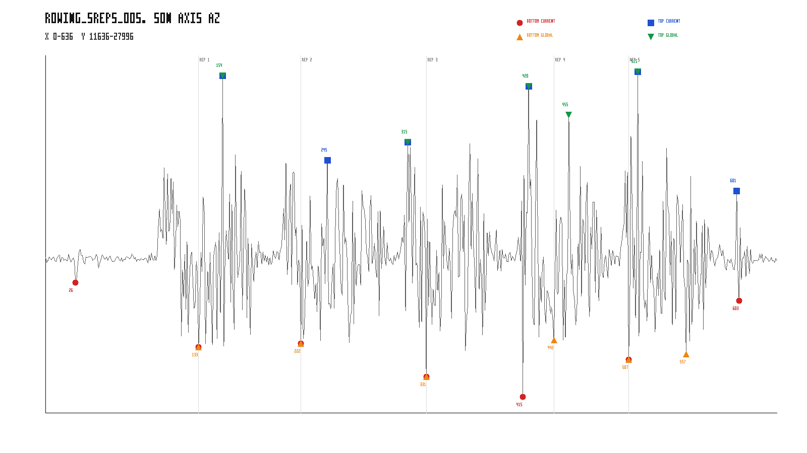
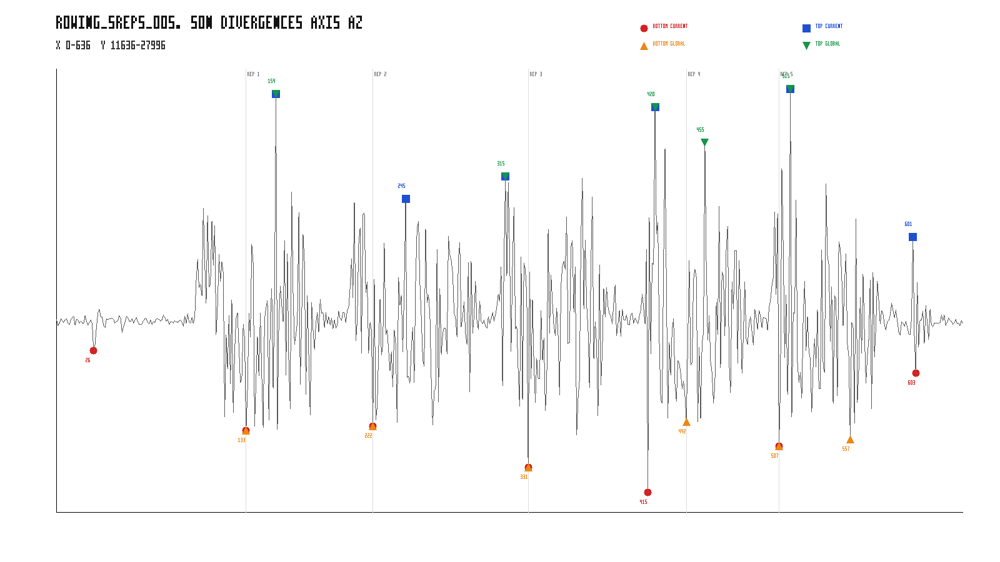
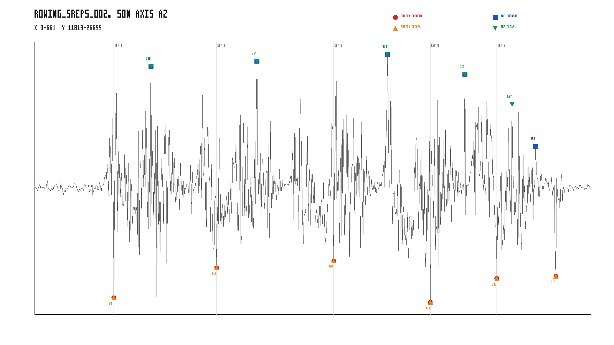
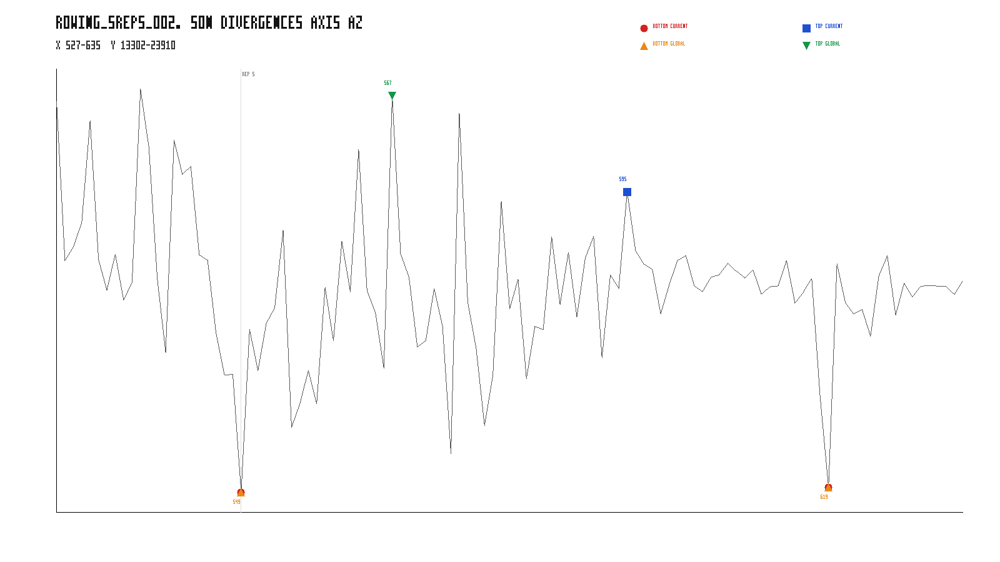
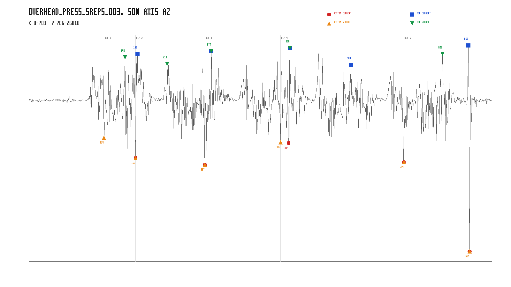
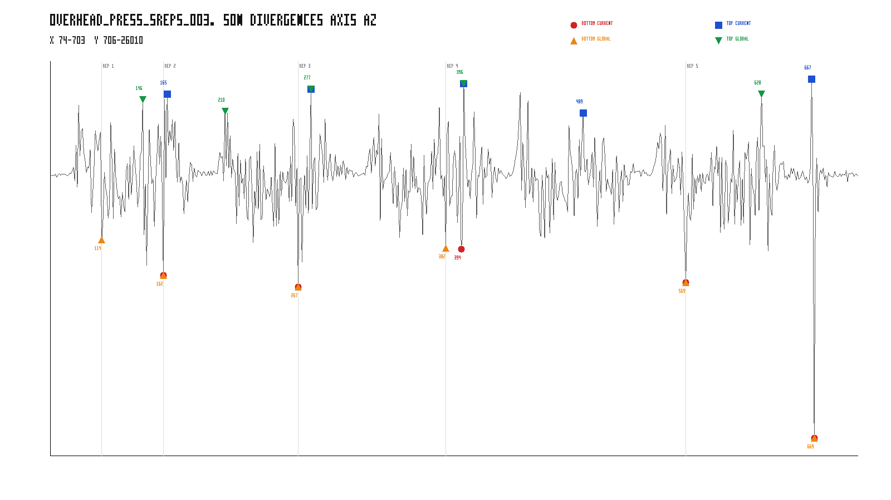

# Global alternating path — qualitative validation

Rapport descriptif d’instrumentation. Aucune modification de calibration, du DP, du score, des seuils ou des datasets.

## Définition de `eligibleCandidatesCount`

- `calibration.ts`, branche `global_alternating_path` : candidats RAW, puis filtre `PROMINENCE`, puis filtre `DIRECTION_CHANGE`; `admissibleCandidateCount = bottoms.length + tops.length`. Aucun filtre `MIN_DISTANCE` n’est appliqué dans cette branche.
- `globalPathComparisonRunner.ts` : événements de debug uniques où `filter === DIRECTION_CHANGE && kept`, dédupliqués par `(type,index)`; le total est `globalEligibleCandidatesCount`.
- `inspectGlobalPath.ts` : applique la même extraction syntaxique, mais sur `current.debug`. Cette population a auparavant traversé `MIN_DISTANCE`, contrairement à la branche globale. Elle ne mesure donc pas la même population.
- Dans les données auditées ci-dessous, le total dédupliqué du runner qualitatif est comparé à `admissibleCandidateCount` exposé par la calibration; toute différence est affichée explicitement.

La moyenne 54.6 du benchmark porte sur les survivants `PROMINENCE + DIRECTION_CHANGE` de la branche globale sur les 10 datasets. Les anciens chiffres d’`inspectGlobalPath.ts` portent sur les survivants de `MIN_DISTANCE + PROMINENCE + DIRECTION_CHANGE` de `current_filters` pour deux datasets.

Dataset overhead_press déterminé automatiquement : **overhead_press_5reps_003.json** (currentRepDifference=3).

## rowing_5reps_005.json

### Comptes de candidats

| Population unique par (type,index) | Bottoms | Tops | Total |
|---|---:|---:|---:|
| RAW | 30 | 25 | 55 |
| après PROMINENCE | 30 | 25 | 55 |
| après DIRECTION_CHANGE / eligible Global | 30 | 25 | 55 |
| population appelée eligible par inspectGlobalPath.ts (current.debug) | 7 | 6 | 13 |
| Global selected | 6 | 5 | 11 |

Calibration `admissibleCandidateCount`: 55; total eligible dédupliqué: 55; cohérence: **OUI**.

### Divergences

| index | type | value | current | global | catégorie |
|---:|---|---:|---|---|---|
| 26 | BOTTOM | 17604 | YES | NO | CURRENT_ONLY |
| 133 | BOTTOM | 14656 | YES | YES | COMMON |
| 154 | TOP | 27068 | YES | YES | COMMON |
| 222 | BOTTOM | 14808 | YES | YES | COMMON |
| 245 | TOP | 23192 | YES | NO | CURRENT_ONLY |
| 315 | TOP | 24032 | YES | YES | COMMON |
| 331 | BOTTOM | 13288 | YES | YES | COMMON |
| 415 | BOTTOM | 12380 | YES | NO | CURRENT_ONLY |
| 420 | TOP | 26584 | YES | YES | COMMON |
| 442 | BOTTOM | 14976 | NO | YES | GLOBAL_ONLY |
| 455 | TOP | 25268 | NO | YES | GLOBAL_ONLY |
| 507 | BOTTOM | 14072 | YES | YES | COMMON |
| 515 | TOP | 27252 | YES | YES | COMMON |
| 557 | BOTTOM | 14328 | NO | YES | GLOBAL_ONLY |
| 601 | TOP | 21800 | YES | NO | CURRENT_ONLY |
| 603 | BOTTOM | 16780 | YES | NO | CURRENT_ONLY |

- commonSelectedEventsCount: 8
- currentOnlyEventsCount: 5
- globalOnlyEventsCount: 3
- overlapRate (intersection / union): 0.5000
- current sequence: B(26) -> B(133) -> T(154) -> B(222) -> T(245) -> T(315) -> B(331) -> B(415) -> T(420) -> B(507) -> T(515) -> T(601) -> B(603)
- global sequence: B(133) -> T(154) -> B(222) -> T(315) -> B(331) -> T(420) -> B(442) -> T(455) -> B(507) -> T(515) -> B(557)
- current simulatedReps: 2
- global simulatedReps: 5
- globalPathScore: 44076
- globalFinalStatesCount: 16

### Contexte local des événements divergents

| index | type | value | selected précédent | distance | selected suivant | distance | amplitude locale disponible | autres RAW candidats à ±40 samples | fenêtre locale |
|---:|---|---:|---|---:|---|---:|---:|---|---|
| 26 | BOTTOM | 17604 | — | — | B(133) | 107 | 1520 | — | [PNG](./rowing_5reps_005_zoom_26_bottom.png) |
| 245 | TOP | 23192 | B(222) | 23 | T(315) | 70 | 8232 | T(209), B(222), T(230), B(239), B(248), T(254), B(264), T(275) | [PNG](./rowing_5reps_005_zoom_245_top.png) |
| 415 | BOTTOM | 12380 | B(331) | 84 | T(420) | 5 | 14204 | B(380), T(392), T(420), B(429), B(442), T(444), T(455) | [PNG](./rowing_5reps_005_zoom_415_bottom.png) |
| 442 | BOTTOM | 14976 | T(420) | 22 | T(455) | 13 | 5940 | B(415), T(420), B(429), T(444), T(455), B(461), T(465), B(473) | [PNG](./rowing_5reps_005_zoom_442_bottom.png) |
| 455 | TOP | 25268 | B(442) | 13 | B(507) | 52 | 10288 | B(415), T(420), B(429), B(442), T(444), B(461), T(465), B(473) | [PNG](./rowing_5reps_005_zoom_455_top.png) |
| 557 | BOTTOM | 14328 | T(515) | 42 | T(601) | 44 | 8128 | B(530), T(540), B(545), T(549), T(561), B(572), T(573) | [PNG](./rowing_5reps_005_zoom_557_bottom.png) |
| 601 | TOP | 21800 | B(557) | 44 | B(603) | 2 | 5020 | T(561), B(572), T(573), B(603) | [PNG](./rowing_5reps_005_zoom_601_top.png) |
| 603 | BOTTOM | 16780 | T(601) | 2 | — | — | 5020 | B(572), T(573), T(601) | [PNG](./rowing_5reps_005_zoom_603_bottom.png) |

### Durées Global

| repNumber | bottomStartIndex | topIndex | bottomEndIndex | concentricDuration | eccentricDuration | totalDuration |
|---:|---:|---:|---:|---:|---:|---:|
| 1 | 133 | 154 | 222 | 21 | 68 | 89 |
| 2 | 222 | 315 | 331 | 93 | 16 | 109 |
| 3 | 331 | 420 | 442 | 89 | 22 | 111 |
| 4 | 442 | 455 | 507 | 13 | 52 | 65 |
| 5 | 507 | 515 | 557 | 8 | 42 | 50 |

## rowing_5reps_002.json

### Comptes de candidats

| Population unique par (type,index) | Bottoms | Tops | Total |
|---|---:|---:|---:|
| RAW | 30 | 26 | 56 |
| après PROMINENCE | 30 | 26 | 56 |
| après DIRECTION_CHANGE / eligible Global | 30 | 26 | 56 |
| population appelée eligible par inspectGlobalPath.ts (current.debug) | 6 | 5 | 11 |
| Global selected | 6 | 5 | 11 |

Calibration `admissibleCandidateCount`: 56; total eligible dédupliqué: 56; cohérence: **OUI**.

### Divergences

| index | type | value | current | global | catégorie |
|---:|---|---:|---|---|---|
| 94 | BOTTOM | 12728 | YES | YES | COMMON |
| 138 | TOP | 25328 | YES | YES | COMMON |
| 216 | BOTTOM | 14360 | YES | YES | COMMON |
| 264 | TOP | 25636 | YES | YES | COMMON |
| 355 | BOTTOM | 14740 | YES | YES | COMMON |
| 419 | TOP | 25980 | YES | YES | COMMON |
| 470 | BOTTOM | 12488 | YES | YES | COMMON |
| 511 | TOP | 24912 | YES | YES | COMMON |
| 549 | BOTTOM | 13784 | YES | YES | COMMON |
| 567 | TOP | 23264 | NO | YES | GLOBAL_ONLY |
| 595 | TOP | 20968 | YES | NO | CURRENT_ONLY |
| 619 | BOTTOM | 13904 | YES | YES | COMMON |

- commonSelectedEventsCount: 10
- currentOnlyEventsCount: 1
- globalOnlyEventsCount: 1
- overlapRate (intersection / union): 0.8333
- current sequence: B(94) -> T(138) -> B(216) -> T(264) -> B(355) -> T(419) -> B(470) -> T(511) -> B(549) -> T(595) -> B(619)
- global sequence: B(94) -> T(138) -> B(216) -> T(264) -> B(355) -> T(419) -> B(470) -> T(511) -> B(549) -> T(567) -> B(619)
- current simulatedReps: 5
- global simulatedReps: 5
- globalPathScore: 43116
- globalFinalStatesCount: 13

### Contexte local des événements divergents

| index | type | value | selected précédent | distance | selected suivant | distance | amplitude locale disponible | autres RAW candidats à ±40 samples | fenêtre locale |
|---:|---|---:|---|---:|---|---:|---:|---|---|
| 567 | TOP | 23264 | B(549) | 18 | T(595) | 28 | 8556 | T(527), T(537), B(549), T(554), B(574), B(592), T(595) | [PNG](./rowing_5reps_002_zoom_567_top.png) |
| 595 | TOP | 20968 | T(567) | 28 | B(619) | 24 | 3964 | T(567), B(574), B(592), B(619), T(626) | [PNG](./rowing_5reps_002_zoom_595_top.png) |

### Durées Global

| repNumber | bottomStartIndex | topIndex | bottomEndIndex | concentricDuration | eccentricDuration | totalDuration |
|---:|---:|---:|---:|---:|---:|---:|
| 1 | 94 | 138 | 216 | 44 | 78 | 122 |
| 2 | 216 | 264 | 355 | 48 | 91 | 139 |
| 3 | 355 | 419 | 470 | 64 | 51 | 115 |
| 4 | 470 | 511 | 549 | 41 | 38 | 79 |
| 5 | 549 | 567 | 619 | 18 | 52 | 70 |

## overhead_press_5reps_003.json

### Comptes de candidats

| Population unique par (type,index) | Bottoms | Tops | Total |
|---|---:|---:|---:|
| RAW | 26 | 30 | 56 |
| après PROMINENCE | 26 | 30 | 56 |
| après DIRECTION_CHANGE / eligible Global | 26 | 30 | 56 |
| population appelée eligible par inspectGlobalPath.ts (current.debug) | 5 | 5 | 10 |
| Global selected | 6 | 5 | 11 |

Calibration `admissibleCandidateCount`: 56; total eligible dédupliqué: 56; cohérence: **OUI**.

### Divergences

| index | type | value | current | global | catégorie |
|---:|---|---:|---|---|---|
| 114 | BOTTOM | 14568 | NO | YES | GLOBAL_ONLY |
| 146 | TOP | 23568 | NO | YES | GLOBAL_ONLY |
| 162 | BOTTOM | 12284 | YES | YES | COMMON |
| 165 | TOP | 23896 | YES | NO | CURRENT_ONLY |
| 210 | TOP | 22820 | NO | YES | GLOBAL_ONLY |
| 267 | BOTTOM | 11544 | YES | YES | COMMON |
| 277 | TOP | 24228 | YES | YES | COMMON |
| 382 | BOTTOM | 14036 | NO | YES | GLOBAL_ONLY |
| 394 | BOTTOM | 13976 | YES | NO | CURRENT_ONLY |
| 396 | TOP | 24596 | YES | YES | COMMON |
| 489 | TOP | 22700 | YES | NO | CURRENT_ONLY |
| 569 | BOTTOM | 11832 | YES | YES | COMMON |
| 628 | TOP | 23896 | NO | YES | GLOBAL_ONLY |
| 667 | TOP | 24860 | YES | NO | CURRENT_ONLY |
| 669 | BOTTOM | 1856 | YES | YES | COMMON |

- commonSelectedEventsCount: 6
- currentOnlyEventsCount: 4
- globalOnlyEventsCount: 5
- overlapRate (intersection / union): 0.4000
- current sequence: B(162) -> T(165) -> B(267) -> T(277) -> B(394) -> T(396) -> T(489) -> B(569) -> T(667) -> B(669)
- global sequence: B(114) -> T(146) -> B(162) -> T(210) -> B(267) -> T(277) -> B(382) -> T(396) -> B(569) -> T(628) -> B(669)
- current simulatedReps: 2
- global simulatedReps: 5
- globalPathScore: 52988
- globalFinalStatesCount: 14

### Contexte local des événements divergents

| index | type | value | selected précédent | distance | selected suivant | distance | amplitude locale disponible | autres RAW candidats à ±40 samples | fenêtre locale |
|---:|---|---:|---|---:|---|---:|---:|---|---|
| 114 | BOTTOM | 14568 | — | — | T(146) | 32 | 7524 | B(95), T(96), T(109), T(121), T(146), B(149) | [PNG](./overhead_press_5reps_003_zoom_114_bottom.png) |
| 146 | TOP | 23568 | B(114) | 32 | B(162) | 16 | 10628 | T(109), B(114), T(121), B(149), B(162), T(165), B(178), T(183) | [PNG](./overhead_press_5reps_003_zoom_146_top.png) |
| 165 | TOP | 23896 | B(162) | 3 | T(210) | 45 | 11612 | T(146), B(149), B(162), B(178), T(183) | [PNG](./overhead_press_5reps_003_zoom_165_top.png) |
| 210 | TOP | 22820 | T(165) | 45 | B(267) | 57 | 4484 | B(178), T(183), B(219), B(232), T(237), B(248), T(249) | [PNG](./overhead_press_5reps_003_zoom_210_top.png) |
| 382 | BOTTOM | 14036 | T(277) | 105 | B(394) | 12 | 9024 | B(346), T(355), B(364), T(377), B(394), T(396), B(406) | [PNG](./overhead_press_5reps_003_zoom_382_bottom.png) |
| 394 | BOTTOM | 13976 | B(382) | 12 | T(396) | 2 | 10620 | T(355), B(364), T(377), B(382), T(396), B(406) | [PNG](./overhead_press_5reps_003_zoom_394_bottom.png) |
| 489 | TOP | 22700 | T(396) | 93 | B(569) | 80 | 6612 | B(459), T(465), T(478), B(482), T(498), B(500), B(513), T(515), T(528) | [PNG](./overhead_press_5reps_003_zoom_489_top.png) |
| 628 | TOP | 23896 | B(569) | 59 | T(667) | 39 | 10044 | T(593), B(596), T(606), B(619), B(633), T(638), T(667) | [PNG](./overhead_press_5reps_003_zoom_628_top.png) |
| 667 | TOP | 24860 | T(628) | 39 | B(669) | 2 | 23004 | T(628), B(633), T(638), B(669) | [PNG](./overhead_press_5reps_003_zoom_667_top.png) |

### Durées Global

| repNumber | bottomStartIndex | topIndex | bottomEndIndex | concentricDuration | eccentricDuration | totalDuration |
|---:|---:|---:|---:|---:|---:|---:|
| 1 | 114 | 146 | 162 | 32 | 16 | 48 |
| 2 | 162 | 210 | 267 | 48 | 57 | 105 |
| 3 | 267 | 277 | 382 | 10 | 105 | 115 |
| 4 | 382 | 396 | 569 | 14 | 173 | 187 |
| 5 | 569 | 628 | 669 | 59 | 41 | 100 |

## Fichiers PNG générés

- `overhead_press_5reps_003_divergence_windows.png`
- `overhead_press_5reps_003_full_comparison.png`
- `overhead_press_5reps_003_zoom_114_bottom.png`
- `overhead_press_5reps_003_zoom_146_top.png`
- `overhead_press_5reps_003_zoom_165_top.png`
- `overhead_press_5reps_003_zoom_210_top.png`
- `overhead_press_5reps_003_zoom_382_bottom.png`
- `overhead_press_5reps_003_zoom_394_bottom.png`
- `overhead_press_5reps_003_zoom_489_top.png`
- `overhead_press_5reps_003_zoom_628_top.png`
- `overhead_press_5reps_003_zoom_667_top.png`
- `rowing_5reps_002_divergence_windows.png`
- `rowing_5reps_002_full_comparison.png`
- `rowing_5reps_002_zoom_567_top.png`
- `rowing_5reps_002_zoom_595_top.png`
- `rowing_5reps_005_divergence_windows.png`
- `rowing_5reps_005_full_comparison.png`
- `rowing_5reps_005_zoom_245_top.png`
- `rowing_5reps_005_zoom_26_bottom.png`
- `rowing_5reps_005_zoom_415_bottom.png`
- `rowing_5reps_005_zoom_442_bottom.png`
- `rowing_5reps_005_zoom_455_top.png`
- `rowing_5reps_005_zoom_557_bottom.png`
- `rowing_5reps_005_zoom_601_top.png`
- `rowing_5reps_005_zoom_603_bottom.png`
