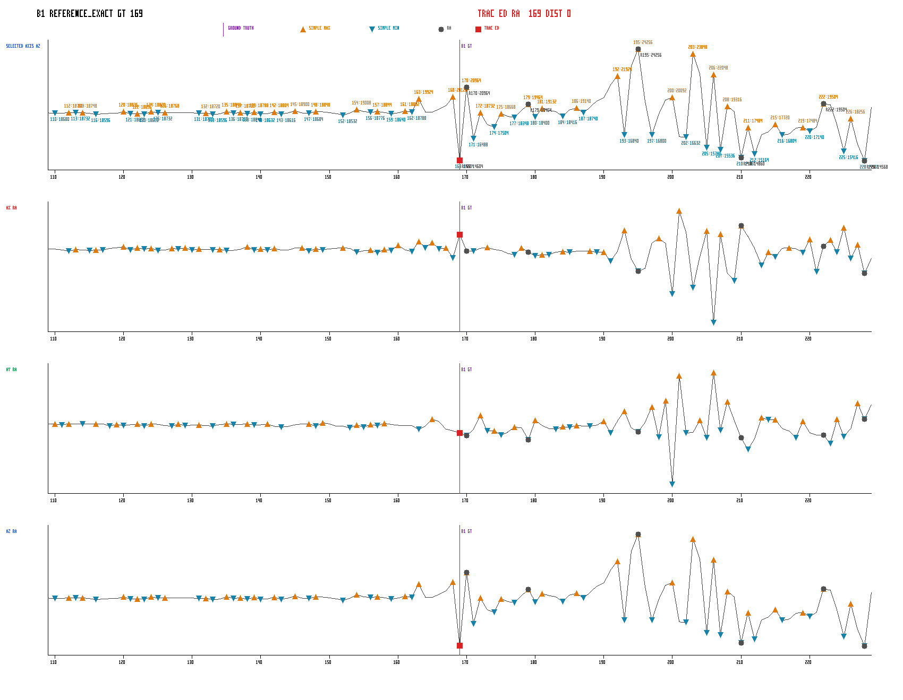
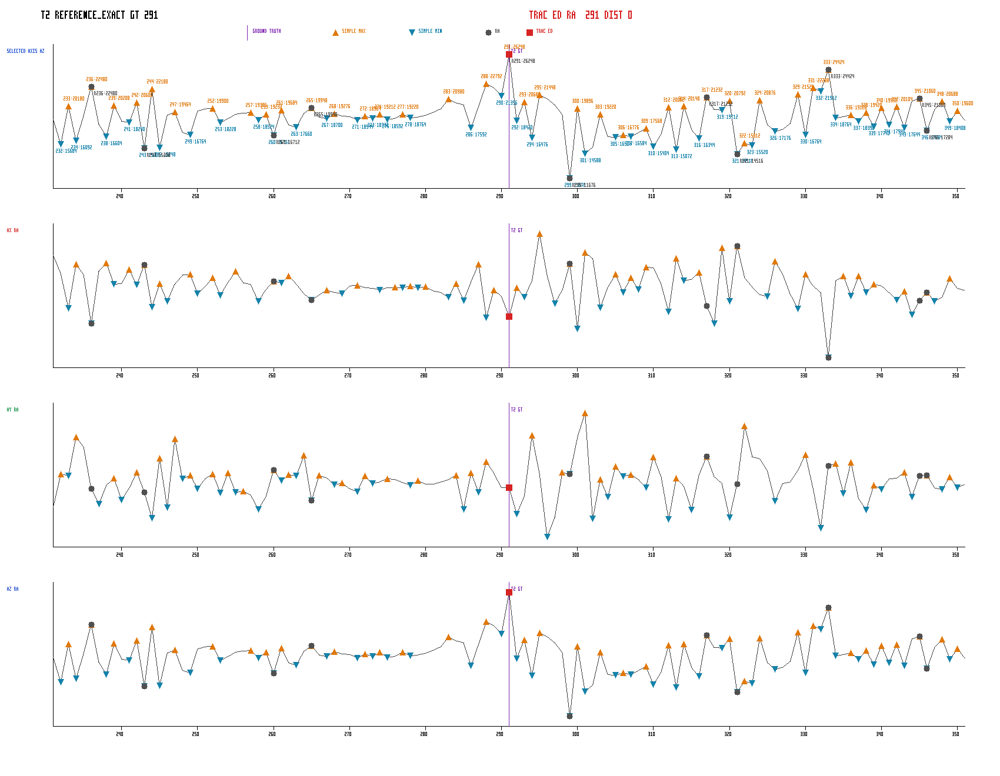
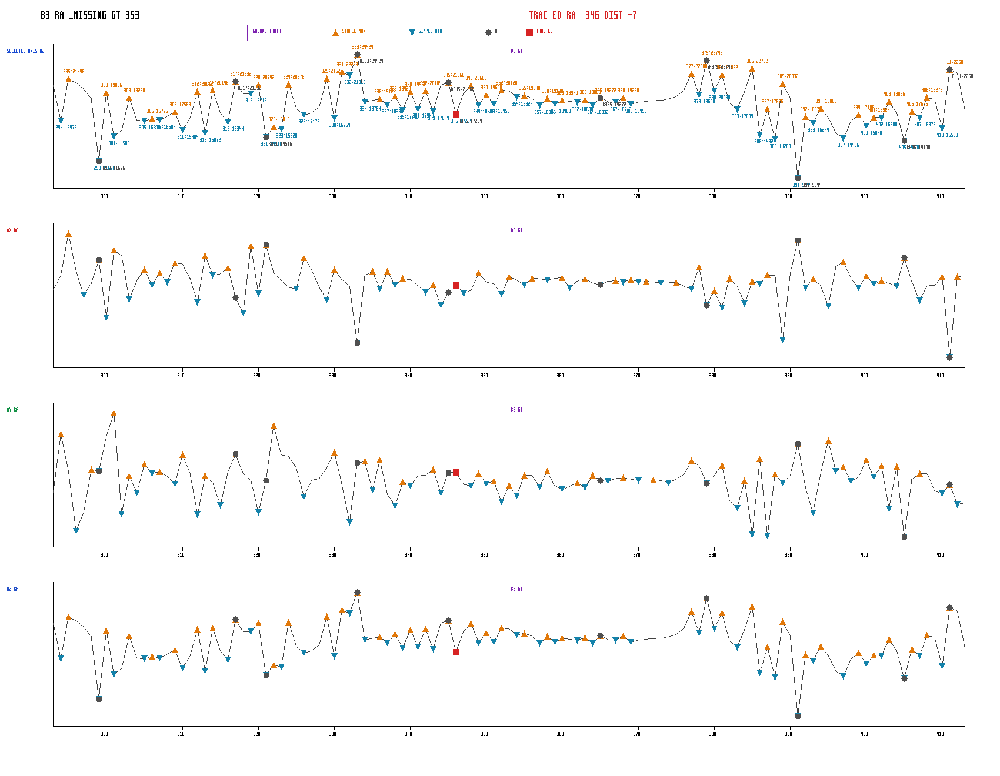
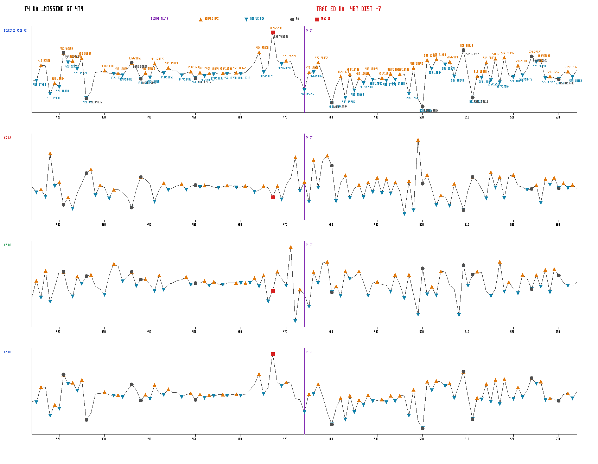
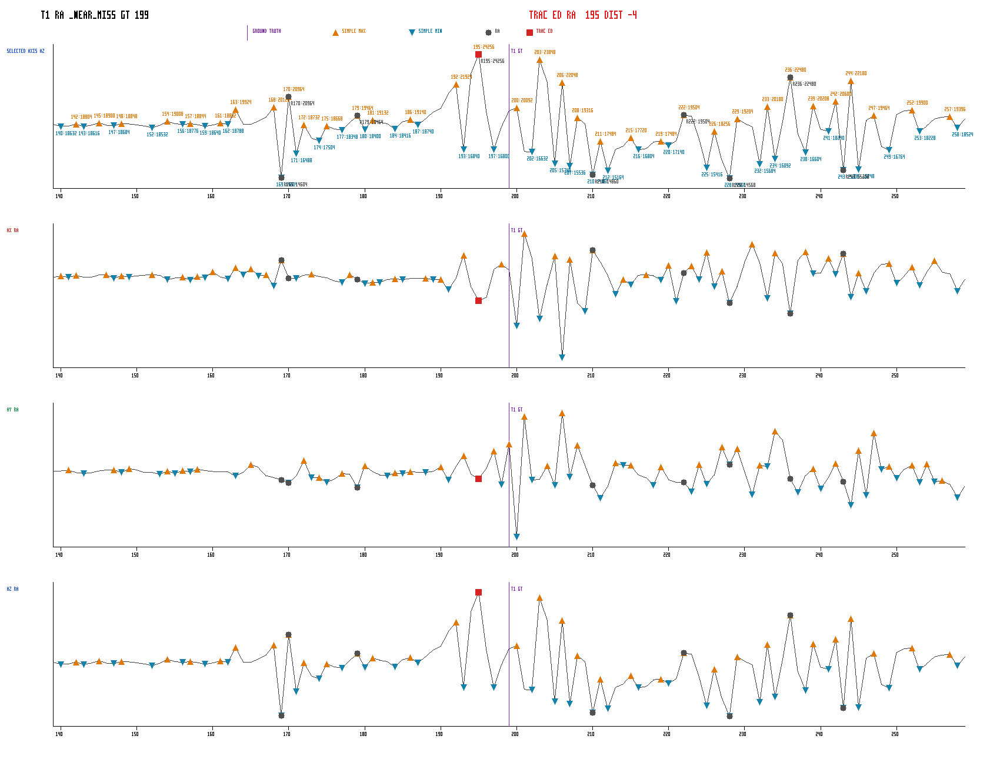
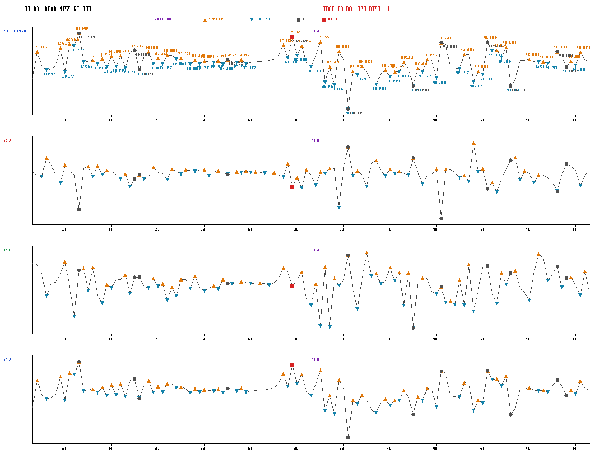
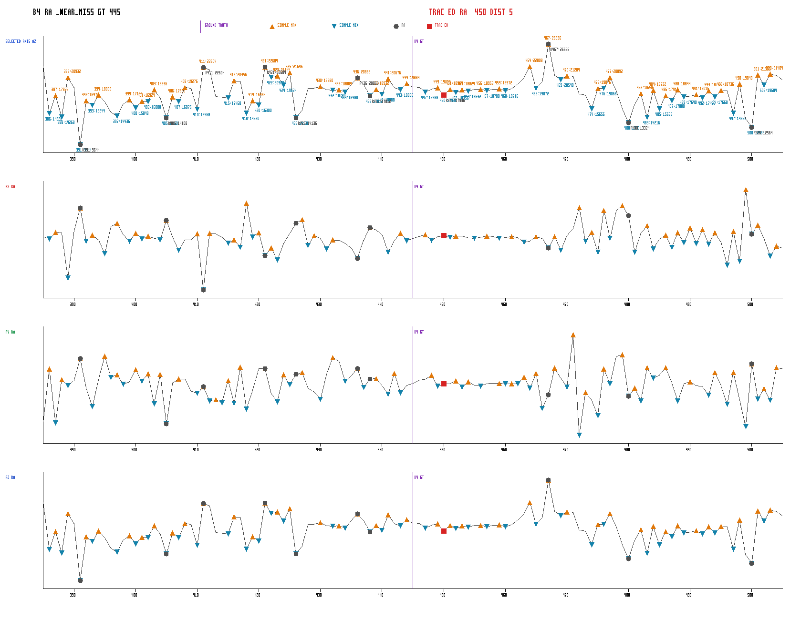
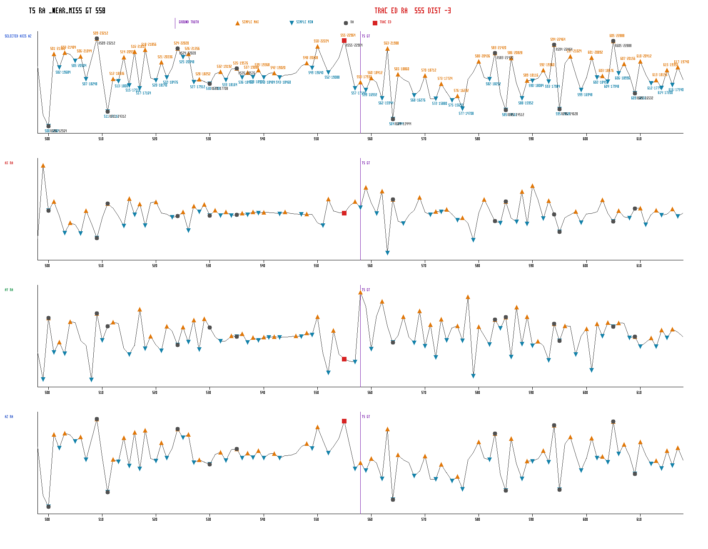
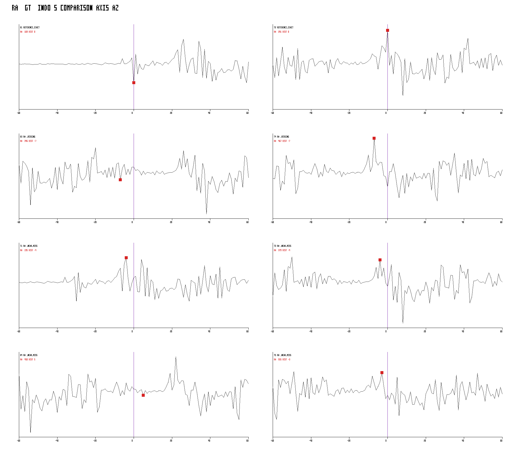

# rowing_5reps_007 — RAW Investigation

Investigation descriptive en lecture seule des huit événements ciblés.

## Formules descriptives

- `localNoiseEstimate = median(abs(signal[i] - signal[i-1]))` sur la fenêtre ±60.
- `amplitudeToNoiseRatio = localPeakToPeakAmplitude / localNoiseEstimate`.
- `slopeBefore` et `slopeAfter` sont les moyennes des différences consécutives sur un rayon de 8 samples.
- `plateauLengthSamples` étend une zone contiguë autour de Ground Truth tant que chaque différence consécutive reste inférieure ou égale à `localNoiseEstimate`.
- Ces mesures ne sont utilisées par aucun filtre et ne constituent aucun score.

## Tableau récapitulatif

| eventLabel | expectedType | groundTruthIndex | status | nearestSameTypeRawIndex | signedDistanceSamples | localPeakToPeakAmplitude | localNoiseEstimate | amplitudeToNoiseRatio | slopeBefore | slopeAfter | directionChangeVisible | simpleExtremumAtGroundTruth | rawCandidateAtGroundTruth | snappedCandidateIndex | selectedAxis | strongestAxisInWindow |
|---|---|---:|---|---:|---:|---:|---:|---:|---:|---:|---|---|---|---|---|---|
| B1 | BOTTOM | 169 | REFERENCE_EXACT | 169 | 0 | 9688 | 198 | 48.92929292929293 | -536 | 468 | true | true | true | DIAGNOSTIC_UNAVAILABLE | az | az |
| T2 | TOP | 291 | REFERENCE_EXACT | 291 | 0 | 14572 | 1244 | 11.713826366559486 | 658.5 | -1821.5 | true | true | true | DIAGNOSTIC_UNAVAILABLE | az | az |
| B3 | BOTTOM | 353 | RAW_MISSING | 346 | -7 | 14780 | 1318 | 11.213960546282246 | -121 | -157.5 | false | false | false | DIAGNOSTIC_UNAVAILABLE | az | az |
| T4 | TOP | 474 | RAW_MISSING | 467 | -7 | 13972 | 1186 | 11.780775716694773 | -569.5 | 322.5 | true | false | false | DIAGNOSTIC_UNAVAILABLE | az | az |
| T1 | TOP | 199 | RAW_NEAR_MISS | 195 | -4 | 9688 | 580 | 16.70344827586207 | -166 | -538.5 | false | false | false | DIAGNOSTIC_UNAVAILABLE | az | az |
| T3 | TOP | 383 | RAW_NEAR_MISS | 379 | -4 | 14780 | 1142 | 12.942206654991244 | -195.5 | -1020 | false | false | false | DIAGNOSTIC_UNAVAILABLE | az | az |
| B4 | BOTTOM | 445 | RAW_NEAR_MISS | 450 | 5 | 16892 | 1220 | 13.845901639344262 | -59 | -59.5 | false | false | false | DIAGNOSTIC_UNAVAILABLE | az | az |
| T5 | TOP | 558 | RAW_NEAR_MISS | 555 | -3 | 10648 | 1506 | 7.0703851261620185 | -536.5 | 41 | true | true | false | DIAGNOSTIC_UNAVAILABLE | az | az |

## Mesures détaillées

### B1



```json
{
  "eventLabel": "B1",
  "expectedType": "BOTTOM",
  "groundTruthIndex": 169,
  "status": "REFERENCE_EXACT",
  "nearestSameTypeRawIndex": 169,
  "signedDistanceSamples": 0,
  "absoluteDistanceSamples": 0,
  "signalValueAtGroundTruth": 14604,
  "signalValueAtNearestRaw": 14604,
  "localMinimum": 14568,
  "localMaximum": 24256,
  "localPeakToPeakAmplitude": 9688,
  "localMedian": 18732,
  "localNoiseEstimate": 198,
  "amplitudeToNoiseRatio": 48.92929292929293,
  "slopeBefore": -536,
  "slopeAfter": 468,
  "directionChangeVisible": true,
  "simpleExtremumAtGroundTruth": true,
  "rawCandidateAtGroundTruth": true,
  "snappedCandidateIndex": "DIAGNOSTIC_UNAVAILABLE",
  "selectedAxis": "az",
  "strongestAxisInWindow": "az",
  "windowStart": 109,
  "windowEnd": 229,
  "radiusMeasurements": [
    {
      "radius": 2,
      "minimum": 14604,
      "maximum": 20964,
      "amplitude": 6360,
      "slopeBefore": -2370,
      "slopeAfter": 942,
      "directionChangeVisible": true,
      "plateauLengthSamples": 1
    },
    {
      "radius": 4,
      "minimum": 14604,
      "maximum": 20964,
      "amplitude": 6360,
      "slopeBefore": -1048,
      "slopeAfter": 778,
      "directionChangeVisible": true,
      "plateauLengthSamples": 1
    },
    {
      "radius": 8,
      "minimum": 14604,
      "maximum": 20964,
      "amplitude": 6360,
      "slopeBefore": -536,
      "slopeAfter": 468,
      "directionChangeVisible": true,
      "plateauLengthSamples": 1
    }
  ],
  "competingSimpleExtrema": [
    {
      "index": 110,
      "type": "MIN",
      "value": 18680
    },
    {
      "index": 112,
      "type": "MAX",
      "value": 18760
    },
    {
      "index": 113,
      "type": "MIN",
      "value": 18732
    },
    {
      "index": 114,
      "type": "MAX",
      "value": 18748
    },
    {
      "index": 116,
      "type": "MIN",
      "value": 18596
    },
    {
      "index": 120,
      "type": "MAX",
      "value": 18836
    },
    {
      "index": 121,
      "type": "MIN",
      "value": 18652
    },
    {
      "index": 122,
      "type": "MAX",
      "value": 18656
    },
    {
      "index": 123,
      "type": "MIN",
      "value": 18628
    },
    {
      "index": 124,
      "type": "MAX",
      "value": 18820
    },
    {
      "index": 125,
      "type": "MIN",
      "value": 18732
    },
    {
      "index": 126,
      "type": "MAX",
      "value": 18768
    },
    {
      "index": 131,
      "type": "MIN",
      "value": 18700
    },
    {
      "index": 132,
      "type": "MAX",
      "value": 18720
    },
    {
      "index": 133,
      "type": "MIN",
      "value": 18596
    },
    {
      "index": 135,
      "type": "MAX",
      "value": 18844
    },
    {
      "index": 136,
      "type": "MIN",
      "value": 18716
    },
    {
      "index": 137,
      "type": "MAX",
      "value": 18732
    },
    {
      "index": 138,
      "type": "MIN",
      "value": 18640
    },
    {
      "index": 139,
      "type": "MAX",
      "value": 18788
    },
    {
      "index": 140,
      "type": "MIN",
      "value": 18632
    },
    {
      "index": 142,
      "type": "MAX",
      "value": 18804
    },
    {
      "index": 143,
      "type": "MIN",
      "value": 18616
    },
    {
      "index": 145,
      "type": "MAX",
      "value": 18900
    },
    {
      "index": 147,
      "type": "MIN",
      "value": 18684
    },
    {
      "index": 148,
      "type": "MAX",
      "value": 18848
    },
    {
      "index": 152,
      "type": "MIN",
      "value": 18532
    },
    {
      "index": 154,
      "type": "MAX",
      "value": 19008
    },
    {
      "index": 156,
      "type": "MIN",
      "value": 18776
    },
    {
      "index": 157,
      "type": "MAX",
      "value": 18844
    },
    {
      "index": 159,
      "type": "MIN",
      "value": 18640
    },
    {
      "index": 161,
      "type": "MAX",
      "value": 18892
    },
    {
      "index": 162,
      "type": "MIN",
      "value": 18788
    },
    {
      "index": 163,
      "type": "MAX",
      "value": 19924
    },
    {
      "index": 168,
      "type": "MAX",
      "value": 20120
    },
    {
      "index": 169,
      "type": "MIN",
      "value": 14604
    },
    {
      "index": 170,
      "type": "MAX",
      "value": 20964
    },
    {
      "index": 171,
      "type": "MIN",
      "value": 16488
    },
    {
      "index": 172,
      "type": "MAX",
      "value": 18732
    },
    {
      "index": 174,
      "type": "MIN",
      "value": 17504
    },
    {
      "index": 175,
      "type": "MAX",
      "value": 18668
    },
    {
      "index": 177,
      "type": "MIN",
      "value": 18348
    },
    {
      "index": 179,
      "type": "MAX",
      "value": 19464
    },
    {
      "index": 180,
      "type": "MIN",
      "value": 18400
    },
    {
      "index": 181,
      "type": "MAX",
      "value": 19132
    },
    {
      "index": 184,
      "type": "MIN",
      "value": 18416
    },
    {
      "index": 186,
      "type": "MAX",
      "value": 19140
    },
    {
      "index": 187,
      "type": "MIN",
      "value": 18740
    },
    {
      "index": 192,
      "type": "MAX",
      "value": 21924
    },
    {
      "index": 193,
      "type": "MIN",
      "value": 16840
    },
    {
      "index": 195,
      "type": "MAX",
      "value": 24256
    },
    {
      "index": 197,
      "type": "MIN",
      "value": 16800
    },
    {
      "index": 200,
      "type": "MAX",
      "value": 20092
    },
    {
      "index": 202,
      "type": "MIN",
      "value": 16632
    },
    {
      "index": 203,
      "type": "MAX",
      "value": 23848
    },
    {
      "index": 205,
      "type": "MIN",
      "value": 15740
    },
    {
      "index": 206,
      "type": "MAX",
      "value": 22048
    },
    {
      "index": 207,
      "type": "MIN",
      "value": 15536
    },
    {
      "index": 208,
      "type": "MAX",
      "value": 19316
    },
    {
      "index": 210,
      "type": "MIN",
      "value": 14860
    },
    {
      "index": 211,
      "type": "MAX",
      "value": 17484
    },
    {
      "index": 212,
      "type": "MIN",
      "value": 15164
    },
    {
      "index": 215,
      "type": "MAX",
      "value": 17720
    },
    {
      "index": 216,
      "type": "MIN",
      "value": 16804
    },
    {
      "index": 219,
      "type": "MAX",
      "value": 17484
    },
    {
      "index": 220,
      "type": "MIN",
      "value": 17140
    },
    {
      "index": 222,
      "type": "MAX",
      "value": 19504
    },
    {
      "index": 225,
      "type": "MIN",
      "value": 15416
    },
    {
      "index": 226,
      "type": "MAX",
      "value": 18256
    },
    {
      "index": 228,
      "type": "MIN",
      "value": 14568
    }
  ],
  "detectorFacts": {
    "simpleExtremumOfExpectedTypeAtGroundTruth": true,
    "directionChangeAroundGroundTruth": true,
    "snapToLocalExtremumWouldMoveCandidate": "DIAGNOSTIC_UNAVAILABLE",
    "snapSelectedIndex": "DIAGNOSTIC_UNAVAILABLE",
    "candidateAbsentBeforeOrAfterSnap": "DIAGNOSTIC_UNAVAILABLE",
    "rawCandidatesInWindow": [
      {
        "type": "BOTTOM",
        "index": 169,
        "value": 14604,
        "previousValue": 20120,
        "nextValue": 20964,
        "localAmplitude": 6360,
        "candidateId": "BOTTOM:169:1"
      },
      {
        "type": "TOP",
        "index": 170,
        "value": 20964,
        "distanceToPreviousGlobal": 1,
        "previousValue": 14604,
        "nextValue": 16488,
        "localAmplitude": 6360,
        "candidateId": "TOP:170:1"
      },
      {
        "type": "TOP",
        "index": 179,
        "value": 19464,
        "distanceToPreviousSameType": 9,
        "distanceToPreviousGlobal": 9,
        "previousValue": 18928,
        "nextValue": 18400,
        "localAmplitude": 2976,
        "candidateId": "TOP:179:1"
      },
      {
        "type": "TOP",
        "index": 195,
        "value": 24256,
        "distanceToPreviousSameType": 16,
        "distanceToPreviousGlobal": 16,
        "previousValue": 22776,
        "nextValue": 19768,
        "localAmplitude": 7624,
        "candidateId": "TOP:195:1"
      },
      {
        "type": "BOTTOM",
        "index": 210,
        "value": 14860,
        "distanceToPreviousSameType": 41,
        "distanceToPreviousGlobal": 15,
        "previousValue": 18836,
        "nextValue": 17484,
        "localAmplitude": 8988,
        "candidateId": "BOTTOM:210:1"
      },
      {
        "type": "TOP",
        "index": 222,
        "value": 19504,
        "distanceToPreviousSameType": 27,
        "distanceToPreviousGlobal": 12,
        "previousValue": 17504,
        "nextValue": 19420,
        "localAmplitude": 4936,
        "candidateId": "TOP:222:1"
      },
      {
        "type": "BOTTOM",
        "index": 228,
        "value": 14568,
        "distanceToPreviousSameType": 18,
        "distanceToPreviousGlobal": 6,
        "previousValue": 15984,
        "nextValue": 19204,
        "localAmplitude": 7912,
        "candidateId": "BOTTOM:228:1"
      }
    ],
    "competingSimpleExtrema": [
      {
        "index": 110,
        "type": "MIN",
        "value": 18680
      },
      {
        "index": 112,
        "type": "MAX",
        "value": 18760
      },
      {
        "index": 113,
        "type": "MIN",
        "value": 18732
      },
      {
        "index": 114,
        "type": "MAX",
        "value": 18748
      },
      {
        "index": 116,
        "type": "MIN",
        "value": 18596
      },
      {
        "index": 120,
        "type": "MAX",
        "value": 18836
      },
      {
        "index": 121,
        "type": "MIN",
        "value": 18652
      },
      {
        "index": 122,
        "type": "MAX",
        "value": 18656
      },
      {
        "index": 123,
        "type": "MIN",
        "value": 18628
      },
      {
        "index": 124,
        "type": "MAX",
        "value": 18820
      },
      {
        "index": 125,
        "type": "MIN",
        "value": 18732
      },
      {
        "index": 126,
        "type": "MAX",
        "value": 18768
      },
      {
        "index": 131,
        "type": "MIN",
        "value": 18700
      },
      {
        "index": 132,
        "type": "MAX",
        "value": 18720
      },
      {
        "index": 133,
        "type": "MIN",
        "value": 18596
      },
      {
        "index": 135,
        "type": "MAX",
        "value": 18844
      },
      {
        "index": 136,
        "type": "MIN",
        "value": 18716
      },
      {
        "index": 137,
        "type": "MAX",
        "value": 18732
      },
      {
        "index": 138,
        "type": "MIN",
        "value": 18640
      },
      {
        "index": 139,
        "type": "MAX",
        "value": 18788
      },
      {
        "index": 140,
        "type": "MIN",
        "value": 18632
      },
      {
        "index": 142,
        "type": "MAX",
        "value": 18804
      },
      {
        "index": 143,
        "type": "MIN",
        "value": 18616
      },
      {
        "index": 145,
        "type": "MAX",
        "value": 18900
      },
      {
        "index": 147,
        "type": "MIN",
        "value": 18684
      },
      {
        "index": 148,
        "type": "MAX",
        "value": 18848
      },
      {
        "index": 152,
        "type": "MIN",
        "value": 18532
      },
      {
        "index": 154,
        "type": "MAX",
        "value": 19008
      },
      {
        "index": 156,
        "type": "MIN",
        "value": 18776
      },
      {
        "index": 157,
        "type": "MAX",
        "value": 18844
      },
      {
        "index": 159,
        "type": "MIN",
        "value": 18640
      },
      {
        "index": 161,
        "type": "MAX",
        "value": 18892
      },
      {
        "index": 162,
        "type": "MIN",
        "value": 18788
      },
      {
        "index": 163,
        "type": "MAX",
        "value": 19924
      },
      {
        "index": 168,
        "type": "MAX",
        "value": 20120
      },
      {
        "index": 169,
        "type": "MIN",
        "value": 14604
      },
      {
        "index": 170,
        "type": "MAX",
        "value": 20964
      },
      {
        "index": 171,
        "type": "MIN",
        "value": 16488
      },
      {
        "index": 172,
        "type": "MAX",
        "value": 18732
      },
      {
        "index": 174,
        "type": "MIN",
        "value": 17504
      },
      {
        "index": 175,
        "type": "MAX",
        "value": 18668
      },
      {
        "index": 177,
        "type": "MIN",
        "value": 18348
      },
      {
        "index": 179,
        "type": "MAX",
        "value": 19464
      },
      {
        "index": 180,
        "type": "MIN",
        "value": 18400
      },
      {
        "index": 181,
        "type": "MAX",
        "value": 19132
      },
      {
        "index": 184,
        "type": "MIN",
        "value": 18416
      },
      {
        "index": 186,
        "type": "MAX",
        "value": 19140
      },
      {
        "index": 187,
        "type": "MIN",
        "value": 18740
      },
      {
        "index": 192,
        "type": "MAX",
        "value": 21924
      },
      {
        "index": 193,
        "type": "MIN",
        "value": 16840
      },
      {
        "index": 195,
        "type": "MAX",
        "value": 24256
      },
      {
        "index": 197,
        "type": "MIN",
        "value": 16800
      },
      {
        "index": 200,
        "type": "MAX",
        "value": 20092
      },
      {
        "index": 202,
        "type": "MIN",
        "value": 16632
      },
      {
        "index": 203,
        "type": "MAX",
        "value": 23848
      },
      {
        "index": 205,
        "type": "MIN",
        "value": 15740
      },
      {
        "index": 206,
        "type": "MAX",
        "value": 22048
      },
      {
        "index": 207,
        "type": "MIN",
        "value": 15536
      },
      {
        "index": 208,
        "type": "MAX",
        "value": 19316
      },
      {
        "index": 210,
        "type": "MIN",
        "value": 14860
      },
      {
        "index": 211,
        "type": "MAX",
        "value": 17484
      },
      {
        "index": 212,
        "type": "MIN",
        "value": 15164
      },
      {
        "index": 215,
        "type": "MAX",
        "value": 17720
      },
      {
        "index": 216,
        "type": "MIN",
        "value": 16804
      },
      {
        "index": 219,
        "type": "MAX",
        "value": 17484
      },
      {
        "index": 220,
        "type": "MIN",
        "value": 17140
      },
      {
        "index": 222,
        "type": "MAX",
        "value": 19504
      },
      {
        "index": 225,
        "type": "MIN",
        "value": 15416
      },
      {
        "index": 226,
        "type": "MAX",
        "value": 18256
      },
      {
        "index": 228,
        "type": "MIN",
        "value": 14568
      }
    ]
  }
}
```

### T2



```json
{
  "eventLabel": "T2",
  "expectedType": "TOP",
  "groundTruthIndex": 291,
  "status": "REFERENCE_EXACT",
  "nearestSameTypeRawIndex": 291,
  "signedDistanceSamples": 0,
  "absoluteDistanceSamples": 0,
  "signalValueAtGroundTruth": 26248,
  "signalValueAtNearestRaw": 26248,
  "localMinimum": 11676,
  "localMaximum": 26248,
  "localPeakToPeakAmplitude": 14572,
  "localMedian": 18984,
  "localNoiseEstimate": 1244,
  "amplitudeToNoiseRatio": 11.713826366559486,
  "slopeBefore": 658.5,
  "slopeAfter": -1821.5,
  "directionChangeVisible": true,
  "simpleExtremumAtGroundTruth": true,
  "rawCandidateAtGroundTruth": true,
  "snappedCandidateIndex": "DIAGNOSTIC_UNAVAILABLE",
  "selectedAxis": "az",
  "strongestAxisInWindow": "az",
  "windowStart": 231,
  "windowEnd": 351,
  "radiusMeasurements": [
    {
      "radius": 2,
      "minimum": 18420,
      "maximum": 26248,
      "amplitude": 7828,
      "slopeBefore": 1968,
      "slopeAfter": -2784,
      "directionChangeVisible": true,
      "plateauLengthSamples": 1
    },
    {
      "radius": 4,
      "minimum": 16476,
      "maximum": 26248,
      "amplitude": 9772,
      "slopeBefore": 1520,
      "slopeAfter": -1200,
      "directionChangeVisible": true,
      "plateauLengthSamples": 1
    },
    {
      "radius": 8,
      "minimum": 11676,
      "maximum": 26248,
      "amplitude": 14572,
      "slopeBefore": 658.5,
      "slopeAfter": -1821.5,
      "directionChangeVisible": true,
      "plateauLengthSamples": 1
    }
  ],
  "competingSimpleExtrema": [
    {
      "index": 232,
      "type": "MIN",
      "value": 15684
    },
    {
      "index": 233,
      "type": "MAX",
      "value": 20180
    },
    {
      "index": 234,
      "type": "MIN",
      "value": 16092
    },
    {
      "index": 236,
      "type": "MAX",
      "value": 22480
    },
    {
      "index": 238,
      "type": "MIN",
      "value": 16604
    },
    {
      "index": 239,
      "type": "MAX",
      "value": 20208
    },
    {
      "index": 241,
      "type": "MIN",
      "value": 18240
    },
    {
      "index": 242,
      "type": "MAX",
      "value": 20600
    },
    {
      "index": 243,
      "type": "MIN",
      "value": 15208
    },
    {
      "index": 244,
      "type": "MAX",
      "value": 22180
    },
    {
      "index": 245,
      "type": "MIN",
      "value": 15248
    },
    {
      "index": 247,
      "type": "MAX",
      "value": 19464
    },
    {
      "index": 249,
      "type": "MIN",
      "value": 16764
    },
    {
      "index": 252,
      "type": "MAX",
      "value": 19900
    },
    {
      "index": 253,
      "type": "MIN",
      "value": 18228
    },
    {
      "index": 257,
      "type": "MAX",
      "value": 19396
    },
    {
      "index": 258,
      "type": "MIN",
      "value": 18524
    },
    {
      "index": 259,
      "type": "MAX",
      "value": 19232
    },
    {
      "index": 260,
      "type": "MIN",
      "value": 16712
    },
    {
      "index": 261,
      "type": "MAX",
      "value": 19684
    },
    {
      "index": 263,
      "type": "MIN",
      "value": 17660
    },
    {
      "index": 265,
      "type": "MAX",
      "value": 19948
    },
    {
      "index": 267,
      "type": "MIN",
      "value": 18700
    },
    {
      "index": 268,
      "type": "MAX",
      "value": 19276
    },
    {
      "index": 271,
      "type": "MIN",
      "value": 18544
    },
    {
      "index": 272,
      "type": "MAX",
      "value": 18984
    },
    {
      "index": 273,
      "type": "MIN",
      "value": 18732
    },
    {
      "index": 274,
      "type": "MAX",
      "value": 19212
    },
    {
      "index": 275,
      "type": "MIN",
      "value": 18592
    },
    {
      "index": 277,
      "type": "MAX",
      "value": 19220
    },
    {
      "index": 278,
      "type": "MIN",
      "value": 18764
    },
    {
      "index": 283,
      "type": "MAX",
      "value": 20980
    },
    {
      "index": 286,
      "type": "MIN",
      "value": 17592
    },
    {
      "index": 288,
      "type": "MAX",
      "value": 22792
    },
    {
      "index": 290,
      "type": "MIN",
      "value": 21356
    },
    {
      "index": 291,
      "type": "MAX",
      "value": 26248
    },
    {
      "index": 292,
      "type": "MIN",
      "value": 18420
    },
    {
      "index": 293,
      "type": "MAX",
      "value": 20680
    },
    {
      "index": 294,
      "type": "MIN",
      "value": 16476
    },
    {
      "index": 295,
      "type": "MAX",
      "value": 21448
    },
    {
      "index": 299,
      "type": "MIN",
      "value": 11676
    },
    {
      "index": 300,
      "type": "MAX",
      "value": 19896
    },
    {
      "index": 301,
      "type": "MIN",
      "value": 14588
    },
    {
      "index": 303,
      "type": "MAX",
      "value": 19220
    },
    {
      "index": 305,
      "type": "MIN",
      "value": 16504
    },
    {
      "index": 306,
      "type": "MAX",
      "value": 16776
    },
    {
      "index": 307,
      "type": "MIN",
      "value": 16584
    },
    {
      "index": 309,
      "type": "MAX",
      "value": 17568
    },
    {
      "index": 310,
      "type": "MIN",
      "value": 15404
    },
    {
      "index": 312,
      "type": "MAX",
      "value": 20012
    },
    {
      "index": 313,
      "type": "MIN",
      "value": 15072
    },
    {
      "index": 314,
      "type": "MAX",
      "value": 20148
    },
    {
      "index": 316,
      "type": "MIN",
      "value": 16344
    },
    {
      "index": 317,
      "type": "MAX",
      "value": 21232
    },
    {
      "index": 319,
      "type": "MIN",
      "value": 19712
    },
    {
      "index": 320,
      "type": "MAX",
      "value": 20792
    },
    {
      "index": 321,
      "type": "MIN",
      "value": 14516
    },
    {
      "index": 322,
      "type": "MAX",
      "value": 15812
    },
    {
      "index": 323,
      "type": "MIN",
      "value": 15520
    },
    {
      "index": 324,
      "type": "MAX",
      "value": 20876
    },
    {
      "index": 326,
      "type": "MIN",
      "value": 17176
    },
    {
      "index": 329,
      "type": "MAX",
      "value": 21528
    },
    {
      "index": 330,
      "type": "MIN",
      "value": 16764
    },
    {
      "index": 331,
      "type": "MAX",
      "value": 22288
    },
    {
      "index": 332,
      "type": "MIN",
      "value": 21912
    },
    {
      "index": 333,
      "type": "MAX",
      "value": 24424
    },
    {
      "index": 334,
      "type": "MIN",
      "value": 18764
    },
    {
      "index": 336,
      "type": "MAX",
      "value": 19128
    },
    {
      "index": 337,
      "type": "MIN",
      "value": 18396
    },
    {
      "index": 338,
      "type": "MAX",
      "value": 19420
    },
    {
      "index": 339,
      "type": "MIN",
      "value": 17740
    },
    {
      "index": 340,
      "type": "MAX",
      "value": 19952
    },
    {
      "index": 341,
      "type": "MIN",
      "value": 17940
    },
    {
      "index": 342,
      "type": "MAX",
      "value": 20104
    },
    {
      "index": 343,
      "type": "MIN",
      "value": 17644
    },
    {
      "index": 345,
      "type": "MAX",
      "value": 21060
    },
    {
      "index": 346,
      "type": "MIN",
      "value": 17284
    },
    {
      "index": 348,
      "type": "MAX",
      "value": 20688
    },
    {
      "index": 349,
      "type": "MIN",
      "value": 18408
    },
    {
      "index": 350,
      "type": "MAX",
      "value": 19600
    }
  ],
  "detectorFacts": {
    "simpleExtremumOfExpectedTypeAtGroundTruth": true,
    "directionChangeAroundGroundTruth": true,
    "snapToLocalExtremumWouldMoveCandidate": "DIAGNOSTIC_UNAVAILABLE",
    "snapSelectedIndex": "DIAGNOSTIC_UNAVAILABLE",
    "candidateAbsentBeforeOrAfterSnap": "DIAGNOSTIC_UNAVAILABLE",
    "rawCandidatesInWindow": [
      {
        "type": "TOP",
        "index": 236,
        "value": 22480,
        "distanceToPreviousSameType": 14,
        "distanceToPreviousGlobal": 8,
        "previousValue": 19040,
        "nextValue": 18040,
        "localAmplitude": 7912,
        "candidateId": "TOP:236:1"
      },
      {
        "type": "BOTTOM",
        "index": 243,
        "value": 15208,
        "distanceToPreviousSameType": 15,
        "distanceToPreviousGlobal": 7,
        "previousValue": 20600,
        "nextValue": 22180,
        "localAmplitude": 7272,
        "candidateId": "BOTTOM:243:1"
      },
      {
        "type": "BOTTOM",
        "index": 260,
        "value": 16712,
        "distanceToPreviousSameType": 17,
        "distanceToPreviousGlobal": 17,
        "previousValue": 19232,
        "nextValue": 19684,
        "localAmplitude": 3236,
        "candidateId": "BOTTOM:260:1"
      },
      {
        "type": "TOP",
        "index": 265,
        "value": 19948,
        "distanceToPreviousSameType": 29,
        "distanceToPreviousGlobal": 5,
        "previousValue": 19312,
        "nextValue": 18872,
        "localAmplitude": 3236,
        "candidateId": "TOP:265:1"
      },
      {
        "type": "TOP",
        "index": 291,
        "value": 26248,
        "distanceToPreviousSameType": 26,
        "distanceToPreviousGlobal": 26,
        "previousValue": 21356,
        "nextValue": 18420,
        "localAmplitude": 14572,
        "candidateId": "TOP:291:1"
      },
      {
        "type": "BOTTOM",
        "index": 299,
        "value": 11676,
        "distanceToPreviousSameType": 39,
        "distanceToPreviousGlobal": 8,
        "previousValue": 19148,
        "nextValue": 19896,
        "localAmplitude": 14572,
        "candidateId": "BOTTOM:299:1"
      },
      {
        "type": "TOP",
        "index": 317,
        "value": 21232,
        "distanceToPreviousSameType": 26,
        "distanceToPreviousGlobal": 18,
        "previousValue": 16344,
        "nextValue": 19736,
        "localAmplitude": 6716,
        "candidateId": "TOP:317:1"
      },
      {
        "type": "BOTTOM",
        "index": 321,
        "value": 14516,
        "distanceToPreviousSameType": 22,
        "distanceToPreviousGlobal": 4,
        "previousValue": 20792,
        "nextValue": 15812,
        "localAmplitude": 7012,
        "candidateId": "BOTTOM:321:1"
      },
      {
        "type": "TOP",
        "index": 333,
        "value": 24424,
        "distanceToPreviousSameType": 16,
        "distanceToPreviousGlobal": 12,
        "previousValue": 21912,
        "nextValue": 18764,
        "localAmplitude": 7660,
        "candidateId": "TOP:333:1"
      },
      {
        "type": "TOP",
        "index": 345,
        "value": 21060,
        "distanceToPreviousSameType": 12,
        "distanceToPreviousGlobal": 12,
        "previousValue": 20760,
        "nextValue": 17284,
        "localAmplitude": 3776,
        "candidateId": "TOP:345:1"
      },
      {
        "type": "BOTTOM",
        "index": 346,
        "value": 17284,
        "distanceToPreviousSameType": 25,
        "distanceToPreviousGlobal": 1,
        "previousValue": 21060,
        "nextValue": 19788,
        "localAmplitude": 3776,
        "candidateId": "BOTTOM:346:1"
      }
    ],
    "competingSimpleExtrema": [
      {
        "index": 232,
        "type": "MIN",
        "value": 15684
      },
      {
        "index": 233,
        "type": "MAX",
        "value": 20180
      },
      {
        "index": 234,
        "type": "MIN",
        "value": 16092
      },
      {
        "index": 236,
        "type": "MAX",
        "value": 22480
      },
      {
        "index": 238,
        "type": "MIN",
        "value": 16604
      },
      {
        "index": 239,
        "type": "MAX",
        "value": 20208
      },
      {
        "index": 241,
        "type": "MIN",
        "value": 18240
      },
      {
        "index": 242,
        "type": "MAX",
        "value": 20600
      },
      {
        "index": 243,
        "type": "MIN",
        "value": 15208
      },
      {
        "index": 244,
        "type": "MAX",
        "value": 22180
      },
      {
        "index": 245,
        "type": "MIN",
        "value": 15248
      },
      {
        "index": 247,
        "type": "MAX",
        "value": 19464
      },
      {
        "index": 249,
        "type": "MIN",
        "value": 16764
      },
      {
        "index": 252,
        "type": "MAX",
        "value": 19900
      },
      {
        "index": 253,
        "type": "MIN",
        "value": 18228
      },
      {
        "index": 257,
        "type": "MAX",
        "value": 19396
      },
      {
        "index": 258,
        "type": "MIN",
        "value": 18524
      },
      {
        "index": 259,
        "type": "MAX",
        "value": 19232
      },
      {
        "index": 260,
        "type": "MIN",
        "value": 16712
      },
      {
        "index": 261,
        "type": "MAX",
        "value": 19684
      },
      {
        "index": 263,
        "type": "MIN",
        "value": 17660
      },
      {
        "index": 265,
        "type": "MAX",
        "value": 19948
      },
      {
        "index": 267,
        "type": "MIN",
        "value": 18700
      },
      {
        "index": 268,
        "type": "MAX",
        "value": 19276
      },
      {
        "index": 271,
        "type": "MIN",
        "value": 18544
      },
      {
        "index": 272,
        "type": "MAX",
        "value": 18984
      },
      {
        "index": 273,
        "type": "MIN",
        "value": 18732
      },
      {
        "index": 274,
        "type": "MAX",
        "value": 19212
      },
      {
        "index": 275,
        "type": "MIN",
        "value": 18592
      },
      {
        "index": 277,
        "type": "MAX",
        "value": 19220
      },
      {
        "index": 278,
        "type": "MIN",
        "value": 18764
      },
      {
        "index": 283,
        "type": "MAX",
        "value": 20980
      },
      {
        "index": 286,
        "type": "MIN",
        "value": 17592
      },
      {
        "index": 288,
        "type": "MAX",
        "value": 22792
      },
      {
        "index": 290,
        "type": "MIN",
        "value": 21356
      },
      {
        "index": 291,
        "type": "MAX",
        "value": 26248
      },
      {
        "index": 292,
        "type": "MIN",
        "value": 18420
      },
      {
        "index": 293,
        "type": "MAX",
        "value": 20680
      },
      {
        "index": 294,
        "type": "MIN",
        "value": 16476
      },
      {
        "index": 295,
        "type": "MAX",
        "value": 21448
      },
      {
        "index": 299,
        "type": "MIN",
        "value": 11676
      },
      {
        "index": 300,
        "type": "MAX",
        "value": 19896
      },
      {
        "index": 301,
        "type": "MIN",
        "value": 14588
      },
      {
        "index": 303,
        "type": "MAX",
        "value": 19220
      },
      {
        "index": 305,
        "type": "MIN",
        "value": 16504
      },
      {
        "index": 306,
        "type": "MAX",
        "value": 16776
      },
      {
        "index": 307,
        "type": "MIN",
        "value": 16584
      },
      {
        "index": 309,
        "type": "MAX",
        "value": 17568
      },
      {
        "index": 310,
        "type": "MIN",
        "value": 15404
      },
      {
        "index": 312,
        "type": "MAX",
        "value": 20012
      },
      {
        "index": 313,
        "type": "MIN",
        "value": 15072
      },
      {
        "index": 314,
        "type": "MAX",
        "value": 20148
      },
      {
        "index": 316,
        "type": "MIN",
        "value": 16344
      },
      {
        "index": 317,
        "type": "MAX",
        "value": 21232
      },
      {
        "index": 319,
        "type": "MIN",
        "value": 19712
      },
      {
        "index": 320,
        "type": "MAX",
        "value": 20792
      },
      {
        "index": 321,
        "type": "MIN",
        "value": 14516
      },
      {
        "index": 322,
        "type": "MAX",
        "value": 15812
      },
      {
        "index": 323,
        "type": "MIN",
        "value": 15520
      },
      {
        "index": 324,
        "type": "MAX",
        "value": 20876
      },
      {
        "index": 326,
        "type": "MIN",
        "value": 17176
      },
      {
        "index": 329,
        "type": "MAX",
        "value": 21528
      },
      {
        "index": 330,
        "type": "MIN",
        "value": 16764
      },
      {
        "index": 331,
        "type": "MAX",
        "value": 22288
      },
      {
        "index": 332,
        "type": "MIN",
        "value": 21912
      },
      {
        "index": 333,
        "type": "MAX",
        "value": 24424
      },
      {
        "index": 334,
        "type": "MIN",
        "value": 18764
      },
      {
        "index": 336,
        "type": "MAX",
        "value": 19128
      },
      {
        "index": 337,
        "type": "MIN",
        "value": 18396
      },
      {
        "index": 338,
        "type": "MAX",
        "value": 19420
      },
      {
        "index": 339,
        "type": "MIN",
        "value": 17740
      },
      {
        "index": 340,
        "type": "MAX",
        "value": 19952
      },
      {
        "index": 341,
        "type": "MIN",
        "value": 17940
      },
      {
        "index": 342,
        "type": "MAX",
        "value": 20104
      },
      {
        "index": 343,
        "type": "MIN",
        "value": 17644
      },
      {
        "index": 345,
        "type": "MAX",
        "value": 21060
      },
      {
        "index": 346,
        "type": "MIN",
        "value": 17284
      },
      {
        "index": 348,
        "type": "MAX",
        "value": 20688
      },
      {
        "index": 349,
        "type": "MIN",
        "value": 18408
      },
      {
        "index": 350,
        "type": "MAX",
        "value": 19600
      }
    ]
  }
}
```

### B3



```json
{
  "eventLabel": "B3",
  "expectedType": "BOTTOM",
  "groundTruthIndex": 353,
  "status": "RAW_MISSING",
  "nearestSameTypeRawIndex": 346,
  "signedDistanceSamples": -7,
  "absoluteDistanceSamples": 7,
  "signalValueAtGroundTruth": 20092,
  "signalValueAtNearestRaw": 17284,
  "localMinimum": 9644,
  "localMaximum": 24424,
  "localPeakToPeakAmplitude": 14780,
  "localMedian": 18764,
  "localNoiseEstimate": 1318,
  "amplitudeToNoiseRatio": 11.213960546282246,
  "slopeBefore": -121,
  "slopeAfter": -157.5,
  "directionChangeVisible": false,
  "simpleExtremumAtGroundTruth": false,
  "rawCandidateAtGroundTruth": false,
  "snappedCandidateIndex": "DIAGNOSTIC_UNAVAILABLE",
  "selectedAxis": "az",
  "strongestAxisInWindow": "az",
  "windowStart": 293,
  "windowEnd": 413,
  "radiusMeasurements": [
    {
      "radius": 2,
      "minimum": 18452,
      "maximum": 20128,
      "amplitude": 1676,
      "slopeBefore": 820,
      "slopeAfter": -276,
      "directionChangeVisible": true,
      "plateauLengthSamples": 4
    },
    {
      "radius": 4,
      "minimum": 18300,
      "maximum": 20128,
      "amplitude": 1828,
      "slopeBefore": 421,
      "slopeAfter": -448,
      "directionChangeVisible": true,
      "plateauLengthSamples": 6
    },
    {
      "radius": 8,
      "minimum": 17284,
      "maximum": 21060,
      "amplitude": 3776,
      "slopeBefore": -121,
      "slopeAfter": -157.5,
      "directionChangeVisible": false,
      "plateauLengthSamples": 10
    }
  ],
  "competingSimpleExtrema": [
    {
      "index": 294,
      "type": "MIN",
      "value": 16476
    },
    {
      "index": 295,
      "type": "MAX",
      "value": 21448
    },
    {
      "index": 299,
      "type": "MIN",
      "value": 11676
    },
    {
      "index": 300,
      "type": "MAX",
      "value": 19896
    },
    {
      "index": 301,
      "type": "MIN",
      "value": 14588
    },
    {
      "index": 303,
      "type": "MAX",
      "value": 19220
    },
    {
      "index": 305,
      "type": "MIN",
      "value": 16504
    },
    {
      "index": 306,
      "type": "MAX",
      "value": 16776
    },
    {
      "index": 307,
      "type": "MIN",
      "value": 16584
    },
    {
      "index": 309,
      "type": "MAX",
      "value": 17568
    },
    {
      "index": 310,
      "type": "MIN",
      "value": 15404
    },
    {
      "index": 312,
      "type": "MAX",
      "value": 20012
    },
    {
      "index": 313,
      "type": "MIN",
      "value": 15072
    },
    {
      "index": 314,
      "type": "MAX",
      "value": 20148
    },
    {
      "index": 316,
      "type": "MIN",
      "value": 16344
    },
    {
      "index": 317,
      "type": "MAX",
      "value": 21232
    },
    {
      "index": 319,
      "type": "MIN",
      "value": 19712
    },
    {
      "index": 320,
      "type": "MAX",
      "value": 20792
    },
    {
      "index": 321,
      "type": "MIN",
      "value": 14516
    },
    {
      "index": 322,
      "type": "MAX",
      "value": 15812
    },
    {
      "index": 323,
      "type": "MIN",
      "value": 15520
    },
    {
      "index": 324,
      "type": "MAX",
      "value": 20876
    },
    {
      "index": 326,
      "type": "MIN",
      "value": 17176
    },
    {
      "index": 329,
      "type": "MAX",
      "value": 21528
    },
    {
      "index": 330,
      "type": "MIN",
      "value": 16764
    },
    {
      "index": 331,
      "type": "MAX",
      "value": 22288
    },
    {
      "index": 332,
      "type": "MIN",
      "value": 21912
    },
    {
      "index": 333,
      "type": "MAX",
      "value": 24424
    },
    {
      "index": 334,
      "type": "MIN",
      "value": 18764
    },
    {
      "index": 336,
      "type": "MAX",
      "value": 19128
    },
    {
      "index": 337,
      "type": "MIN",
      "value": 18396
    },
    {
      "index": 338,
      "type": "MAX",
      "value": 19420
    },
    {
      "index": 339,
      "type": "MIN",
      "value": 17740
    },
    {
      "index": 340,
      "type": "MAX",
      "value": 19952
    },
    {
      "index": 341,
      "type": "MIN",
      "value": 17940
    },
    {
      "index": 342,
      "type": "MAX",
      "value": 20104
    },
    {
      "index": 343,
      "type": "MIN",
      "value": 17644
    },
    {
      "index": 345,
      "type": "MAX",
      "value": 21060
    },
    {
      "index": 346,
      "type": "MIN",
      "value": 17284
    },
    {
      "index": 348,
      "type": "MAX",
      "value": 20688
    },
    {
      "index": 349,
      "type": "MIN",
      "value": 18408
    },
    {
      "index": 350,
      "type": "MAX",
      "value": 19600
    },
    {
      "index": 351,
      "type": "MIN",
      "value": 18452
    },
    {
      "index": 352,
      "type": "MAX",
      "value": 20128
    },
    {
      "index": 354,
      "type": "MIN",
      "value": 19324
    },
    {
      "index": 355,
      "type": "MAX",
      "value": 19540
    },
    {
      "index": 357,
      "type": "MIN",
      "value": 18300
    },
    {
      "index": 358,
      "type": "MAX",
      "value": 19188
    },
    {
      "index": 359,
      "type": "MIN",
      "value": 18488
    },
    {
      "index": 360,
      "type": "MAX",
      "value": 18940
    },
    {
      "index": 362,
      "type": "MIN",
      "value": 18688
    },
    {
      "index": 363,
      "type": "MAX",
      "value": 19000
    },
    {
      "index": 364,
      "type": "MIN",
      "value": 18332
    },
    {
      "index": 365,
      "type": "MAX",
      "value": 19272
    },
    {
      "index": 367,
      "type": "MIN",
      "value": 18712
    },
    {
      "index": 368,
      "type": "MAX",
      "value": 19228
    },
    {
      "index": 369,
      "type": "MIN",
      "value": 18492
    },
    {
      "index": 377,
      "type": "MAX",
      "value": 22080
    },
    {
      "index": 378,
      "type": "MIN",
      "value": 19600
    },
    {
      "index": 379,
      "type": "MAX",
      "value": 23748
    },
    {
      "index": 380,
      "type": "MIN",
      "value": 20088
    },
    {
      "index": 381,
      "type": "MAX",
      "value": 21952
    },
    {
      "index": 383,
      "type": "MIN",
      "value": 17804
    },
    {
      "index": 385,
      "type": "MAX",
      "value": 22752
    },
    {
      "index": 386,
      "type": "MIN",
      "value": 14828
    },
    {
      "index": 387,
      "type": "MAX",
      "value": 17876
    },
    {
      "index": 388,
      "type": "MIN",
      "value": 14268
    },
    {
      "index": 389,
      "type": "MAX",
      "value": 20932
    },
    {
      "index": 391,
      "type": "MIN",
      "value": 9644
    },
    {
      "index": 392,
      "type": "MAX",
      "value": 16972
    },
    {
      "index": 393,
      "type": "MIN",
      "value": 16244
    },
    {
      "index": 394,
      "type": "MAX",
      "value": 18000
    },
    {
      "index": 397,
      "type": "MIN",
      "value": 14436
    },
    {
      "index": 399,
      "type": "MAX",
      "value": 17188
    },
    {
      "index": 400,
      "type": "MIN",
      "value": 15848
    },
    {
      "index": 401,
      "type": "MAX",
      "value": 16924
    },
    {
      "index": 402,
      "type": "MIN",
      "value": 16880
    },
    {
      "index": 403,
      "type": "MAX",
      "value": 18836
    },
    {
      "index": 405,
      "type": "MIN",
      "value": 14108
    },
    {
      "index": 406,
      "type": "MAX",
      "value": 17656
    },
    {
      "index": 407,
      "type": "MIN",
      "value": 16876
    },
    {
      "index": 408,
      "type": "MAX",
      "value": 19276
    },
    {
      "index": 410,
      "type": "MIN",
      "value": 15568
    },
    {
      "index": 411,
      "type": "MAX",
      "value": 22604
    }
  ],
  "detectorFacts": {
    "simpleExtremumOfExpectedTypeAtGroundTruth": false,
    "directionChangeAroundGroundTruth": false,
    "snapToLocalExtremumWouldMoveCandidate": "DIAGNOSTIC_UNAVAILABLE",
    "snapSelectedIndex": "DIAGNOSTIC_UNAVAILABLE",
    "candidateAbsentBeforeOrAfterSnap": "DIAGNOSTIC_UNAVAILABLE",
    "rawCandidatesInWindow": [
      {
        "type": "BOTTOM",
        "index": 299,
        "value": 11676,
        "distanceToPreviousSameType": 39,
        "distanceToPreviousGlobal": 8,
        "previousValue": 19148,
        "nextValue": 19896,
        "localAmplitude": 14572,
        "candidateId": "BOTTOM:299:1"
      },
      {
        "type": "TOP",
        "index": 317,
        "value": 21232,
        "distanceToPreviousSameType": 26,
        "distanceToPreviousGlobal": 18,
        "previousValue": 16344,
        "nextValue": 19736,
        "localAmplitude": 6716,
        "candidateId": "TOP:317:1"
      },
      {
        "type": "BOTTOM",
        "index": 321,
        "value": 14516,
        "distanceToPreviousSameType": 22,
        "distanceToPreviousGlobal": 4,
        "previousValue": 20792,
        "nextValue": 15812,
        "localAmplitude": 7012,
        "candidateId": "BOTTOM:321:1"
      },
      {
        "type": "TOP",
        "index": 333,
        "value": 24424,
        "distanceToPreviousSameType": 16,
        "distanceToPreviousGlobal": 12,
        "previousValue": 21912,
        "nextValue": 18764,
        "localAmplitude": 7660,
        "candidateId": "TOP:333:1"
      },
      {
        "type": "TOP",
        "index": 345,
        "value": 21060,
        "distanceToPreviousSameType": 12,
        "distanceToPreviousGlobal": 12,
        "previousValue": 20760,
        "nextValue": 17284,
        "localAmplitude": 3776,
        "candidateId": "TOP:345:1"
      },
      {
        "type": "BOTTOM",
        "index": 346,
        "value": 17284,
        "distanceToPreviousSameType": 25,
        "distanceToPreviousGlobal": 1,
        "previousValue": 21060,
        "nextValue": 19788,
        "localAmplitude": 3776,
        "candidateId": "BOTTOM:346:1"
      },
      {
        "type": "TOP",
        "index": 365,
        "value": 19272,
        "distanceToPreviousSameType": 20,
        "distanceToPreviousGlobal": 19,
        "previousValue": 18332,
        "nextValue": 18784,
        "localAmplitude": 972,
        "candidateId": "TOP:365:1"
      },
      {
        "type": "TOP",
        "index": 379,
        "value": 23748,
        "distanceToPreviousSameType": 14,
        "distanceToPreviousGlobal": 14,
        "previousValue": 19600,
        "nextValue": 20088,
        "localAmplitude": 8920,
        "candidateId": "TOP:379:1"
      },
      {
        "type": "BOTTOM",
        "index": 391,
        "value": 9644,
        "distanceToPreviousSameType": 45,
        "distanceToPreviousGlobal": 12,
        "previousValue": 19232,
        "nextValue": 16972,
        "localAmplitude": 13108,
        "candidateId": "BOTTOM:391:1"
      },
      {
        "type": "BOTTOM",
        "index": 405,
        "value": 14108,
        "distanceToPreviousSameType": 14,
        "distanceToPreviousGlobal": 14,
        "previousValue": 17456,
        "nextValue": 17656,
        "localAmplitude": 8496,
        "candidateId": "BOTTOM:405:1"
      },
      {
        "type": "TOP",
        "index": 411,
        "value": 22604,
        "distanceToPreviousSameType": 32,
        "distanceToPreviousGlobal": 6,
        "previousValue": 15568,
        "nextValue": 22196,
        "localAmplitude": 8496,
        "candidateId": "TOP:411:1"
      }
    ],
    "competingSimpleExtrema": [
      {
        "index": 294,
        "type": "MIN",
        "value": 16476
      },
      {
        "index": 295,
        "type": "MAX",
        "value": 21448
      },
      {
        "index": 299,
        "type": "MIN",
        "value": 11676
      },
      {
        "index": 300,
        "type": "MAX",
        "value": 19896
      },
      {
        "index": 301,
        "type": "MIN",
        "value": 14588
      },
      {
        "index": 303,
        "type": "MAX",
        "value": 19220
      },
      {
        "index": 305,
        "type": "MIN",
        "value": 16504
      },
      {
        "index": 306,
        "type": "MAX",
        "value": 16776
      },
      {
        "index": 307,
        "type": "MIN",
        "value": 16584
      },
      {
        "index": 309,
        "type": "MAX",
        "value": 17568
      },
      {
        "index": 310,
        "type": "MIN",
        "value": 15404
      },
      {
        "index": 312,
        "type": "MAX",
        "value": 20012
      },
      {
        "index": 313,
        "type": "MIN",
        "value": 15072
      },
      {
        "index": 314,
        "type": "MAX",
        "value": 20148
      },
      {
        "index": 316,
        "type": "MIN",
        "value": 16344
      },
      {
        "index": 317,
        "type": "MAX",
        "value": 21232
      },
      {
        "index": 319,
        "type": "MIN",
        "value": 19712
      },
      {
        "index": 320,
        "type": "MAX",
        "value": 20792
      },
      {
        "index": 321,
        "type": "MIN",
        "value": 14516
      },
      {
        "index": 322,
        "type": "MAX",
        "value": 15812
      },
      {
        "index": 323,
        "type": "MIN",
        "value": 15520
      },
      {
        "index": 324,
        "type": "MAX",
        "value": 20876
      },
      {
        "index": 326,
        "type": "MIN",
        "value": 17176
      },
      {
        "index": 329,
        "type": "MAX",
        "value": 21528
      },
      {
        "index": 330,
        "type": "MIN",
        "value": 16764
      },
      {
        "index": 331,
        "type": "MAX",
        "value": 22288
      },
      {
        "index": 332,
        "type": "MIN",
        "value": 21912
      },
      {
        "index": 333,
        "type": "MAX",
        "value": 24424
      },
      {
        "index": 334,
        "type": "MIN",
        "value": 18764
      },
      {
        "index": 336,
        "type": "MAX",
        "value": 19128
      },
      {
        "index": 337,
        "type": "MIN",
        "value": 18396
      },
      {
        "index": 338,
        "type": "MAX",
        "value": 19420
      },
      {
        "index": 339,
        "type": "MIN",
        "value": 17740
      },
      {
        "index": 340,
        "type": "MAX",
        "value": 19952
      },
      {
        "index": 341,
        "type": "MIN",
        "value": 17940
      },
      {
        "index": 342,
        "type": "MAX",
        "value": 20104
      },
      {
        "index": 343,
        "type": "MIN",
        "value": 17644
      },
      {
        "index": 345,
        "type": "MAX",
        "value": 21060
      },
      {
        "index": 346,
        "type": "MIN",
        "value": 17284
      },
      {
        "index": 348,
        "type": "MAX",
        "value": 20688
      },
      {
        "index": 349,
        "type": "MIN",
        "value": 18408
      },
      {
        "index": 350,
        "type": "MAX",
        "value": 19600
      },
      {
        "index": 351,
        "type": "MIN",
        "value": 18452
      },
      {
        "index": 352,
        "type": "MAX",
        "value": 20128
      },
      {
        "index": 354,
        "type": "MIN",
        "value": 19324
      },
      {
        "index": 355,
        "type": "MAX",
        "value": 19540
      },
      {
        "index": 357,
        "type": "MIN",
        "value": 18300
      },
      {
        "index": 358,
        "type": "MAX",
        "value": 19188
      },
      {
        "index": 359,
        "type": "MIN",
        "value": 18488
      },
      {
        "index": 360,
        "type": "MAX",
        "value": 18940
      },
      {
        "index": 362,
        "type": "MIN",
        "value": 18688
      },
      {
        "index": 363,
        "type": "MAX",
        "value": 19000
      },
      {
        "index": 364,
        "type": "MIN",
        "value": 18332
      },
      {
        "index": 365,
        "type": "MAX",
        "value": 19272
      },
      {
        "index": 367,
        "type": "MIN",
        "value": 18712
      },
      {
        "index": 368,
        "type": "MAX",
        "value": 19228
      },
      {
        "index": 369,
        "type": "MIN",
        "value": 18492
      },
      {
        "index": 377,
        "type": "MAX",
        "value": 22080
      },
      {
        "index": 378,
        "type": "MIN",
        "value": 19600
      },
      {
        "index": 379,
        "type": "MAX",
        "value": 23748
      },
      {
        "index": 380,
        "type": "MIN",
        "value": 20088
      },
      {
        "index": 381,
        "type": "MAX",
        "value": 21952
      },
      {
        "index": 383,
        "type": "MIN",
        "value": 17804
      },
      {
        "index": 385,
        "type": "MAX",
        "value": 22752
      },
      {
        "index": 386,
        "type": "MIN",
        "value": 14828
      },
      {
        "index": 387,
        "type": "MAX",
        "value": 17876
      },
      {
        "index": 388,
        "type": "MIN",
        "value": 14268
      },
      {
        "index": 389,
        "type": "MAX",
        "value": 20932
      },
      {
        "index": 391,
        "type": "MIN",
        "value": 9644
      },
      {
        "index": 392,
        "type": "MAX",
        "value": 16972
      },
      {
        "index": 393,
        "type": "MIN",
        "value": 16244
      },
      {
        "index": 394,
        "type": "MAX",
        "value": 18000
      },
      {
        "index": 397,
        "type": "MIN",
        "value": 14436
      },
      {
        "index": 399,
        "type": "MAX",
        "value": 17188
      },
      {
        "index": 400,
        "type": "MIN",
        "value": 15848
      },
      {
        "index": 401,
        "type": "MAX",
        "value": 16924
      },
      {
        "index": 402,
        "type": "MIN",
        "value": 16880
      },
      {
        "index": 403,
        "type": "MAX",
        "value": 18836
      },
      {
        "index": 405,
        "type": "MIN",
        "value": 14108
      },
      {
        "index": 406,
        "type": "MAX",
        "value": 17656
      },
      {
        "index": 407,
        "type": "MIN",
        "value": 16876
      },
      {
        "index": 408,
        "type": "MAX",
        "value": 19276
      },
      {
        "index": 410,
        "type": "MIN",
        "value": 15568
      },
      {
        "index": 411,
        "type": "MAX",
        "value": 22604
      }
    ]
  }
}
```

### T4



```json
{
  "eventLabel": "T4",
  "expectedType": "TOP",
  "groundTruthIndex": 474,
  "status": "RAW_MISSING",
  "nearestSameTypeRawIndex": 467,
  "signedDistanceSamples": -7,
  "absoluteDistanceSamples": 7,
  "signalValueAtGroundTruth": 15656,
  "signalValueAtNearestRaw": 26536,
  "localMinimum": 12564,
  "localMaximum": 26536,
  "localPeakToPeakAmplitude": 13972,
  "localMedian": 18884,
  "localNoiseEstimate": 1186,
  "amplitudeToNoiseRatio": 11.780775716694773,
  "slopeBefore": -569.5,
  "slopeAfter": 322.5,
  "directionChangeVisible": true,
  "simpleExtremumAtGroundTruth": false,
  "rawCandidateAtGroundTruth": false,
  "snappedCandidateIndex": "DIAGNOSTIC_UNAVAILABLE",
  "selectedAxis": "az",
  "strongestAxisInWindow": "az",
  "windowStart": 414,
  "windowEnd": 534,
  "radiusMeasurements": [
    {
      "radius": 2,
      "minimum": 15656,
      "maximum": 19076,
      "amplitude": 3420,
      "slopeBefore": -1254,
      "slopeAfter": 1706,
      "directionChangeVisible": true,
      "plateauLengthSamples": 1
    },
    {
      "radius": 4,
      "minimum": 15656,
      "maximum": 21204,
      "amplitude": 5548,
      "slopeBefore": -1387,
      "slopeAfter": 755,
      "directionChangeVisible": true,
      "plateauLengthSamples": 1
    },
    {
      "radius": 8,
      "minimum": 13324,
      "maximum": 26536,
      "amplitude": 13212,
      "slopeBefore": -569.5,
      "slopeAfter": 322.5,
      "directionChangeVisible": true,
      "plateauLengthSamples": 1
    }
  ],
  "competingSimpleExtrema": [
    {
      "index": 415,
      "type": "MIN",
      "value": 17468
    },
    {
      "index": 416,
      "type": "MAX",
      "value": 20356
    },
    {
      "index": 418,
      "type": "MIN",
      "value": 14920
    },
    {
      "index": 419,
      "type": "MAX",
      "value": 16984
    },
    {
      "index": 420,
      "type": "MIN",
      "value": 16300
    },
    {
      "index": 421,
      "type": "MAX",
      "value": 22684
    },
    {
      "index": 422,
      "type": "MIN",
      "value": 20904
    },
    {
      "index": 423,
      "type": "MAX",
      "value": 21144
    },
    {
      "index": 424,
      "type": "MIN",
      "value": 19624
    },
    {
      "index": 425,
      "type": "MAX",
      "value": 21696
    },
    {
      "index": 426,
      "type": "MIN",
      "value": 14136
    },
    {
      "index": 430,
      "type": "MAX",
      "value": 19380
    },
    {
      "index": 432,
      "type": "MIN",
      "value": 18740
    },
    {
      "index": 433,
      "type": "MAX",
      "value": 18884
    },
    {
      "index": 434,
      "type": "MIN",
      "value": 18480
    },
    {
      "index": 436,
      "type": "MAX",
      "value": 20868
    },
    {
      "index": 438,
      "type": "MIN",
      "value": 17812
    },
    {
      "index": 439,
      "type": "MAX",
      "value": 18932
    },
    {
      "index": 440,
      "type": "MIN",
      "value": 18088
    },
    {
      "index": 441,
      "type": "MAX",
      "value": 20676
    },
    {
      "index": 443,
      "type": "MIN",
      "value": 18856
    },
    {
      "index": 444,
      "type": "MAX",
      "value": 19884
    },
    {
      "index": 447,
      "type": "MIN",
      "value": 18488
    },
    {
      "index": 449,
      "type": "MAX",
      "value": 19208
    },
    {
      "index": 450,
      "type": "MIN",
      "value": 17936
    },
    {
      "index": 451,
      "type": "MAX",
      "value": 18964
    },
    {
      "index": 452,
      "type": "MIN",
      "value": 18356
    },
    {
      "index": 453,
      "type": "MAX",
      "value": 18824
    },
    {
      "index": 454,
      "type": "MIN",
      "value": 18632
    },
    {
      "index": 456,
      "type": "MAX",
      "value": 18952
    },
    {
      "index": 457,
      "type": "MIN",
      "value": 18700
    },
    {
      "index": 459,
      "type": "MAX",
      "value": 18972
    },
    {
      "index": 460,
      "type": "MIN",
      "value": 18716
    },
    {
      "index": 464,
      "type": "MAX",
      "value": 22808
    },
    {
      "index": 465,
      "type": "MIN",
      "value": 19072
    },
    {
      "index": 467,
      "type": "MAX",
      "value": 26536
    },
    {
      "index": 469,
      "type": "MIN",
      "value": 20548
    },
    {
      "index": 470,
      "type": "MAX",
      "value": 21204
    },
    {
      "index": 474,
      "type": "MIN",
      "value": 15656
    },
    {
      "index": 475,
      "type": "MAX",
      "value": 19076
    },
    {
      "index": 476,
      "type": "MIN",
      "value": 19068
    },
    {
      "index": 477,
      "type": "MAX",
      "value": 20892
    },
    {
      "index": 480,
      "type": "MIN",
      "value": 13324
    },
    {
      "index": 482,
      "type": "MAX",
      "value": 18236
    },
    {
      "index": 483,
      "type": "MIN",
      "value": 14216
    },
    {
      "index": 484,
      "type": "MAX",
      "value": 18732
    },
    {
      "index": 485,
      "type": "MIN",
      "value": 15628
    },
    {
      "index": 486,
      "type": "MAX",
      "value": 17912
    },
    {
      "index": 487,
      "type": "MIN",
      "value": 17008
    },
    {
      "index": 488,
      "type": "MAX",
      "value": 18844
    },
    {
      "index": 489,
      "type": "MIN",
      "value": 17640
    },
    {
      "index": 491,
      "type": "MAX",
      "value": 18016
    },
    {
      "index": 492,
      "type": "MIN",
      "value": 17476
    },
    {
      "index": 493,
      "type": "MAX",
      "value": 18728
    },
    {
      "index": 494,
      "type": "MIN",
      "value": 17668
    },
    {
      "index": 495,
      "type": "MAX",
      "value": 18736
    },
    {
      "index": 497,
      "type": "MIN",
      "value": 14960
    },
    {
      "index": 498,
      "type": "MAX",
      "value": 19840
    },
    {
      "index": 500,
      "type": "MIN",
      "value": 12564
    },
    {
      "index": 501,
      "type": "MAX",
      "value": 21360
    },
    {
      "index": 502,
      "type": "MIN",
      "value": 19684
    },
    {
      "index": 503,
      "type": "MAX",
      "value": 21484
    },
    {
      "index": 505,
      "type": "MIN",
      "value": 20504
    },
    {
      "index": 506,
      "type": "MAX",
      "value": 21044
    },
    {
      "index": 507,
      "type": "MIN",
      "value": 18248
    },
    {
      "index": 509,
      "type": "MAX",
      "value": 23212
    },
    {
      "index": 511,
      "type": "MIN",
      "value": 14312
    },
    {
      "index": 512,
      "type": "MAX",
      "value": 18336
    },
    {
      "index": 513,
      "type": "MIN",
      "value": 18004
    },
    {
      "index": 514,
      "type": "MAX",
      "value": 20936
    },
    {
      "index": 515,
      "type": "MIN",
      "value": 17512
    },
    {
      "index": 516,
      "type": "MAX",
      "value": 21612
    },
    {
      "index": 517,
      "type": "MIN",
      "value": 17164
    },
    {
      "index": 518,
      "type": "MAX",
      "value": 21856
    },
    {
      "index": 520,
      "type": "MIN",
      "value": 18140
    },
    {
      "index": 521,
      "type": "MAX",
      "value": 20336
    },
    {
      "index": 522,
      "type": "MIN",
      "value": 18476
    },
    {
      "index": 524,
      "type": "MAX",
      "value": 22020
    },
    {
      "index": 525,
      "type": "MIN",
      "value": 20948
    },
    {
      "index": 526,
      "type": "MAX",
      "value": 21356
    },
    {
      "index": 527,
      "type": "MIN",
      "value": 17912
    },
    {
      "index": 528,
      "type": "MAX",
      "value": 18252
    },
    {
      "index": 530,
      "type": "MIN",
      "value": 17708
    },
    {
      "index": 532,
      "type": "MAX",
      "value": 19192
    },
    {
      "index": 533,
      "type": "MIN",
      "value": 18164
    }
  ],
  "detectorFacts": {
    "simpleExtremumOfExpectedTypeAtGroundTruth": false,
    "directionChangeAroundGroundTruth": true,
    "snapToLocalExtremumWouldMoveCandidate": "DIAGNOSTIC_UNAVAILABLE",
    "snapSelectedIndex": "DIAGNOSTIC_UNAVAILABLE",
    "candidateAbsentBeforeOrAfterSnap": "DIAGNOSTIC_UNAVAILABLE",
    "rawCandidatesInWindow": [
      {
        "type": "TOP",
        "index": 421,
        "value": 22684,
        "distanceToPreviousSameType": 10,
        "distanceToPreviousGlobal": 10,
        "previousValue": 16300,
        "nextValue": 20904,
        "localAmplitude": 8548,
        "candidateId": "TOP:421:1"
      },
      {
        "type": "BOTTOM",
        "index": 426,
        "value": 14136,
        "distanceToPreviousSameType": 21,
        "distanceToPreviousGlobal": 5,
        "previousValue": 21696,
        "nextValue": 15372,
        "localAmplitude": 8548,
        "candidateId": "BOTTOM:426:1"
      },
      {
        "type": "TOP",
        "index": 436,
        "value": 20868,
        "distanceToPreviousSameType": 15,
        "distanceToPreviousGlobal": 10,
        "previousValue": 19732,
        "nextValue": 19772,
        "localAmplitude": 3056,
        "candidateId": "TOP:436:1"
      },
      {
        "type": "BOTTOM",
        "index": 438,
        "value": 17812,
        "distanceToPreviousSameType": 12,
        "distanceToPreviousGlobal": 2,
        "previousValue": 19772,
        "nextValue": 18932,
        "localAmplitude": 3056,
        "candidateId": "BOTTOM:438:1"
      },
      {
        "type": "BOTTOM",
        "index": 450,
        "value": 17936,
        "distanceToPreviousSameType": 12,
        "distanceToPreviousGlobal": 12,
        "previousValue": 19208,
        "nextValue": 18964,
        "localAmplitude": 1948,
        "candidateId": "BOTTOM:450:1"
      },
      {
        "type": "TOP",
        "index": 467,
        "value": 26536,
        "distanceToPreviousSameType": 31,
        "distanceToPreviousGlobal": 17,
        "previousValue": 20212,
        "nextValue": 21284,
        "localAmplitude": 10880,
        "candidateId": "TOP:467:1"
      },
      {
        "type": "BOTTOM",
        "index": 480,
        "value": 13324,
        "distanceToPreviousSameType": 30,
        "distanceToPreviousGlobal": 13,
        "previousValue": 15676,
        "nextValue": 16476,
        "localAmplitude": 7568,
        "candidateId": "BOTTOM:480:1"
      },
      {
        "type": "BOTTOM",
        "index": 500,
        "value": 12564,
        "distanceToPreviousSameType": 20,
        "distanceToPreviousGlobal": 20,
        "previousValue": 13936,
        "nextValue": 21360,
        "localAmplitude": 8920,
        "candidateId": "BOTTOM:500:1"
      },
      {
        "type": "TOP",
        "index": 509,
        "value": 23212,
        "distanceToPreviousSameType": 42,
        "distanceToPreviousGlobal": 9,
        "previousValue": 20700,
        "nextValue": 18580,
        "localAmplitude": 8900,
        "candidateId": "TOP:509:1"
      },
      {
        "type": "BOTTOM",
        "index": 511,
        "value": 14312,
        "distanceToPreviousSameType": 11,
        "distanceToPreviousGlobal": 2,
        "previousValue": 18580,
        "nextValue": 18336,
        "localAmplitude": 8900,
        "candidateId": "BOTTOM:511:1"
      },
      {
        "type": "TOP",
        "index": 524,
        "value": 22020,
        "distanceToPreviousSameType": 15,
        "distanceToPreviousGlobal": 13,
        "previousValue": 19648,
        "nextValue": 20948,
        "localAmplitude": 4856,
        "candidateId": "TOP:524:1"
      },
      {
        "type": "BOTTOM",
        "index": 530,
        "value": 17708,
        "distanceToPreviousSameType": 19,
        "distanceToPreviousGlobal": 6,
        "previousValue": 17976,
        "nextValue": 18908,
        "localAmplitude": 4312,
        "candidateId": "BOTTOM:530:1"
      }
    ],
    "competingSimpleExtrema": [
      {
        "index": 415,
        "type": "MIN",
        "value": 17468
      },
      {
        "index": 416,
        "type": "MAX",
        "value": 20356
      },
      {
        "index": 418,
        "type": "MIN",
        "value": 14920
      },
      {
        "index": 419,
        "type": "MAX",
        "value": 16984
      },
      {
        "index": 420,
        "type": "MIN",
        "value": 16300
      },
      {
        "index": 421,
        "type": "MAX",
        "value": 22684
      },
      {
        "index": 422,
        "type": "MIN",
        "value": 20904
      },
      {
        "index": 423,
        "type": "MAX",
        "value": 21144
      },
      {
        "index": 424,
        "type": "MIN",
        "value": 19624
      },
      {
        "index": 425,
        "type": "MAX",
        "value": 21696
      },
      {
        "index": 426,
        "type": "MIN",
        "value": 14136
      },
      {
        "index": 430,
        "type": "MAX",
        "value": 19380
      },
      {
        "index": 432,
        "type": "MIN",
        "value": 18740
      },
      {
        "index": 433,
        "type": "MAX",
        "value": 18884
      },
      {
        "index": 434,
        "type": "MIN",
        "value": 18480
      },
      {
        "index": 436,
        "type": "MAX",
        "value": 20868
      },
      {
        "index": 438,
        "type": "MIN",
        "value": 17812
      },
      {
        "index": 439,
        "type": "MAX",
        "value": 18932
      },
      {
        "index": 440,
        "type": "MIN",
        "value": 18088
      },
      {
        "index": 441,
        "type": "MAX",
        "value": 20676
      },
      {
        "index": 443,
        "type": "MIN",
        "value": 18856
      },
      {
        "index": 444,
        "type": "MAX",
        "value": 19884
      },
      {
        "index": 447,
        "type": "MIN",
        "value": 18488
      },
      {
        "index": 449,
        "type": "MAX",
        "value": 19208
      },
      {
        "index": 450,
        "type": "MIN",
        "value": 17936
      },
      {
        "index": 451,
        "type": "MAX",
        "value": 18964
      },
      {
        "index": 452,
        "type": "MIN",
        "value": 18356
      },
      {
        "index": 453,
        "type": "MAX",
        "value": 18824
      },
      {
        "index": 454,
        "type": "MIN",
        "value": 18632
      },
      {
        "index": 456,
        "type": "MAX",
        "value": 18952
      },
      {
        "index": 457,
        "type": "MIN",
        "value": 18700
      },
      {
        "index": 459,
        "type": "MAX",
        "value": 18972
      },
      {
        "index": 460,
        "type": "MIN",
        "value": 18716
      },
      {
        "index": 464,
        "type": "MAX",
        "value": 22808
      },
      {
        "index": 465,
        "type": "MIN",
        "value": 19072
      },
      {
        "index": 467,
        "type": "MAX",
        "value": 26536
      },
      {
        "index": 469,
        "type": "MIN",
        "value": 20548
      },
      {
        "index": 470,
        "type": "MAX",
        "value": 21204
      },
      {
        "index": 474,
        "type": "MIN",
        "value": 15656
      },
      {
        "index": 475,
        "type": "MAX",
        "value": 19076
      },
      {
        "index": 476,
        "type": "MIN",
        "value": 19068
      },
      {
        "index": 477,
        "type": "MAX",
        "value": 20892
      },
      {
        "index": 480,
        "type": "MIN",
        "value": 13324
      },
      {
        "index": 482,
        "type": "MAX",
        "value": 18236
      },
      {
        "index": 483,
        "type": "MIN",
        "value": 14216
      },
      {
        "index": 484,
        "type": "MAX",
        "value": 18732
      },
      {
        "index": 485,
        "type": "MIN",
        "value": 15628
      },
      {
        "index": 486,
        "type": "MAX",
        "value": 17912
      },
      {
        "index": 487,
        "type": "MIN",
        "value": 17008
      },
      {
        "index": 488,
        "type": "MAX",
        "value": 18844
      },
      {
        "index": 489,
        "type": "MIN",
        "value": 17640
      },
      {
        "index": 491,
        "type": "MAX",
        "value": 18016
      },
      {
        "index": 492,
        "type": "MIN",
        "value": 17476
      },
      {
        "index": 493,
        "type": "MAX",
        "value": 18728
      },
      {
        "index": 494,
        "type": "MIN",
        "value": 17668
      },
      {
        "index": 495,
        "type": "MAX",
        "value": 18736
      },
      {
        "index": 497,
        "type": "MIN",
        "value": 14960
      },
      {
        "index": 498,
        "type": "MAX",
        "value": 19840
      },
      {
        "index": 500,
        "type": "MIN",
        "value": 12564
      },
      {
        "index": 501,
        "type": "MAX",
        "value": 21360
      },
      {
        "index": 502,
        "type": "MIN",
        "value": 19684
      },
      {
        "index": 503,
        "type": "MAX",
        "value": 21484
      },
      {
        "index": 505,
        "type": "MIN",
        "value": 20504
      },
      {
        "index": 506,
        "type": "MAX",
        "value": 21044
      },
      {
        "index": 507,
        "type": "MIN",
        "value": 18248
      },
      {
        "index": 509,
        "type": "MAX",
        "value": 23212
      },
      {
        "index": 511,
        "type": "MIN",
        "value": 14312
      },
      {
        "index": 512,
        "type": "MAX",
        "value": 18336
      },
      {
        "index": 513,
        "type": "MIN",
        "value": 18004
      },
      {
        "index": 514,
        "type": "MAX",
        "value": 20936
      },
      {
        "index": 515,
        "type": "MIN",
        "value": 17512
      },
      {
        "index": 516,
        "type": "MAX",
        "value": 21612
      },
      {
        "index": 517,
        "type": "MIN",
        "value": 17164
      },
      {
        "index": 518,
        "type": "MAX",
        "value": 21856
      },
      {
        "index": 520,
        "type": "MIN",
        "value": 18140
      },
      {
        "index": 521,
        "type": "MAX",
        "value": 20336
      },
      {
        "index": 522,
        "type": "MIN",
        "value": 18476
      },
      {
        "index": 524,
        "type": "MAX",
        "value": 22020
      },
      {
        "index": 525,
        "type": "MIN",
        "value": 20948
      },
      {
        "index": 526,
        "type": "MAX",
        "value": 21356
      },
      {
        "index": 527,
        "type": "MIN",
        "value": 17912
      },
      {
        "index": 528,
        "type": "MAX",
        "value": 18252
      },
      {
        "index": 530,
        "type": "MIN",
        "value": 17708
      },
      {
        "index": 532,
        "type": "MAX",
        "value": 19192
      },
      {
        "index": 533,
        "type": "MIN",
        "value": 18164
      }
    ]
  }
}
```

### T1



```json
{
  "eventLabel": "T1",
  "expectedType": "TOP",
  "groundTruthIndex": 199,
  "status": "RAW_NEAR_MISS",
  "nearestSameTypeRawIndex": 195,
  "signedDistanceSamples": -4,
  "absoluteDistanceSamples": 4,
  "signalValueAtGroundTruth": 19844,
  "signalValueAtNearestRaw": 24256,
  "localMinimum": 14568,
  "localMaximum": 24256,
  "localPeakToPeakAmplitude": 9688,
  "localMedian": 18748,
  "localNoiseEstimate": 580,
  "amplitudeToNoiseRatio": 16.70344827586207,
  "slopeBefore": -166,
  "slopeAfter": -538.5,
  "directionChangeVisible": false,
  "simpleExtremumAtGroundTruth": false,
  "rawCandidateAtGroundTruth": false,
  "snappedCandidateIndex": "DIAGNOSTIC_UNAVAILABLE",
  "selectedAxis": "az",
  "strongestAxisInWindow": "az",
  "windowStart": 139,
  "windowEnd": 259,
  "radiusMeasurements": [
    {
      "radius": 2,
      "minimum": 16668,
      "maximum": 20092,
      "amplitude": 3424,
      "slopeBefore": 1522,
      "slopeAfter": -1588,
      "directionChangeVisible": true,
      "plateauLengthSamples": 2
    },
    {
      "radius": 4,
      "minimum": 16632,
      "maximum": 24256,
      "amplitude": 7624,
      "slopeBefore": -1103,
      "slopeAfter": 1001,
      "directionChangeVisible": true,
      "plateauLengthSamples": 2
    },
    {
      "radius": 8,
      "minimum": 15536,
      "maximum": 24256,
      "amplitude": 8720,
      "slopeBefore": -166,
      "slopeAfter": -538.5,
      "directionChangeVisible": false,
      "plateauLengthSamples": 2
    }
  ],
  "competingSimpleExtrema": [
    {
      "index": 140,
      "type": "MIN",
      "value": 18632
    },
    {
      "index": 142,
      "type": "MAX",
      "value": 18804
    },
    {
      "index": 143,
      "type": "MIN",
      "value": 18616
    },
    {
      "index": 145,
      "type": "MAX",
      "value": 18900
    },
    {
      "index": 147,
      "type": "MIN",
      "value": 18684
    },
    {
      "index": 148,
      "type": "MAX",
      "value": 18848
    },
    {
      "index": 152,
      "type": "MIN",
      "value": 18532
    },
    {
      "index": 154,
      "type": "MAX",
      "value": 19008
    },
    {
      "index": 156,
      "type": "MIN",
      "value": 18776
    },
    {
      "index": 157,
      "type": "MAX",
      "value": 18844
    },
    {
      "index": 159,
      "type": "MIN",
      "value": 18640
    },
    {
      "index": 161,
      "type": "MAX",
      "value": 18892
    },
    {
      "index": 162,
      "type": "MIN",
      "value": 18788
    },
    {
      "index": 163,
      "type": "MAX",
      "value": 19924
    },
    {
      "index": 168,
      "type": "MAX",
      "value": 20120
    },
    {
      "index": 169,
      "type": "MIN",
      "value": 14604
    },
    {
      "index": 170,
      "type": "MAX",
      "value": 20964
    },
    {
      "index": 171,
      "type": "MIN",
      "value": 16488
    },
    {
      "index": 172,
      "type": "MAX",
      "value": 18732
    },
    {
      "index": 174,
      "type": "MIN",
      "value": 17504
    },
    {
      "index": 175,
      "type": "MAX",
      "value": 18668
    },
    {
      "index": 177,
      "type": "MIN",
      "value": 18348
    },
    {
      "index": 179,
      "type": "MAX",
      "value": 19464
    },
    {
      "index": 180,
      "type": "MIN",
      "value": 18400
    },
    {
      "index": 181,
      "type": "MAX",
      "value": 19132
    },
    {
      "index": 184,
      "type": "MIN",
      "value": 18416
    },
    {
      "index": 186,
      "type": "MAX",
      "value": 19140
    },
    {
      "index": 187,
      "type": "MIN",
      "value": 18740
    },
    {
      "index": 192,
      "type": "MAX",
      "value": 21924
    },
    {
      "index": 193,
      "type": "MIN",
      "value": 16840
    },
    {
      "index": 195,
      "type": "MAX",
      "value": 24256
    },
    {
      "index": 197,
      "type": "MIN",
      "value": 16800
    },
    {
      "index": 200,
      "type": "MAX",
      "value": 20092
    },
    {
      "index": 202,
      "type": "MIN",
      "value": 16632
    },
    {
      "index": 203,
      "type": "MAX",
      "value": 23848
    },
    {
      "index": 205,
      "type": "MIN",
      "value": 15740
    },
    {
      "index": 206,
      "type": "MAX",
      "value": 22048
    },
    {
      "index": 207,
      "type": "MIN",
      "value": 15536
    },
    {
      "index": 208,
      "type": "MAX",
      "value": 19316
    },
    {
      "index": 210,
      "type": "MIN",
      "value": 14860
    },
    {
      "index": 211,
      "type": "MAX",
      "value": 17484
    },
    {
      "index": 212,
      "type": "MIN",
      "value": 15164
    },
    {
      "index": 215,
      "type": "MAX",
      "value": 17720
    },
    {
      "index": 216,
      "type": "MIN",
      "value": 16804
    },
    {
      "index": 219,
      "type": "MAX",
      "value": 17484
    },
    {
      "index": 220,
      "type": "MIN",
      "value": 17140
    },
    {
      "index": 222,
      "type": "MAX",
      "value": 19504
    },
    {
      "index": 225,
      "type": "MIN",
      "value": 15416
    },
    {
      "index": 226,
      "type": "MAX",
      "value": 18256
    },
    {
      "index": 228,
      "type": "MIN",
      "value": 14568
    },
    {
      "index": 229,
      "type": "MAX",
      "value": 19204
    },
    {
      "index": 232,
      "type": "MIN",
      "value": 15684
    },
    {
      "index": 233,
      "type": "MAX",
      "value": 20180
    },
    {
      "index": 234,
      "type": "MIN",
      "value": 16092
    },
    {
      "index": 236,
      "type": "MAX",
      "value": 22480
    },
    {
      "index": 238,
      "type": "MIN",
      "value": 16604
    },
    {
      "index": 239,
      "type": "MAX",
      "value": 20208
    },
    {
      "index": 241,
      "type": "MIN",
      "value": 18240
    },
    {
      "index": 242,
      "type": "MAX",
      "value": 20600
    },
    {
      "index": 243,
      "type": "MIN",
      "value": 15208
    },
    {
      "index": 244,
      "type": "MAX",
      "value": 22180
    },
    {
      "index": 245,
      "type": "MIN",
      "value": 15248
    },
    {
      "index": 247,
      "type": "MAX",
      "value": 19464
    },
    {
      "index": 249,
      "type": "MIN",
      "value": 16764
    },
    {
      "index": 252,
      "type": "MAX",
      "value": 19900
    },
    {
      "index": 253,
      "type": "MIN",
      "value": 18228
    },
    {
      "index": 257,
      "type": "MAX",
      "value": 19396
    },
    {
      "index": 258,
      "type": "MIN",
      "value": 18524
    }
  ],
  "detectorFacts": {
    "simpleExtremumOfExpectedTypeAtGroundTruth": false,
    "directionChangeAroundGroundTruth": false,
    "snapToLocalExtremumWouldMoveCandidate": "DIAGNOSTIC_UNAVAILABLE",
    "snapSelectedIndex": "DIAGNOSTIC_UNAVAILABLE",
    "candidateAbsentBeforeOrAfterSnap": "DIAGNOSTIC_UNAVAILABLE",
    "rawCandidatesInWindow": [
      {
        "type": "BOTTOM",
        "index": 169,
        "value": 14604,
        "previousValue": 20120,
        "nextValue": 20964,
        "localAmplitude": 6360,
        "candidateId": "BOTTOM:169:1"
      },
      {
        "type": "TOP",
        "index": 170,
        "value": 20964,
        "distanceToPreviousGlobal": 1,
        "previousValue": 14604,
        "nextValue": 16488,
        "localAmplitude": 6360,
        "candidateId": "TOP:170:1"
      },
      {
        "type": "TOP",
        "index": 179,
        "value": 19464,
        "distanceToPreviousSameType": 9,
        "distanceToPreviousGlobal": 9,
        "previousValue": 18928,
        "nextValue": 18400,
        "localAmplitude": 2976,
        "candidateId": "TOP:179:1"
      },
      {
        "type": "TOP",
        "index": 195,
        "value": 24256,
        "distanceToPreviousSameType": 16,
        "distanceToPreviousGlobal": 16,
        "previousValue": 22776,
        "nextValue": 19768,
        "localAmplitude": 7624,
        "candidateId": "TOP:195:1"
      },
      {
        "type": "BOTTOM",
        "index": 210,
        "value": 14860,
        "distanceToPreviousSameType": 41,
        "distanceToPreviousGlobal": 15,
        "previousValue": 18836,
        "nextValue": 17484,
        "localAmplitude": 8988,
        "candidateId": "BOTTOM:210:1"
      },
      {
        "type": "TOP",
        "index": 222,
        "value": 19504,
        "distanceToPreviousSameType": 27,
        "distanceToPreviousGlobal": 12,
        "previousValue": 17504,
        "nextValue": 19420,
        "localAmplitude": 4936,
        "candidateId": "TOP:222:1"
      },
      {
        "type": "BOTTOM",
        "index": 228,
        "value": 14568,
        "distanceToPreviousSameType": 18,
        "distanceToPreviousGlobal": 6,
        "previousValue": 15984,
        "nextValue": 19204,
        "localAmplitude": 7912,
        "candidateId": "BOTTOM:228:1"
      },
      {
        "type": "TOP",
        "index": 236,
        "value": 22480,
        "distanceToPreviousSameType": 14,
        "distanceToPreviousGlobal": 8,
        "previousValue": 19040,
        "nextValue": 18040,
        "localAmplitude": 7912,
        "candidateId": "TOP:236:1"
      },
      {
        "type": "BOTTOM",
        "index": 243,
        "value": 15208,
        "distanceToPreviousSameType": 15,
        "distanceToPreviousGlobal": 7,
        "previousValue": 20600,
        "nextValue": 22180,
        "localAmplitude": 7272,
        "candidateId": "BOTTOM:243:1"
      }
    ],
    "competingSimpleExtrema": [
      {
        "index": 140,
        "type": "MIN",
        "value": 18632
      },
      {
        "index": 142,
        "type": "MAX",
        "value": 18804
      },
      {
        "index": 143,
        "type": "MIN",
        "value": 18616
      },
      {
        "index": 145,
        "type": "MAX",
        "value": 18900
      },
      {
        "index": 147,
        "type": "MIN",
        "value": 18684
      },
      {
        "index": 148,
        "type": "MAX",
        "value": 18848
      },
      {
        "index": 152,
        "type": "MIN",
        "value": 18532
      },
      {
        "index": 154,
        "type": "MAX",
        "value": 19008
      },
      {
        "index": 156,
        "type": "MIN",
        "value": 18776
      },
      {
        "index": 157,
        "type": "MAX",
        "value": 18844
      },
      {
        "index": 159,
        "type": "MIN",
        "value": 18640
      },
      {
        "index": 161,
        "type": "MAX",
        "value": 18892
      },
      {
        "index": 162,
        "type": "MIN",
        "value": 18788
      },
      {
        "index": 163,
        "type": "MAX",
        "value": 19924
      },
      {
        "index": 168,
        "type": "MAX",
        "value": 20120
      },
      {
        "index": 169,
        "type": "MIN",
        "value": 14604
      },
      {
        "index": 170,
        "type": "MAX",
        "value": 20964
      },
      {
        "index": 171,
        "type": "MIN",
        "value": 16488
      },
      {
        "index": 172,
        "type": "MAX",
        "value": 18732
      },
      {
        "index": 174,
        "type": "MIN",
        "value": 17504
      },
      {
        "index": 175,
        "type": "MAX",
        "value": 18668
      },
      {
        "index": 177,
        "type": "MIN",
        "value": 18348
      },
      {
        "index": 179,
        "type": "MAX",
        "value": 19464
      },
      {
        "index": 180,
        "type": "MIN",
        "value": 18400
      },
      {
        "index": 181,
        "type": "MAX",
        "value": 19132
      },
      {
        "index": 184,
        "type": "MIN",
        "value": 18416
      },
      {
        "index": 186,
        "type": "MAX",
        "value": 19140
      },
      {
        "index": 187,
        "type": "MIN",
        "value": 18740
      },
      {
        "index": 192,
        "type": "MAX",
        "value": 21924
      },
      {
        "index": 193,
        "type": "MIN",
        "value": 16840
      },
      {
        "index": 195,
        "type": "MAX",
        "value": 24256
      },
      {
        "index": 197,
        "type": "MIN",
        "value": 16800
      },
      {
        "index": 200,
        "type": "MAX",
        "value": 20092
      },
      {
        "index": 202,
        "type": "MIN",
        "value": 16632
      },
      {
        "index": 203,
        "type": "MAX",
        "value": 23848
      },
      {
        "index": 205,
        "type": "MIN",
        "value": 15740
      },
      {
        "index": 206,
        "type": "MAX",
        "value": 22048
      },
      {
        "index": 207,
        "type": "MIN",
        "value": 15536
      },
      {
        "index": 208,
        "type": "MAX",
        "value": 19316
      },
      {
        "index": 210,
        "type": "MIN",
        "value": 14860
      },
      {
        "index": 211,
        "type": "MAX",
        "value": 17484
      },
      {
        "index": 212,
        "type": "MIN",
        "value": 15164
      },
      {
        "index": 215,
        "type": "MAX",
        "value": 17720
      },
      {
        "index": 216,
        "type": "MIN",
        "value": 16804
      },
      {
        "index": 219,
        "type": "MAX",
        "value": 17484
      },
      {
        "index": 220,
        "type": "MIN",
        "value": 17140
      },
      {
        "index": 222,
        "type": "MAX",
        "value": 19504
      },
      {
        "index": 225,
        "type": "MIN",
        "value": 15416
      },
      {
        "index": 226,
        "type": "MAX",
        "value": 18256
      },
      {
        "index": 228,
        "type": "MIN",
        "value": 14568
      },
      {
        "index": 229,
        "type": "MAX",
        "value": 19204
      },
      {
        "index": 232,
        "type": "MIN",
        "value": 15684
      },
      {
        "index": 233,
        "type": "MAX",
        "value": 20180
      },
      {
        "index": 234,
        "type": "MIN",
        "value": 16092
      },
      {
        "index": 236,
        "type": "MAX",
        "value": 22480
      },
      {
        "index": 238,
        "type": "MIN",
        "value": 16604
      },
      {
        "index": 239,
        "type": "MAX",
        "value": 20208
      },
      {
        "index": 241,
        "type": "MIN",
        "value": 18240
      },
      {
        "index": 242,
        "type": "MAX",
        "value": 20600
      },
      {
        "index": 243,
        "type": "MIN",
        "value": 15208
      },
      {
        "index": 244,
        "type": "MAX",
        "value": 22180
      },
      {
        "index": 245,
        "type": "MIN",
        "value": 15248
      },
      {
        "index": 247,
        "type": "MAX",
        "value": 19464
      },
      {
        "index": 249,
        "type": "MIN",
        "value": 16764
      },
      {
        "index": 252,
        "type": "MAX",
        "value": 19900
      },
      {
        "index": 253,
        "type": "MIN",
        "value": 18228
      },
      {
        "index": 257,
        "type": "MAX",
        "value": 19396
      },
      {
        "index": 258,
        "type": "MIN",
        "value": 18524
      }
    ]
  }
}
```

### T3



```json
{
  "eventLabel": "T3",
  "expectedType": "TOP",
  "groundTruthIndex": 383,
  "status": "RAW_NEAR_MISS",
  "nearestSameTypeRawIndex": 379,
  "signedDistanceSamples": -4,
  "absoluteDistanceSamples": 4,
  "signalValueAtGroundTruth": 17804,
  "signalValueAtNearestRaw": 23748,
  "localMinimum": 9644,
  "localMaximum": 24424,
  "localPeakToPeakAmplitude": 14780,
  "localMedian": 18880,
  "localNoiseEstimate": 1142,
  "amplitudeToNoiseRatio": 12.942206654991244,
  "slopeBefore": -195.5,
  "slopeAfter": -1020,
  "directionChangeVisible": false,
  "simpleExtremumAtGroundTruth": false,
  "rawCandidateAtGroundTruth": false,
  "snappedCandidateIndex": "DIAGNOSTIC_UNAVAILABLE",
  "selectedAxis": "az",
  "strongestAxisInWindow": "az",
  "windowStart": 323,
  "windowEnd": 443,
  "radiusMeasurements": [
    {
      "radius": 2,
      "minimum": 17804,
      "maximum": 22752,
      "amplitude": 4948,
      "slopeBefore": -2074,
      "slopeAfter": 2474,
      "directionChangeVisible": true,
      "plateauLengthSamples": 2
    },
    {
      "radius": 4,
      "minimum": 14828,
      "maximum": 23748,
      "amplitude": 8920,
      "slopeBefore": -1486,
      "slopeAfter": 18,
      "directionChangeVisible": true,
      "plateauLengthSamples": 2
    },
    {
      "radius": 8,
      "minimum": 9644,
      "maximum": 23748,
      "amplitude": 14104,
      "slopeBefore": -195.5,
      "slopeAfter": -1020,
      "directionChangeVisible": false,
      "plateauLengthSamples": 2
    }
  ],
  "competingSimpleExtrema": [
    {
      "index": 324,
      "type": "MAX",
      "value": 20876
    },
    {
      "index": 326,
      "type": "MIN",
      "value": 17176
    },
    {
      "index": 329,
      "type": "MAX",
      "value": 21528
    },
    {
      "index": 330,
      "type": "MIN",
      "value": 16764
    },
    {
      "index": 331,
      "type": "MAX",
      "value": 22288
    },
    {
      "index": 332,
      "type": "MIN",
      "value": 21912
    },
    {
      "index": 333,
      "type": "MAX",
      "value": 24424
    },
    {
      "index": 334,
      "type": "MIN",
      "value": 18764
    },
    {
      "index": 336,
      "type": "MAX",
      "value": 19128
    },
    {
      "index": 337,
      "type": "MIN",
      "value": 18396
    },
    {
      "index": 338,
      "type": "MAX",
      "value": 19420
    },
    {
      "index": 339,
      "type": "MIN",
      "value": 17740
    },
    {
      "index": 340,
      "type": "MAX",
      "value": 19952
    },
    {
      "index": 341,
      "type": "MIN",
      "value": 17940
    },
    {
      "index": 342,
      "type": "MAX",
      "value": 20104
    },
    {
      "index": 343,
      "type": "MIN",
      "value": 17644
    },
    {
      "index": 345,
      "type": "MAX",
      "value": 21060
    },
    {
      "index": 346,
      "type": "MIN",
      "value": 17284
    },
    {
      "index": 348,
      "type": "MAX",
      "value": 20688
    },
    {
      "index": 349,
      "type": "MIN",
      "value": 18408
    },
    {
      "index": 350,
      "type": "MAX",
      "value": 19600
    },
    {
      "index": 351,
      "type": "MIN",
      "value": 18452
    },
    {
      "index": 352,
      "type": "MAX",
      "value": 20128
    },
    {
      "index": 354,
      "type": "MIN",
      "value": 19324
    },
    {
      "index": 355,
      "type": "MAX",
      "value": 19540
    },
    {
      "index": 357,
      "type": "MIN",
      "value": 18300
    },
    {
      "index": 358,
      "type": "MAX",
      "value": 19188
    },
    {
      "index": 359,
      "type": "MIN",
      "value": 18488
    },
    {
      "index": 360,
      "type": "MAX",
      "value": 18940
    },
    {
      "index": 362,
      "type": "MIN",
      "value": 18688
    },
    {
      "index": 363,
      "type": "MAX",
      "value": 19000
    },
    {
      "index": 364,
      "type": "MIN",
      "value": 18332
    },
    {
      "index": 365,
      "type": "MAX",
      "value": 19272
    },
    {
      "index": 367,
      "type": "MIN",
      "value": 18712
    },
    {
      "index": 368,
      "type": "MAX",
      "value": 19228
    },
    {
      "index": 369,
      "type": "MIN",
      "value": 18492
    },
    {
      "index": 377,
      "type": "MAX",
      "value": 22080
    },
    {
      "index": 378,
      "type": "MIN",
      "value": 19600
    },
    {
      "index": 379,
      "type": "MAX",
      "value": 23748
    },
    {
      "index": 380,
      "type": "MIN",
      "value": 20088
    },
    {
      "index": 381,
      "type": "MAX",
      "value": 21952
    },
    {
      "index": 383,
      "type": "MIN",
      "value": 17804
    },
    {
      "index": 385,
      "type": "MAX",
      "value": 22752
    },
    {
      "index": 386,
      "type": "MIN",
      "value": 14828
    },
    {
      "index": 387,
      "type": "MAX",
      "value": 17876
    },
    {
      "index": 388,
      "type": "MIN",
      "value": 14268
    },
    {
      "index": 389,
      "type": "MAX",
      "value": 20932
    },
    {
      "index": 391,
      "type": "MIN",
      "value": 9644
    },
    {
      "index": 392,
      "type": "MAX",
      "value": 16972
    },
    {
      "index": 393,
      "type": "MIN",
      "value": 16244
    },
    {
      "index": 394,
      "type": "MAX",
      "value": 18000
    },
    {
      "index": 397,
      "type": "MIN",
      "value": 14436
    },
    {
      "index": 399,
      "type": "MAX",
      "value": 17188
    },
    {
      "index": 400,
      "type": "MIN",
      "value": 15848
    },
    {
      "index": 401,
      "type": "MAX",
      "value": 16924
    },
    {
      "index": 402,
      "type": "MIN",
      "value": 16880
    },
    {
      "index": 403,
      "type": "MAX",
      "value": 18836
    },
    {
      "index": 405,
      "type": "MIN",
      "value": 14108
    },
    {
      "index": 406,
      "type": "MAX",
      "value": 17656
    },
    {
      "index": 407,
      "type": "MIN",
      "value": 16876
    },
    {
      "index": 408,
      "type": "MAX",
      "value": 19276
    },
    {
      "index": 410,
      "type": "MIN",
      "value": 15568
    },
    {
      "index": 411,
      "type": "MAX",
      "value": 22604
    },
    {
      "index": 415,
      "type": "MIN",
      "value": 17468
    },
    {
      "index": 416,
      "type": "MAX",
      "value": 20356
    },
    {
      "index": 418,
      "type": "MIN",
      "value": 14920
    },
    {
      "index": 419,
      "type": "MAX",
      "value": 16984
    },
    {
      "index": 420,
      "type": "MIN",
      "value": 16300
    },
    {
      "index": 421,
      "type": "MAX",
      "value": 22684
    },
    {
      "index": 422,
      "type": "MIN",
      "value": 20904
    },
    {
      "index": 423,
      "type": "MAX",
      "value": 21144
    },
    {
      "index": 424,
      "type": "MIN",
      "value": 19624
    },
    {
      "index": 425,
      "type": "MAX",
      "value": 21696
    },
    {
      "index": 426,
      "type": "MIN",
      "value": 14136
    },
    {
      "index": 430,
      "type": "MAX",
      "value": 19380
    },
    {
      "index": 432,
      "type": "MIN",
      "value": 18740
    },
    {
      "index": 433,
      "type": "MAX",
      "value": 18884
    },
    {
      "index": 434,
      "type": "MIN",
      "value": 18480
    },
    {
      "index": 436,
      "type": "MAX",
      "value": 20868
    },
    {
      "index": 438,
      "type": "MIN",
      "value": 17812
    },
    {
      "index": 439,
      "type": "MAX",
      "value": 18932
    },
    {
      "index": 440,
      "type": "MIN",
      "value": 18088
    },
    {
      "index": 441,
      "type": "MAX",
      "value": 20676
    }
  ],
  "detectorFacts": {
    "simpleExtremumOfExpectedTypeAtGroundTruth": false,
    "directionChangeAroundGroundTruth": false,
    "snapToLocalExtremumWouldMoveCandidate": "DIAGNOSTIC_UNAVAILABLE",
    "snapSelectedIndex": "DIAGNOSTIC_UNAVAILABLE",
    "candidateAbsentBeforeOrAfterSnap": "DIAGNOSTIC_UNAVAILABLE",
    "rawCandidatesInWindow": [
      {
        "type": "TOP",
        "index": 333,
        "value": 24424,
        "distanceToPreviousSameType": 16,
        "distanceToPreviousGlobal": 12,
        "previousValue": 21912,
        "nextValue": 18764,
        "localAmplitude": 7660,
        "candidateId": "TOP:333:1"
      },
      {
        "type": "TOP",
        "index": 345,
        "value": 21060,
        "distanceToPreviousSameType": 12,
        "distanceToPreviousGlobal": 12,
        "previousValue": 20760,
        "nextValue": 17284,
        "localAmplitude": 3776,
        "candidateId": "TOP:345:1"
      },
      {
        "type": "BOTTOM",
        "index": 346,
        "value": 17284,
        "distanceToPreviousSameType": 25,
        "distanceToPreviousGlobal": 1,
        "previousValue": 21060,
        "nextValue": 19788,
        "localAmplitude": 3776,
        "candidateId": "BOTTOM:346:1"
      },
      {
        "type": "TOP",
        "index": 365,
        "value": 19272,
        "distanceToPreviousSameType": 20,
        "distanceToPreviousGlobal": 19,
        "previousValue": 18332,
        "nextValue": 18784,
        "localAmplitude": 972,
        "candidateId": "TOP:365:1"
      },
      {
        "type": "TOP",
        "index": 379,
        "value": 23748,
        "distanceToPreviousSameType": 14,
        "distanceToPreviousGlobal": 14,
        "previousValue": 19600,
        "nextValue": 20088,
        "localAmplitude": 8920,
        "candidateId": "TOP:379:1"
      },
      {
        "type": "BOTTOM",
        "index": 391,
        "value": 9644,
        "distanceToPreviousSameType": 45,
        "distanceToPreviousGlobal": 12,
        "previousValue": 19232,
        "nextValue": 16972,
        "localAmplitude": 13108,
        "candidateId": "BOTTOM:391:1"
      },
      {
        "type": "BOTTOM",
        "index": 405,
        "value": 14108,
        "distanceToPreviousSameType": 14,
        "distanceToPreviousGlobal": 14,
        "previousValue": 17456,
        "nextValue": 17656,
        "localAmplitude": 8496,
        "candidateId": "BOTTOM:405:1"
      },
      {
        "type": "TOP",
        "index": 411,
        "value": 22604,
        "distanceToPreviousSameType": 32,
        "distanceToPreviousGlobal": 6,
        "previousValue": 15568,
        "nextValue": 22196,
        "localAmplitude": 8496,
        "candidateId": "TOP:411:1"
      },
      {
        "type": "TOP",
        "index": 421,
        "value": 22684,
        "distanceToPreviousSameType": 10,
        "distanceToPreviousGlobal": 10,
        "previousValue": 16300,
        "nextValue": 20904,
        "localAmplitude": 8548,
        "candidateId": "TOP:421:1"
      },
      {
        "type": "BOTTOM",
        "index": 426,
        "value": 14136,
        "distanceToPreviousSameType": 21,
        "distanceToPreviousGlobal": 5,
        "previousValue": 21696,
        "nextValue": 15372,
        "localAmplitude": 8548,
        "candidateId": "BOTTOM:426:1"
      },
      {
        "type": "TOP",
        "index": 436,
        "value": 20868,
        "distanceToPreviousSameType": 15,
        "distanceToPreviousGlobal": 10,
        "previousValue": 19732,
        "nextValue": 19772,
        "localAmplitude": 3056,
        "candidateId": "TOP:436:1"
      },
      {
        "type": "BOTTOM",
        "index": 438,
        "value": 17812,
        "distanceToPreviousSameType": 12,
        "distanceToPreviousGlobal": 2,
        "previousValue": 19772,
        "nextValue": 18932,
        "localAmplitude": 3056,
        "candidateId": "BOTTOM:438:1"
      }
    ],
    "competingSimpleExtrema": [
      {
        "index": 324,
        "type": "MAX",
        "value": 20876
      },
      {
        "index": 326,
        "type": "MIN",
        "value": 17176
      },
      {
        "index": 329,
        "type": "MAX",
        "value": 21528
      },
      {
        "index": 330,
        "type": "MIN",
        "value": 16764
      },
      {
        "index": 331,
        "type": "MAX",
        "value": 22288
      },
      {
        "index": 332,
        "type": "MIN",
        "value": 21912
      },
      {
        "index": 333,
        "type": "MAX",
        "value": 24424
      },
      {
        "index": 334,
        "type": "MIN",
        "value": 18764
      },
      {
        "index": 336,
        "type": "MAX",
        "value": 19128
      },
      {
        "index": 337,
        "type": "MIN",
        "value": 18396
      },
      {
        "index": 338,
        "type": "MAX",
        "value": 19420
      },
      {
        "index": 339,
        "type": "MIN",
        "value": 17740
      },
      {
        "index": 340,
        "type": "MAX",
        "value": 19952
      },
      {
        "index": 341,
        "type": "MIN",
        "value": 17940
      },
      {
        "index": 342,
        "type": "MAX",
        "value": 20104
      },
      {
        "index": 343,
        "type": "MIN",
        "value": 17644
      },
      {
        "index": 345,
        "type": "MAX",
        "value": 21060
      },
      {
        "index": 346,
        "type": "MIN",
        "value": 17284
      },
      {
        "index": 348,
        "type": "MAX",
        "value": 20688
      },
      {
        "index": 349,
        "type": "MIN",
        "value": 18408
      },
      {
        "index": 350,
        "type": "MAX",
        "value": 19600
      },
      {
        "index": 351,
        "type": "MIN",
        "value": 18452
      },
      {
        "index": 352,
        "type": "MAX",
        "value": 20128
      },
      {
        "index": 354,
        "type": "MIN",
        "value": 19324
      },
      {
        "index": 355,
        "type": "MAX",
        "value": 19540
      },
      {
        "index": 357,
        "type": "MIN",
        "value": 18300
      },
      {
        "index": 358,
        "type": "MAX",
        "value": 19188
      },
      {
        "index": 359,
        "type": "MIN",
        "value": 18488
      },
      {
        "index": 360,
        "type": "MAX",
        "value": 18940
      },
      {
        "index": 362,
        "type": "MIN",
        "value": 18688
      },
      {
        "index": 363,
        "type": "MAX",
        "value": 19000
      },
      {
        "index": 364,
        "type": "MIN",
        "value": 18332
      },
      {
        "index": 365,
        "type": "MAX",
        "value": 19272
      },
      {
        "index": 367,
        "type": "MIN",
        "value": 18712
      },
      {
        "index": 368,
        "type": "MAX",
        "value": 19228
      },
      {
        "index": 369,
        "type": "MIN",
        "value": 18492
      },
      {
        "index": 377,
        "type": "MAX",
        "value": 22080
      },
      {
        "index": 378,
        "type": "MIN",
        "value": 19600
      },
      {
        "index": 379,
        "type": "MAX",
        "value": 23748
      },
      {
        "index": 380,
        "type": "MIN",
        "value": 20088
      },
      {
        "index": 381,
        "type": "MAX",
        "value": 21952
      },
      {
        "index": 383,
        "type": "MIN",
        "value": 17804
      },
      {
        "index": 385,
        "type": "MAX",
        "value": 22752
      },
      {
        "index": 386,
        "type": "MIN",
        "value": 14828
      },
      {
        "index": 387,
        "type": "MAX",
        "value": 17876
      },
      {
        "index": 388,
        "type": "MIN",
        "value": 14268
      },
      {
        "index": 389,
        "type": "MAX",
        "value": 20932
      },
      {
        "index": 391,
        "type": "MIN",
        "value": 9644
      },
      {
        "index": 392,
        "type": "MAX",
        "value": 16972
      },
      {
        "index": 393,
        "type": "MIN",
        "value": 16244
      },
      {
        "index": 394,
        "type": "MAX",
        "value": 18000
      },
      {
        "index": 397,
        "type": "MIN",
        "value": 14436
      },
      {
        "index": 399,
        "type": "MAX",
        "value": 17188
      },
      {
        "index": 400,
        "type": "MIN",
        "value": 15848
      },
      {
        "index": 401,
        "type": "MAX",
        "value": 16924
      },
      {
        "index": 402,
        "type": "MIN",
        "value": 16880
      },
      {
        "index": 403,
        "type": "MAX",
        "value": 18836
      },
      {
        "index": 405,
        "type": "MIN",
        "value": 14108
      },
      {
        "index": 406,
        "type": "MAX",
        "value": 17656
      },
      {
        "index": 407,
        "type": "MIN",
        "value": 16876
      },
      {
        "index": 408,
        "type": "MAX",
        "value": 19276
      },
      {
        "index": 410,
        "type": "MIN",
        "value": 15568
      },
      {
        "index": 411,
        "type": "MAX",
        "value": 22604
      },
      {
        "index": 415,
        "type": "MIN",
        "value": 17468
      },
      {
        "index": 416,
        "type": "MAX",
        "value": 20356
      },
      {
        "index": 418,
        "type": "MIN",
        "value": 14920
      },
      {
        "index": 419,
        "type": "MAX",
        "value": 16984
      },
      {
        "index": 420,
        "type": "MIN",
        "value": 16300
      },
      {
        "index": 421,
        "type": "MAX",
        "value": 22684
      },
      {
        "index": 422,
        "type": "MIN",
        "value": 20904
      },
      {
        "index": 423,
        "type": "MAX",
        "value": 21144
      },
      {
        "index": 424,
        "type": "MIN",
        "value": 19624
      },
      {
        "index": 425,
        "type": "MAX",
        "value": 21696
      },
      {
        "index": 426,
        "type": "MIN",
        "value": 14136
      },
      {
        "index": 430,
        "type": "MAX",
        "value": 19380
      },
      {
        "index": 432,
        "type": "MIN",
        "value": 18740
      },
      {
        "index": 433,
        "type": "MAX",
        "value": 18884
      },
      {
        "index": 434,
        "type": "MIN",
        "value": 18480
      },
      {
        "index": 436,
        "type": "MAX",
        "value": 20868
      },
      {
        "index": 438,
        "type": "MIN",
        "value": 17812
      },
      {
        "index": 439,
        "type": "MAX",
        "value": 18932
      },
      {
        "index": 440,
        "type": "MIN",
        "value": 18088
      },
      {
        "index": 441,
        "type": "MAX",
        "value": 20676
      }
    ]
  }
}
```

### B4



```json
{
  "eventLabel": "B4",
  "expectedType": "BOTTOM",
  "groundTruthIndex": 445,
  "status": "RAW_NEAR_MISS",
  "nearestSameTypeRawIndex": 450,
  "signedDistanceSamples": 5,
  "absoluteDistanceSamples": 5,
  "signalValueAtGroundTruth": 19300,
  "signalValueAtNearestRaw": 17936,
  "localMinimum": 9644,
  "localMaximum": 26536,
  "localPeakToPeakAmplitude": 16892,
  "localMedian": 18736,
  "localNoiseEstimate": 1220,
  "amplitudeToNoiseRatio": 13.845901639344262,
  "slopeBefore": -59,
  "slopeAfter": -59.5,
  "directionChangeVisible": false,
  "simpleExtremumAtGroundTruth": false,
  "rawCandidateAtGroundTruth": false,
  "snappedCandidateIndex": "DIAGNOSTIC_UNAVAILABLE",
  "selectedAxis": "az",
  "strongestAxisInWindow": "az",
  "windowStart": 385,
  "windowEnd": 505,
  "radiusMeasurements": [
    {
      "radius": 2,
      "minimum": 18488,
      "maximum": 19884,
      "amplitude": 1396,
      "slopeBefore": 222,
      "slopeAfter": -406,
      "directionChangeVisible": true,
      "plateauLengthSamples": 5
    },
    {
      "radius": 4,
      "minimum": 18488,
      "maximum": 20676,
      "amplitude": 2188,
      "slopeBefore": -344,
      "slopeAfter": -23,
      "directionChangeVisible": false,
      "plateauLengthSamples": 8
    },
    {
      "radius": 8,
      "minimum": 17812,
      "maximum": 20676,
      "amplitude": 2864,
      "slopeBefore": -59,
      "slopeAfter": -59.5,
      "directionChangeVisible": false,
      "plateauLengthSamples": 8
    }
  ],
  "competingSimpleExtrema": [
    {
      "index": 386,
      "type": "MIN",
      "value": 14828
    },
    {
      "index": 387,
      "type": "MAX",
      "value": 17876
    },
    {
      "index": 388,
      "type": "MIN",
      "value": 14268
    },
    {
      "index": 389,
      "type": "MAX",
      "value": 20932
    },
    {
      "index": 391,
      "type": "MIN",
      "value": 9644
    },
    {
      "index": 392,
      "type": "MAX",
      "value": 16972
    },
    {
      "index": 393,
      "type": "MIN",
      "value": 16244
    },
    {
      "index": 394,
      "type": "MAX",
      "value": 18000
    },
    {
      "index": 397,
      "type": "MIN",
      "value": 14436
    },
    {
      "index": 399,
      "type": "MAX",
      "value": 17188
    },
    {
      "index": 400,
      "type": "MIN",
      "value": 15848
    },
    {
      "index": 401,
      "type": "MAX",
      "value": 16924
    },
    {
      "index": 402,
      "type": "MIN",
      "value": 16880
    },
    {
      "index": 403,
      "type": "MAX",
      "value": 18836
    },
    {
      "index": 405,
      "type": "MIN",
      "value": 14108
    },
    {
      "index": 406,
      "type": "MAX",
      "value": 17656
    },
    {
      "index": 407,
      "type": "MIN",
      "value": 16876
    },
    {
      "index": 408,
      "type": "MAX",
      "value": 19276
    },
    {
      "index": 410,
      "type": "MIN",
      "value": 15568
    },
    {
      "index": 411,
      "type": "MAX",
      "value": 22604
    },
    {
      "index": 415,
      "type": "MIN",
      "value": 17468
    },
    {
      "index": 416,
      "type": "MAX",
      "value": 20356
    },
    {
      "index": 418,
      "type": "MIN",
      "value": 14920
    },
    {
      "index": 419,
      "type": "MAX",
      "value": 16984
    },
    {
      "index": 420,
      "type": "MIN",
      "value": 16300
    },
    {
      "index": 421,
      "type": "MAX",
      "value": 22684
    },
    {
      "index": 422,
      "type": "MIN",
      "value": 20904
    },
    {
      "index": 423,
      "type": "MAX",
      "value": 21144
    },
    {
      "index": 424,
      "type": "MIN",
      "value": 19624
    },
    {
      "index": 425,
      "type": "MAX",
      "value": 21696
    },
    {
      "index": 426,
      "type": "MIN",
      "value": 14136
    },
    {
      "index": 430,
      "type": "MAX",
      "value": 19380
    },
    {
      "index": 432,
      "type": "MIN",
      "value": 18740
    },
    {
      "index": 433,
      "type": "MAX",
      "value": 18884
    },
    {
      "index": 434,
      "type": "MIN",
      "value": 18480
    },
    {
      "index": 436,
      "type": "MAX",
      "value": 20868
    },
    {
      "index": 438,
      "type": "MIN",
      "value": 17812
    },
    {
      "index": 439,
      "type": "MAX",
      "value": 18932
    },
    {
      "index": 440,
      "type": "MIN",
      "value": 18088
    },
    {
      "index": 441,
      "type": "MAX",
      "value": 20676
    },
    {
      "index": 443,
      "type": "MIN",
      "value": 18856
    },
    {
      "index": 444,
      "type": "MAX",
      "value": 19884
    },
    {
      "index": 447,
      "type": "MIN",
      "value": 18488
    },
    {
      "index": 449,
      "type": "MAX",
      "value": 19208
    },
    {
      "index": 450,
      "type": "MIN",
      "value": 17936
    },
    {
      "index": 451,
      "type": "MAX",
      "value": 18964
    },
    {
      "index": 452,
      "type": "MIN",
      "value": 18356
    },
    {
      "index": 453,
      "type": "MAX",
      "value": 18824
    },
    {
      "index": 454,
      "type": "MIN",
      "value": 18632
    },
    {
      "index": 456,
      "type": "MAX",
      "value": 18952
    },
    {
      "index": 457,
      "type": "MIN",
      "value": 18700
    },
    {
      "index": 459,
      "type": "MAX",
      "value": 18972
    },
    {
      "index": 460,
      "type": "MIN",
      "value": 18716
    },
    {
      "index": 464,
      "type": "MAX",
      "value": 22808
    },
    {
      "index": 465,
      "type": "MIN",
      "value": 19072
    },
    {
      "index": 467,
      "type": "MAX",
      "value": 26536
    },
    {
      "index": 469,
      "type": "MIN",
      "value": 20548
    },
    {
      "index": 470,
      "type": "MAX",
      "value": 21204
    },
    {
      "index": 474,
      "type": "MIN",
      "value": 15656
    },
    {
      "index": 475,
      "type": "MAX",
      "value": 19076
    },
    {
      "index": 476,
      "type": "MIN",
      "value": 19068
    },
    {
      "index": 477,
      "type": "MAX",
      "value": 20892
    },
    {
      "index": 480,
      "type": "MIN",
      "value": 13324
    },
    {
      "index": 482,
      "type": "MAX",
      "value": 18236
    },
    {
      "index": 483,
      "type": "MIN",
      "value": 14216
    },
    {
      "index": 484,
      "type": "MAX",
      "value": 18732
    },
    {
      "index": 485,
      "type": "MIN",
      "value": 15628
    },
    {
      "index": 486,
      "type": "MAX",
      "value": 17912
    },
    {
      "index": 487,
      "type": "MIN",
      "value": 17008
    },
    {
      "index": 488,
      "type": "MAX",
      "value": 18844
    },
    {
      "index": 489,
      "type": "MIN",
      "value": 17640
    },
    {
      "index": 491,
      "type": "MAX",
      "value": 18016
    },
    {
      "index": 492,
      "type": "MIN",
      "value": 17476
    },
    {
      "index": 493,
      "type": "MAX",
      "value": 18728
    },
    {
      "index": 494,
      "type": "MIN",
      "value": 17668
    },
    {
      "index": 495,
      "type": "MAX",
      "value": 18736
    },
    {
      "index": 497,
      "type": "MIN",
      "value": 14960
    },
    {
      "index": 498,
      "type": "MAX",
      "value": 19840
    },
    {
      "index": 500,
      "type": "MIN",
      "value": 12564
    },
    {
      "index": 501,
      "type": "MAX",
      "value": 21360
    },
    {
      "index": 502,
      "type": "MIN",
      "value": 19684
    },
    {
      "index": 503,
      "type": "MAX",
      "value": 21484
    }
  ],
  "detectorFacts": {
    "simpleExtremumOfExpectedTypeAtGroundTruth": false,
    "directionChangeAroundGroundTruth": false,
    "snapToLocalExtremumWouldMoveCandidate": "DIAGNOSTIC_UNAVAILABLE",
    "snapSelectedIndex": "DIAGNOSTIC_UNAVAILABLE",
    "candidateAbsentBeforeOrAfterSnap": "DIAGNOSTIC_UNAVAILABLE",
    "rawCandidatesInWindow": [
      {
        "type": "BOTTOM",
        "index": 391,
        "value": 9644,
        "distanceToPreviousSameType": 45,
        "distanceToPreviousGlobal": 12,
        "previousValue": 19232,
        "nextValue": 16972,
        "localAmplitude": 13108,
        "candidateId": "BOTTOM:391:1"
      },
      {
        "type": "BOTTOM",
        "index": 405,
        "value": 14108,
        "distanceToPreviousSameType": 14,
        "distanceToPreviousGlobal": 14,
        "previousValue": 17456,
        "nextValue": 17656,
        "localAmplitude": 8496,
        "candidateId": "BOTTOM:405:1"
      },
      {
        "type": "TOP",
        "index": 411,
        "value": 22604,
        "distanceToPreviousSameType": 32,
        "distanceToPreviousGlobal": 6,
        "previousValue": 15568,
        "nextValue": 22196,
        "localAmplitude": 8496,
        "candidateId": "TOP:411:1"
      },
      {
        "type": "TOP",
        "index": 421,
        "value": 22684,
        "distanceToPreviousSameType": 10,
        "distanceToPreviousGlobal": 10,
        "previousValue": 16300,
        "nextValue": 20904,
        "localAmplitude": 8548,
        "candidateId": "TOP:421:1"
      },
      {
        "type": "BOTTOM",
        "index": 426,
        "value": 14136,
        "distanceToPreviousSameType": 21,
        "distanceToPreviousGlobal": 5,
        "previousValue": 21696,
        "nextValue": 15372,
        "localAmplitude": 8548,
        "candidateId": "BOTTOM:426:1"
      },
      {
        "type": "TOP",
        "index": 436,
        "value": 20868,
        "distanceToPreviousSameType": 15,
        "distanceToPreviousGlobal": 10,
        "previousValue": 19732,
        "nextValue": 19772,
        "localAmplitude": 3056,
        "candidateId": "TOP:436:1"
      },
      {
        "type": "BOTTOM",
        "index": 438,
        "value": 17812,
        "distanceToPreviousSameType": 12,
        "distanceToPreviousGlobal": 2,
        "previousValue": 19772,
        "nextValue": 18932,
        "localAmplitude": 3056,
        "candidateId": "BOTTOM:438:1"
      },
      {
        "type": "BOTTOM",
        "index": 450,
        "value": 17936,
        "distanceToPreviousSameType": 12,
        "distanceToPreviousGlobal": 12,
        "previousValue": 19208,
        "nextValue": 18964,
        "localAmplitude": 1948,
        "candidateId": "BOTTOM:450:1"
      },
      {
        "type": "TOP",
        "index": 467,
        "value": 26536,
        "distanceToPreviousSameType": 31,
        "distanceToPreviousGlobal": 17,
        "previousValue": 20212,
        "nextValue": 21284,
        "localAmplitude": 10880,
        "candidateId": "TOP:467:1"
      },
      {
        "type": "BOTTOM",
        "index": 480,
        "value": 13324,
        "distanceToPreviousSameType": 30,
        "distanceToPreviousGlobal": 13,
        "previousValue": 15676,
        "nextValue": 16476,
        "localAmplitude": 7568,
        "candidateId": "BOTTOM:480:1"
      },
      {
        "type": "BOTTOM",
        "index": 500,
        "value": 12564,
        "distanceToPreviousSameType": 20,
        "distanceToPreviousGlobal": 20,
        "previousValue": 13936,
        "nextValue": 21360,
        "localAmplitude": 8920,
        "candidateId": "BOTTOM:500:1"
      }
    ],
    "competingSimpleExtrema": [
      {
        "index": 386,
        "type": "MIN",
        "value": 14828
      },
      {
        "index": 387,
        "type": "MAX",
        "value": 17876
      },
      {
        "index": 388,
        "type": "MIN",
        "value": 14268
      },
      {
        "index": 389,
        "type": "MAX",
        "value": 20932
      },
      {
        "index": 391,
        "type": "MIN",
        "value": 9644
      },
      {
        "index": 392,
        "type": "MAX",
        "value": 16972
      },
      {
        "index": 393,
        "type": "MIN",
        "value": 16244
      },
      {
        "index": 394,
        "type": "MAX",
        "value": 18000
      },
      {
        "index": 397,
        "type": "MIN",
        "value": 14436
      },
      {
        "index": 399,
        "type": "MAX",
        "value": 17188
      },
      {
        "index": 400,
        "type": "MIN",
        "value": 15848
      },
      {
        "index": 401,
        "type": "MAX",
        "value": 16924
      },
      {
        "index": 402,
        "type": "MIN",
        "value": 16880
      },
      {
        "index": 403,
        "type": "MAX",
        "value": 18836
      },
      {
        "index": 405,
        "type": "MIN",
        "value": 14108
      },
      {
        "index": 406,
        "type": "MAX",
        "value": 17656
      },
      {
        "index": 407,
        "type": "MIN",
        "value": 16876
      },
      {
        "index": 408,
        "type": "MAX",
        "value": 19276
      },
      {
        "index": 410,
        "type": "MIN",
        "value": 15568
      },
      {
        "index": 411,
        "type": "MAX",
        "value": 22604
      },
      {
        "index": 415,
        "type": "MIN",
        "value": 17468
      },
      {
        "index": 416,
        "type": "MAX",
        "value": 20356
      },
      {
        "index": 418,
        "type": "MIN",
        "value": 14920
      },
      {
        "index": 419,
        "type": "MAX",
        "value": 16984
      },
      {
        "index": 420,
        "type": "MIN",
        "value": 16300
      },
      {
        "index": 421,
        "type": "MAX",
        "value": 22684
      },
      {
        "index": 422,
        "type": "MIN",
        "value": 20904
      },
      {
        "index": 423,
        "type": "MAX",
        "value": 21144
      },
      {
        "index": 424,
        "type": "MIN",
        "value": 19624
      },
      {
        "index": 425,
        "type": "MAX",
        "value": 21696
      },
      {
        "index": 426,
        "type": "MIN",
        "value": 14136
      },
      {
        "index": 430,
        "type": "MAX",
        "value": 19380
      },
      {
        "index": 432,
        "type": "MIN",
        "value": 18740
      },
      {
        "index": 433,
        "type": "MAX",
        "value": 18884
      },
      {
        "index": 434,
        "type": "MIN",
        "value": 18480
      },
      {
        "index": 436,
        "type": "MAX",
        "value": 20868
      },
      {
        "index": 438,
        "type": "MIN",
        "value": 17812
      },
      {
        "index": 439,
        "type": "MAX",
        "value": 18932
      },
      {
        "index": 440,
        "type": "MIN",
        "value": 18088
      },
      {
        "index": 441,
        "type": "MAX",
        "value": 20676
      },
      {
        "index": 443,
        "type": "MIN",
        "value": 18856
      },
      {
        "index": 444,
        "type": "MAX",
        "value": 19884
      },
      {
        "index": 447,
        "type": "MIN",
        "value": 18488
      },
      {
        "index": 449,
        "type": "MAX",
        "value": 19208
      },
      {
        "index": 450,
        "type": "MIN",
        "value": 17936
      },
      {
        "index": 451,
        "type": "MAX",
        "value": 18964
      },
      {
        "index": 452,
        "type": "MIN",
        "value": 18356
      },
      {
        "index": 453,
        "type": "MAX",
        "value": 18824
      },
      {
        "index": 454,
        "type": "MIN",
        "value": 18632
      },
      {
        "index": 456,
        "type": "MAX",
        "value": 18952
      },
      {
        "index": 457,
        "type": "MIN",
        "value": 18700
      },
      {
        "index": 459,
        "type": "MAX",
        "value": 18972
      },
      {
        "index": 460,
        "type": "MIN",
        "value": 18716
      },
      {
        "index": 464,
        "type": "MAX",
        "value": 22808
      },
      {
        "index": 465,
        "type": "MIN",
        "value": 19072
      },
      {
        "index": 467,
        "type": "MAX",
        "value": 26536
      },
      {
        "index": 469,
        "type": "MIN",
        "value": 20548
      },
      {
        "index": 470,
        "type": "MAX",
        "value": 21204
      },
      {
        "index": 474,
        "type": "MIN",
        "value": 15656
      },
      {
        "index": 475,
        "type": "MAX",
        "value": 19076
      },
      {
        "index": 476,
        "type": "MIN",
        "value": 19068
      },
      {
        "index": 477,
        "type": "MAX",
        "value": 20892
      },
      {
        "index": 480,
        "type": "MIN",
        "value": 13324
      },
      {
        "index": 482,
        "type": "MAX",
        "value": 18236
      },
      {
        "index": 483,
        "type": "MIN",
        "value": 14216
      },
      {
        "index": 484,
        "type": "MAX",
        "value": 18732
      },
      {
        "index": 485,
        "type": "MIN",
        "value": 15628
      },
      {
        "index": 486,
        "type": "MAX",
        "value": 17912
      },
      {
        "index": 487,
        "type": "MIN",
        "value": 17008
      },
      {
        "index": 488,
        "type": "MAX",
        "value": 18844
      },
      {
        "index": 489,
        "type": "MIN",
        "value": 17640
      },
      {
        "index": 491,
        "type": "MAX",
        "value": 18016
      },
      {
        "index": 492,
        "type": "MIN",
        "value": 17476
      },
      {
        "index": 493,
        "type": "MAX",
        "value": 18728
      },
      {
        "index": 494,
        "type": "MIN",
        "value": 17668
      },
      {
        "index": 495,
        "type": "MAX",
        "value": 18736
      },
      {
        "index": 497,
        "type": "MIN",
        "value": 14960
      },
      {
        "index": 498,
        "type": "MAX",
        "value": 19840
      },
      {
        "index": 500,
        "type": "MIN",
        "value": 12564
      },
      {
        "index": 501,
        "type": "MAX",
        "value": 21360
      },
      {
        "index": 502,
        "type": "MIN",
        "value": 19684
      },
      {
        "index": 503,
        "type": "MAX",
        "value": 21484
      }
    ]
  }
}
```

### T5



```json
{
  "eventLabel": "T5",
  "expectedType": "TOP",
  "groundTruthIndex": 558,
  "status": "RAW_NEAR_MISS",
  "nearestSameTypeRawIndex": 555,
  "signedDistanceSamples": -3,
  "absoluteDistanceSamples": 3,
  "signalValueAtGroundTruth": 17932,
  "signalValueAtNearestRaw": 22964,
  "localMinimum": 12564,
  "localMaximum": 23212,
  "localPeakToPeakAmplitude": 10648,
  "localMedian": 18580,
  "localNoiseEstimate": 1506,
  "amplitudeToNoiseRatio": 7.0703851261620185,
  "slopeBefore": -536.5,
  "slopeAfter": 41,
  "directionChangeVisible": true,
  "simpleExtremumAtGroundTruth": true,
  "rawCandidateAtGroundTruth": false,
  "snappedCandidateIndex": "DIAGNOSTIC_UNAVAILABLE",
  "selectedAxis": "az",
  "strongestAxisInWindow": "az",
  "windowStart": 498,
  "windowEnd": 618,
  "radiusMeasurements": [
    {
      "radius": 2,
      "minimum": 16932,
      "maximum": 20036,
      "amplitude": 3104,
      "slopeBefore": -1052,
      "slopeAfter": 240,
      "directionChangeVisible": true,
      "plateauLengthSamples": 4
    },
    {
      "radius": 4,
      "minimum": 15944,
      "maximum": 22964,
      "amplitude": 7020,
      "slopeBefore": -737,
      "slopeAfter": -497,
      "directionChangeVisible": false,
      "plateauLengthSamples": 5
    },
    {
      "radius": 8,
      "minimum": 13444,
      "maximum": 22964,
      "amplitude": 9520,
      "slopeBefore": -536.5,
      "slopeAfter": 41,
      "directionChangeVisible": true,
      "plateauLengthSamples": 5
    }
  ],
  "competingSimpleExtrema": [
    {
      "index": 500,
      "type": "MIN",
      "value": 12564
    },
    {
      "index": 501,
      "type": "MAX",
      "value": 21360
    },
    {
      "index": 502,
      "type": "MIN",
      "value": 19684
    },
    {
      "index": 503,
      "type": "MAX",
      "value": 21484
    },
    {
      "index": 505,
      "type": "MIN",
      "value": 20504
    },
    {
      "index": 506,
      "type": "MAX",
      "value": 21044
    },
    {
      "index": 507,
      "type": "MIN",
      "value": 18248
    },
    {
      "index": 509,
      "type": "MAX",
      "value": 23212
    },
    {
      "index": 511,
      "type": "MIN",
      "value": 14312
    },
    {
      "index": 512,
      "type": "MAX",
      "value": 18336
    },
    {
      "index": 513,
      "type": "MIN",
      "value": 18004
    },
    {
      "index": 514,
      "type": "MAX",
      "value": 20936
    },
    {
      "index": 515,
      "type": "MIN",
      "value": 17512
    },
    {
      "index": 516,
      "type": "MAX",
      "value": 21612
    },
    {
      "index": 517,
      "type": "MIN",
      "value": 17164
    },
    {
      "index": 518,
      "type": "MAX",
      "value": 21856
    },
    {
      "index": 520,
      "type": "MIN",
      "value": 18140
    },
    {
      "index": 521,
      "type": "MAX",
      "value": 20336
    },
    {
      "index": 522,
      "type": "MIN",
      "value": 18476
    },
    {
      "index": 524,
      "type": "MAX",
      "value": 22020
    },
    {
      "index": 525,
      "type": "MIN",
      "value": 20948
    },
    {
      "index": 526,
      "type": "MAX",
      "value": 21356
    },
    {
      "index": 527,
      "type": "MIN",
      "value": 17912
    },
    {
      "index": 528,
      "type": "MAX",
      "value": 18252
    },
    {
      "index": 530,
      "type": "MIN",
      "value": 17708
    },
    {
      "index": 532,
      "type": "MAX",
      "value": 19192
    },
    {
      "index": 533,
      "type": "MIN",
      "value": 18164
    },
    {
      "index": 535,
      "type": "MAX",
      "value": 19576
    },
    {
      "index": 536,
      "type": "MIN",
      "value": 18456
    },
    {
      "index": 537,
      "type": "MAX",
      "value": 19088
    },
    {
      "index": 538,
      "type": "MIN",
      "value": 18520
    },
    {
      "index": 539,
      "type": "MAX",
      "value": 19368
    },
    {
      "index": 540,
      "type": "MIN",
      "value": 18484
    },
    {
      "index": 542,
      "type": "MAX",
      "value": 19020
    },
    {
      "index": 543,
      "type": "MIN",
      "value": 18460
    },
    {
      "index": 548,
      "type": "MAX",
      "value": 20208
    },
    {
      "index": 549,
      "type": "MIN",
      "value": 19640
    },
    {
      "index": 550,
      "type": "MAX",
      "value": 22224
    },
    {
      "index": 552,
      "type": "MIN",
      "value": 19088
    },
    {
      "index": 555,
      "type": "MAX",
      "value": 22964
    },
    {
      "index": 557,
      "type": "MIN",
      "value": 17140
    },
    {
      "index": 558,
      "type": "MAX",
      "value": 17932
    },
    {
      "index": 559,
      "type": "MIN",
      "value": 16932
    },
    {
      "index": 560,
      "type": "MAX",
      "value": 18412
    },
    {
      "index": 562,
      "type": "MIN",
      "value": 15944
    },
    {
      "index": 563,
      "type": "MAX",
      "value": 21988
    },
    {
      "index": 564,
      "type": "MIN",
      "value": 13444
    },
    {
      "index": 565,
      "type": "MAX",
      "value": 18860
    },
    {
      "index": 568,
      "type": "MIN",
      "value": 16276
    },
    {
      "index": 570,
      "type": "MAX",
      "value": 18712
    },
    {
      "index": 572,
      "type": "MIN",
      "value": 15880
    },
    {
      "index": 573,
      "type": "MAX",
      "value": 17724
    },
    {
      "index": 575,
      "type": "MIN",
      "value": 15692
    },
    {
      "index": 576,
      "type": "MAX",
      "value": 16232
    },
    {
      "index": 577,
      "type": "MIN",
      "value": 14708
    },
    {
      "index": 580,
      "type": "MAX",
      "value": 20436
    },
    {
      "index": 582,
      "type": "MIN",
      "value": 18252
    },
    {
      "index": 583,
      "type": "MAX",
      "value": 21420
    },
    {
      "index": 585,
      "type": "MIN",
      "value": 14512
    },
    {
      "index": 586,
      "type": "MAX",
      "value": 20828
    },
    {
      "index": 588,
      "type": "MIN",
      "value": 15952
    },
    {
      "index": 589,
      "type": "MAX",
      "value": 18116
    },
    {
      "index": 590,
      "type": "MIN",
      "value": 18084
    },
    {
      "index": 592,
      "type": "MAX",
      "value": 19360
    },
    {
      "index": 593,
      "type": "MIN",
      "value": 17984
    },
    {
      "index": 594,
      "type": "MAX",
      "value": 22464
    },
    {
      "index": 595,
      "type": "MIN",
      "value": 14628
    },
    {
      "index": 597,
      "type": "MAX",
      "value": 21024
    },
    {
      "index": 599,
      "type": "MIN",
      "value": 16948
    },
    {
      "index": 601,
      "type": "MAX",
      "value": 20892
    },
    {
      "index": 602,
      "type": "MIN",
      "value": 18456
    },
    {
      "index": 603,
      "type": "MAX",
      "value": 18676
    },
    {
      "index": 604,
      "type": "MIN",
      "value": 17948
    },
    {
      "index": 605,
      "type": "MAX",
      "value": 22888
    },
    {
      "index": 606,
      "type": "MIN",
      "value": 18996
    },
    {
      "index": 607,
      "type": "MAX",
      "value": 20156
    },
    {
      "index": 609,
      "type": "MIN",
      "value": 16532
    },
    {
      "index": 610,
      "type": "MAX",
      "value": 20412
    },
    {
      "index": 612,
      "type": "MIN",
      "value": 17748
    },
    {
      "index": 613,
      "type": "MAX",
      "value": 18156
    },
    {
      "index": 614,
      "type": "MIN",
      "value": 17200
    },
    {
      "index": 615,
      "type": "MAX",
      "value": 19356
    },
    {
      "index": 616,
      "type": "MIN",
      "value": 17540
    },
    {
      "index": 617,
      "type": "MAX",
      "value": 19740
    }
  ],
  "detectorFacts": {
    "simpleExtremumOfExpectedTypeAtGroundTruth": true,
    "directionChangeAroundGroundTruth": true,
    "snapToLocalExtremumWouldMoveCandidate": "DIAGNOSTIC_UNAVAILABLE",
    "snapSelectedIndex": "DIAGNOSTIC_UNAVAILABLE",
    "candidateAbsentBeforeOrAfterSnap": "DIAGNOSTIC_UNAVAILABLE",
    "rawCandidatesInWindow": [
      {
        "type": "BOTTOM",
        "index": 500,
        "value": 12564,
        "distanceToPreviousSameType": 20,
        "distanceToPreviousGlobal": 20,
        "previousValue": 13936,
        "nextValue": 21360,
        "localAmplitude": 8920,
        "candidateId": "BOTTOM:500:1"
      },
      {
        "type": "TOP",
        "index": 509,
        "value": 23212,
        "distanceToPreviousSameType": 42,
        "distanceToPreviousGlobal": 9,
        "previousValue": 20700,
        "nextValue": 18580,
        "localAmplitude": 8900,
        "candidateId": "TOP:509:1"
      },
      {
        "type": "BOTTOM",
        "index": 511,
        "value": 14312,
        "distanceToPreviousSameType": 11,
        "distanceToPreviousGlobal": 2,
        "previousValue": 18580,
        "nextValue": 18336,
        "localAmplitude": 8900,
        "candidateId": "BOTTOM:511:1"
      },
      {
        "type": "TOP",
        "index": 524,
        "value": 22020,
        "distanceToPreviousSameType": 15,
        "distanceToPreviousGlobal": 13,
        "previousValue": 19648,
        "nextValue": 20948,
        "localAmplitude": 4856,
        "candidateId": "TOP:524:1"
      },
      {
        "type": "BOTTOM",
        "index": 530,
        "value": 17708,
        "distanceToPreviousSameType": 19,
        "distanceToPreviousGlobal": 6,
        "previousValue": 17976,
        "nextValue": 18908,
        "localAmplitude": 4312,
        "candidateId": "BOTTOM:530:1"
      },
      {
        "type": "TOP",
        "index": 535,
        "value": 19576,
        "distanceToPreviousSameType": 11,
        "distanceToPreviousGlobal": 5,
        "previousValue": 19496,
        "nextValue": 18456,
        "localAmplitude": 1868,
        "candidateId": "TOP:535:1"
      },
      {
        "type": "TOP",
        "index": 555,
        "value": 22964,
        "distanceToPreviousSameType": 20,
        "distanceToPreviousGlobal": 20,
        "previousValue": 20880,
        "nextValue": 20036,
        "localAmplitude": 7020,
        "candidateId": "TOP:555:1"
      },
      {
        "type": "BOTTOM",
        "index": 564,
        "value": 13444,
        "distanceToPreviousSameType": 34,
        "distanceToPreviousGlobal": 9,
        "previousValue": 21988,
        "nextValue": 18860,
        "localAmplitude": 8544,
        "candidateId": "BOTTOM:564:1"
      },
      {
        "type": "TOP",
        "index": 583,
        "value": 21420,
        "distanceToPreviousSameType": 28,
        "distanceToPreviousGlobal": 19,
        "previousValue": 18252,
        "nextValue": 16492,
        "localAmplitude": 6908,
        "candidateId": "TOP:583:1"
      },
      {
        "type": "BOTTOM",
        "index": 585,
        "value": 14512,
        "distanceToPreviousSameType": 21,
        "distanceToPreviousGlobal": 2,
        "previousValue": 16492,
        "nextValue": 20828,
        "localAmplitude": 6908,
        "candidateId": "BOTTOM:585:1"
      },
      {
        "type": "TOP",
        "index": 594,
        "value": 22464,
        "distanceToPreviousSameType": 11,
        "distanceToPreviousGlobal": 9,
        "previousValue": 17984,
        "nextValue": 14628,
        "localAmplitude": 7836,
        "candidateId": "TOP:594:1"
      },
      {
        "type": "BOTTOM",
        "index": 595,
        "value": 14628,
        "distanceToPreviousSameType": 10,
        "distanceToPreviousGlobal": 1,
        "previousValue": 22464,
        "nextValue": 20164,
        "localAmplitude": 7836,
        "candidateId": "BOTTOM:595:1"
      },
      {
        "type": "TOP",
        "index": 605,
        "value": 22888,
        "distanceToPreviousSameType": 11,
        "distanceToPreviousGlobal": 10,
        "previousValue": 17948,
        "nextValue": 18996,
        "localAmplitude": 6356,
        "candidateId": "TOP:605:1"
      },
      {
        "type": "BOTTOM",
        "index": 609,
        "value": 16532,
        "distanceToPreviousSameType": 14,
        "distanceToPreviousGlobal": 4,
        "previousValue": 18768,
        "nextValue": 20412,
        "localAmplitude": 6356,
        "candidateId": "BOTTOM:609:1"
      }
    ],
    "competingSimpleExtrema": [
      {
        "index": 500,
        "type": "MIN",
        "value": 12564
      },
      {
        "index": 501,
        "type": "MAX",
        "value": 21360
      },
      {
        "index": 502,
        "type": "MIN",
        "value": 19684
      },
      {
        "index": 503,
        "type": "MAX",
        "value": 21484
      },
      {
        "index": 505,
        "type": "MIN",
        "value": 20504
      },
      {
        "index": 506,
        "type": "MAX",
        "value": 21044
      },
      {
        "index": 507,
        "type": "MIN",
        "value": 18248
      },
      {
        "index": 509,
        "type": "MAX",
        "value": 23212
      },
      {
        "index": 511,
        "type": "MIN",
        "value": 14312
      },
      {
        "index": 512,
        "type": "MAX",
        "value": 18336
      },
      {
        "index": 513,
        "type": "MIN",
        "value": 18004
      },
      {
        "index": 514,
        "type": "MAX",
        "value": 20936
      },
      {
        "index": 515,
        "type": "MIN",
        "value": 17512
      },
      {
        "index": 516,
        "type": "MAX",
        "value": 21612
      },
      {
        "index": 517,
        "type": "MIN",
        "value": 17164
      },
      {
        "index": 518,
        "type": "MAX",
        "value": 21856
      },
      {
        "index": 520,
        "type": "MIN",
        "value": 18140
      },
      {
        "index": 521,
        "type": "MAX",
        "value": 20336
      },
      {
        "index": 522,
        "type": "MIN",
        "value": 18476
      },
      {
        "index": 524,
        "type": "MAX",
        "value": 22020
      },
      {
        "index": 525,
        "type": "MIN",
        "value": 20948
      },
      {
        "index": 526,
        "type": "MAX",
        "value": 21356
      },
      {
        "index": 527,
        "type": "MIN",
        "value": 17912
      },
      {
        "index": 528,
        "type": "MAX",
        "value": 18252
      },
      {
        "index": 530,
        "type": "MIN",
        "value": 17708
      },
      {
        "index": 532,
        "type": "MAX",
        "value": 19192
      },
      {
        "index": 533,
        "type": "MIN",
        "value": 18164
      },
      {
        "index": 535,
        "type": "MAX",
        "value": 19576
      },
      {
        "index": 536,
        "type": "MIN",
        "value": 18456
      },
      {
        "index": 537,
        "type": "MAX",
        "value": 19088
      },
      {
        "index": 538,
        "type": "MIN",
        "value": 18520
      },
      {
        "index": 539,
        "type": "MAX",
        "value": 19368
      },
      {
        "index": 540,
        "type": "MIN",
        "value": 18484
      },
      {
        "index": 542,
        "type": "MAX",
        "value": 19020
      },
      {
        "index": 543,
        "type": "MIN",
        "value": 18460
      },
      {
        "index": 548,
        "type": "MAX",
        "value": 20208
      },
      {
        "index": 549,
        "type": "MIN",
        "value": 19640
      },
      {
        "index": 550,
        "type": "MAX",
        "value": 22224
      },
      {
        "index": 552,
        "type": "MIN",
        "value": 19088
      },
      {
        "index": 555,
        "type": "MAX",
        "value": 22964
      },
      {
        "index": 557,
        "type": "MIN",
        "value": 17140
      },
      {
        "index": 558,
        "type": "MAX",
        "value": 17932
      },
      {
        "index": 559,
        "type": "MIN",
        "value": 16932
      },
      {
        "index": 560,
        "type": "MAX",
        "value": 18412
      },
      {
        "index": 562,
        "type": "MIN",
        "value": 15944
      },
      {
        "index": 563,
        "type": "MAX",
        "value": 21988
      },
      {
        "index": 564,
        "type": "MIN",
        "value": 13444
      },
      {
        "index": 565,
        "type": "MAX",
        "value": 18860
      },
      {
        "index": 568,
        "type": "MIN",
        "value": 16276
      },
      {
        "index": 570,
        "type": "MAX",
        "value": 18712
      },
      {
        "index": 572,
        "type": "MIN",
        "value": 15880
      },
      {
        "index": 573,
        "type": "MAX",
        "value": 17724
      },
      {
        "index": 575,
        "type": "MIN",
        "value": 15692
      },
      {
        "index": 576,
        "type": "MAX",
        "value": 16232
      },
      {
        "index": 577,
        "type": "MIN",
        "value": 14708
      },
      {
        "index": 580,
        "type": "MAX",
        "value": 20436
      },
      {
        "index": 582,
        "type": "MIN",
        "value": 18252
      },
      {
        "index": 583,
        "type": "MAX",
        "value": 21420
      },
      {
        "index": 585,
        "type": "MIN",
        "value": 14512
      },
      {
        "index": 586,
        "type": "MAX",
        "value": 20828
      },
      {
        "index": 588,
        "type": "MIN",
        "value": 15952
      },
      {
        "index": 589,
        "type": "MAX",
        "value": 18116
      },
      {
        "index": 590,
        "type": "MIN",
        "value": 18084
      },
      {
        "index": 592,
        "type": "MAX",
        "value": 19360
      },
      {
        "index": 593,
        "type": "MIN",
        "value": 17984
      },
      {
        "index": 594,
        "type": "MAX",
        "value": 22464
      },
      {
        "index": 595,
        "type": "MIN",
        "value": 14628
      },
      {
        "index": 597,
        "type": "MAX",
        "value": 21024
      },
      {
        "index": 599,
        "type": "MIN",
        "value": 16948
      },
      {
        "index": 601,
        "type": "MAX",
        "value": 20892
      },
      {
        "index": 602,
        "type": "MIN",
        "value": 18456
      },
      {
        "index": 603,
        "type": "MAX",
        "value": 18676
      },
      {
        "index": 604,
        "type": "MIN",
        "value": 17948
      },
      {
        "index": 605,
        "type": "MAX",
        "value": 22888
      },
      {
        "index": 606,
        "type": "MIN",
        "value": 18996
      },
      {
        "index": 607,
        "type": "MAX",
        "value": 20156
      },
      {
        "index": 609,
        "type": "MIN",
        "value": 16532
      },
      {
        "index": 610,
        "type": "MAX",
        "value": 20412
      },
      {
        "index": 612,
        "type": "MIN",
        "value": 17748
      },
      {
        "index": 613,
        "type": "MAX",
        "value": 18156
      },
      {
        "index": 614,
        "type": "MIN",
        "value": 17200
      },
      {
        "index": 615,
        "type": "MAX",
        "value": 19356
      },
      {
        "index": 616,
        "type": "MIN",
        "value": 17540
      },
      {
        "index": 617,
        "type": "MAX",
        "value": 19740
      }
    ]
  }
}
```

## Comparaison alignée



## Observations humaines à compléter

