# rowing_5reps_007 — Ground Truth Validation

## Métadonnées

| Champ | Valeur |
|---|---:|
| datasetName | rowing_5reps_007.json |
| samplingRateHz | 20 |
| annotationEventCount | 11 |
| globalEventCount | 11 |
| globalPathStatus | GLOBAL_PATH_FOUND |
| globalPathScore | 48176 |
| syncVideoTimeSeconds | 14.47 |
| syncImuSampleIndex | 157 |
| syncImuTimeSeconds | 7.85 |
| videoToImuOffsetSeconds | 6.620000000000001 |

## Comparaison stricte des événements

| # | label | type | rep | vidéo (s) | IMU attendue (s) | index attendu | index Global | temps Global (s) | erreur samples | erreur abs. | erreur ms | erreur abs. ms | ≤1 | ≤2 |
|---:|---|---|---:|---:|---:|---:|---:|---:|---:|---:|---:|---:|---|---|
| 1 | B1 | BOTTOM | 1 | 15.07 | 8.45 | 169 | 169 | 8.45 | 0 | 0 | 0 | 0 | true | true |
| 2 | T1 | TOP | 1 | 16.59 | 9.969999999999999 | 199 | 195 | 9.75 | -4 | 4 | -200 | 200 | false | false |
| 3 | B2 | BOTTOM | 2 | 19.74 | 13.119999999999997 | 262 | 228 | 11.4 | -34 | 34 | -1700 | 1700 | false | false |
| 4 | T2 | TOP | 2 | 21.19 | 14.57 | 291 | 291 | 14.55 | 0 | 0 | 0 | 0 | true | true |
| 5 | B3 | BOTTOM | 3 | 24.29 | 17.669999999999998 | 353 | 299 | 14.95 | -54 | 54 | -2700 | 2700 | false | false |
| 6 | T3 | TOP | 3 | 25.79 | 19.169999999999998 | 383 | 333 | 16.65 | -50 | 50 | -2500 | 2500 | false | false |
| 7 | B4 | BOTTOM | 4 | 28.85 | 22.23 | 445 | 391 | 19.55 | -54 | 54 | -2700 | 2700 | false | false |
| 8 | T4 | TOP | 4 | 30.3 | 23.68 | 474 | 467 | 23.35 | -7 | 7 | -350 | 350 | false | false |
| 9 | B5 | BOTTOM | 5 | 33.07 | 26.45 | 529 | 500 | 25 | -29 | 29 | -1450 | 1450 | false | false |
| 10 | T5 | TOP | 5 | 34.51 | 27.889999999999997 | 558 | 509 | 25.45 | -49 | 49 | -2450 | 2450 | false | false |
| 11 | B6 | BOTTOM | 6 | 37.15 | 30.529999999999998 | 611 | 564 | 28.2 | -47 | 47 | -2350 | 2350 | false | false |

## Statistiques

| Mesure | Valeur |
|---|---:|
| evaluatedEventCount | 11 |
| meanAbsoluteErrorSamples | 29.818181818181817 |
| medianAbsoluteErrorSamples | 34 |
| maxAbsoluteErrorSamples | 54 |
| meanAbsoluteErrorMilliseconds | 1490.909090909091 |
| medianAbsoluteErrorMilliseconds | 1700 |
| maxAbsoluteErrorMilliseconds | 2700 |
| eventsWithinOneSample | 2 |
| eventsWithinTwoSamples | 2 |
| eventsOutsideTwoSamples | 9 |
| bottomMeanAbsoluteErrorSamples | 36.333333333333336 |
| topMeanAbsoluteErrorSamples | 22 |
| listEventsOutsideTwoSamples | T1, B2, B3, T3, B4, T4, B5, T5, B6 |

## Toutes les chaînes terminales du DP

| Rang | DP State Id | DP Score | Erreur absolue totale | Erreur moyenne | Erreur médiane | Erreur maximale | Événements ≤1 | Événements ≤2 | Chaîne |
|---:|---|---:|---:|---:|---:|---:|---:|---:|---|
| 1 | 11:43:609 | 45088 | 283 | 25.727272727272727 | 29 | 54 | 2 | 3 | B(169) -> T(195) -> B(228) -> T(291) -> B(299) -> T(333) -> B(391) -> T(467) -> B(500) -> T(509) -> B(609) |
| 2 | 11:41:595 | 46992 | 297 | 27 | 29 | 54 | 2 | 2 | B(169) -> T(195) -> B(228) -> T(291) -> B(299) -> T(333) -> B(391) -> T(467) -> B(500) -> T(509) -> B(595) |
| 3 | 11:39:585 | 47108 | 307 | 27.90909090909091 | 29 | 54 | 2 | 2 | B(169) -> T(195) -> B(228) -> T(291) -> B(299) -> T(333) -> B(391) -> T(467) -> B(500) -> T(509) -> B(585) |
| 4 | 11:45:641 | 48164 | 311 | 28.272727272727273 | 30 | 54 | 2 | 2 | B(169) -> T(195) -> B(228) -> T(291) -> B(299) -> T(333) -> B(391) -> T(467) -> B(500) -> T(509) -> B(641) |
| 5 | 11:37:564 | 48176 | 328 | 29.818181818181817 | 34 | 54 | 2 | 2 | B(169) -> T(195) -> B(228) -> T(291) -> B(299) -> T(333) -> B(391) -> T(467) -> B(500) -> T(509) -> B(564) |
| 6 | 11:34:530 | 43152 | 382 | 34.72727272727273 | 49 | 81 | 2 | 2 | B(169) -> T(195) -> B(228) -> T(291) -> B(299) -> T(333) -> B(391) -> T(467) -> B(480) -> T(509) -> B(530) |
| 7 | 11:32:511 | 43124 | 665 | 60.45454545454545 | 54 | 138 | 2 | 2 | B(169) -> T(195) -> B(228) -> T(291) -> B(299) -> T(333) -> B(346) -> T(379) -> B(391) -> T(467) -> B(511) |
| 8 | 11:30:500 | 44872 | 676 | 61.45454545454545 | 54 | 138 | 2 | 2 | B(169) -> T(195) -> B(228) -> T(291) -> B(299) -> T(333) -> B(346) -> T(379) -> B(391) -> T(467) -> B(500) |
| 9 | 11:29:480 | 44112 | 696 | 63.27272727272727 | 54 | 138 | 2 | 2 | B(169) -> T(195) -> B(228) -> T(291) -> B(299) -> T(333) -> B(346) -> T(379) -> B(391) -> T(467) -> B(480) |
| 10 | 11:27:450 | 35648 | 772 | 70.18181818181819 | 54 | 161 | 2 | 2 | B(169) -> T(195) -> B(228) -> T(291) -> B(299) -> T(333) -> B(346) -> T(379) -> B(391) -> T(421) -> B(450) |
| 11 | 11:26:438 | 35772 | 784 | 71.27272727272727 | 54 | 173 | 2 | 2 | B(169) -> T(195) -> B(228) -> T(291) -> B(299) -> T(333) -> B(346) -> T(379) -> B(391) -> T(421) -> B(438) |

## BEST_MATCH_TO_GROUND_TRUTH

- rang: 1
- score DP: 45088
- chaîne: B(169) -> T(195) -> B(228) -> T(291) -> B(299) -> T(333) -> B(391) -> T(467) -> B(500) -> T(509) -> B(609)
- erreur absolue totale: 283
- erreur moyenne: 25.727272727272727

## CURRENT_DP_WINNER

- rang Ground Truth: 5
- score DP: 48176
- chaîne: B(169) -> T(195) -> B(228) -> T(291) -> B(299) -> T(333) -> B(391) -> T(467) -> B(500) -> T(509) -> B(564)
- erreur absolue totale: 328
- erreur moyenne: 29.818181818181817

## BEST_MATCH_TO_GROUND_TRUTH vs CURRENT_DP_WINNER

- même chaîne: NO
- différence d’erreur totale (Best - Winner): -45
- différence de score DP (Best - Winner): -3088

## Événements à plus de 2 samples

- T1: -4 samples (-200 ms)
- B2: -34 samples (-1700 ms)
- B3: -54 samples (-2700 ms)
- T3: -50 samples (-2500 ms)
- B4: -54 samples (-2700 ms)
- T4: -7 samples (-350 ms)
- B5: -29 samples (-1450 ms)
- T5: -49 samples (-2450 ms)
- B6: -47 samples (-2350 ms)

## Preuve visuelle

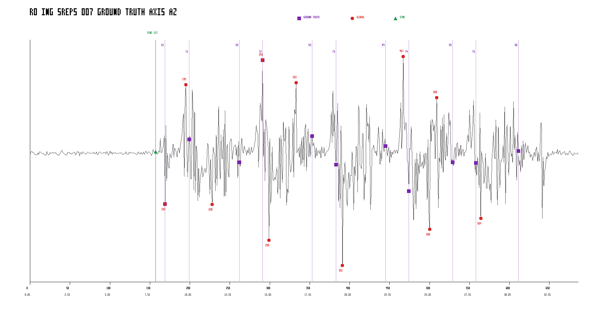

### B1

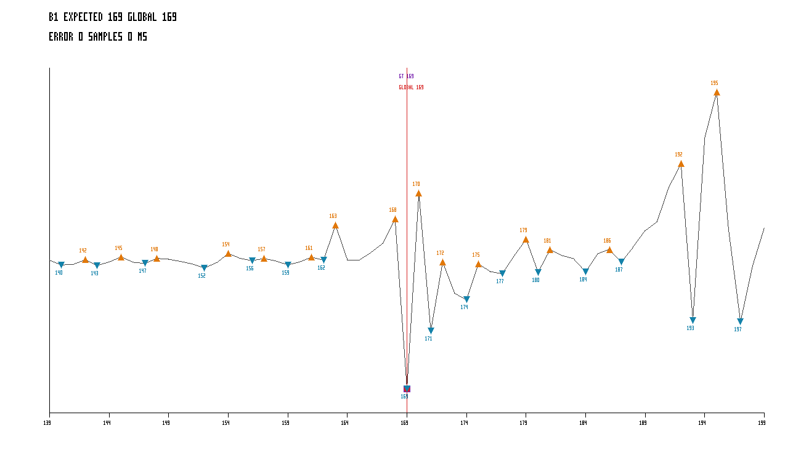

### T1

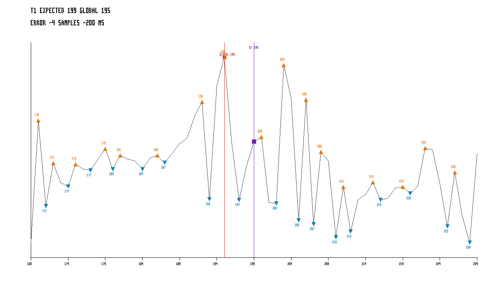

### B2

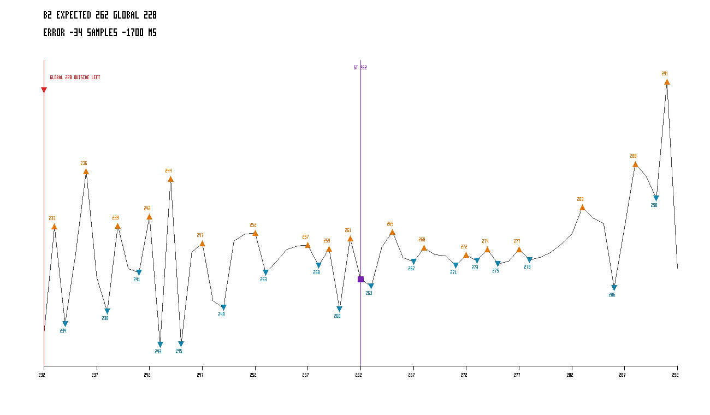

### T2

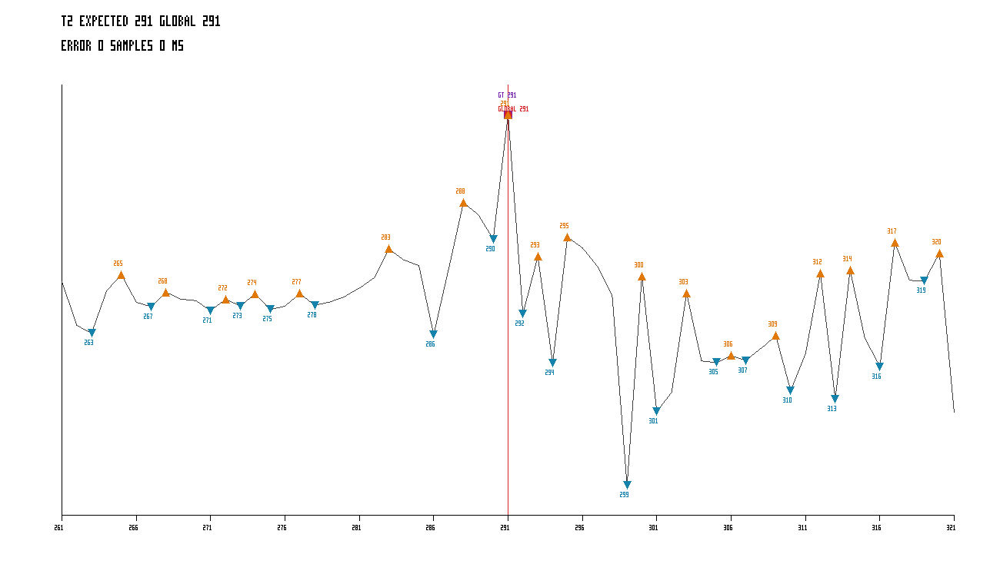

### B3

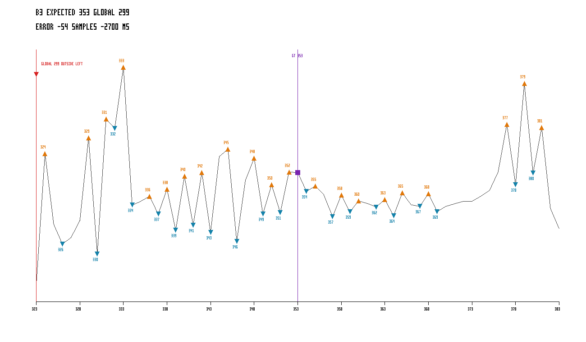

### T3

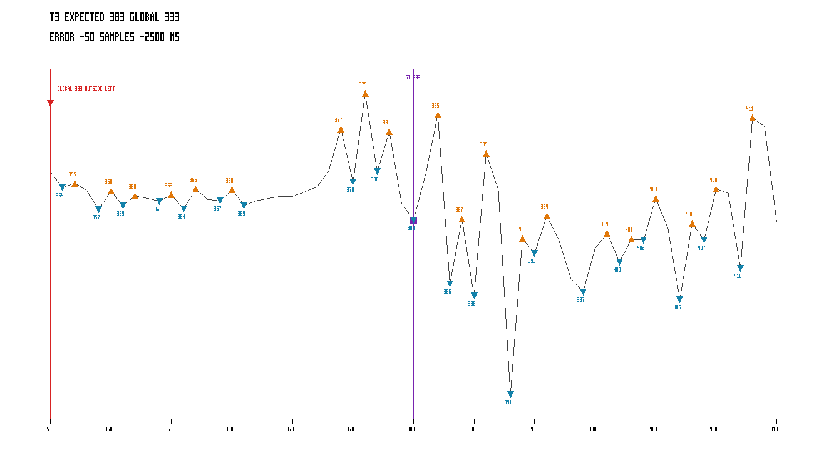

### B4

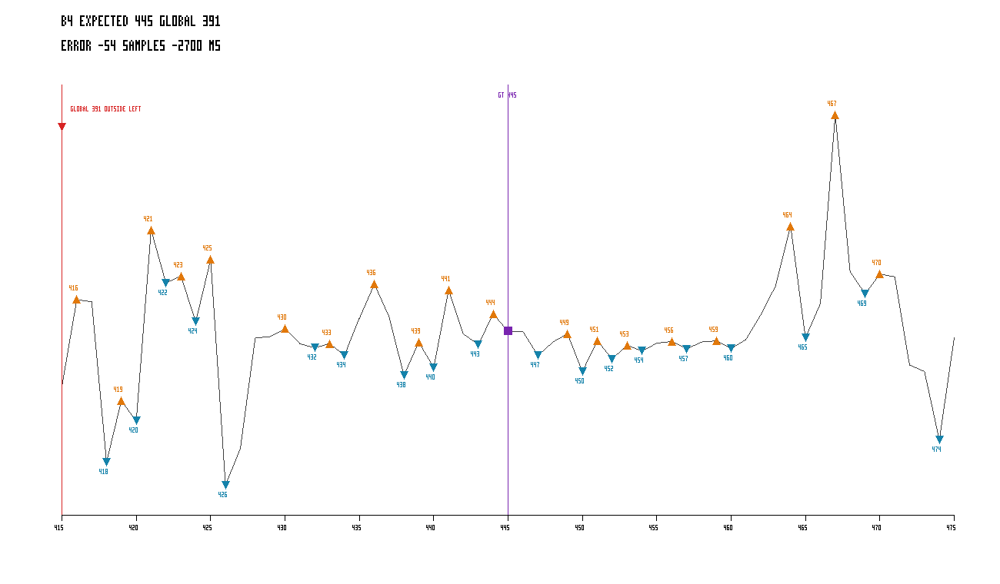

### T4

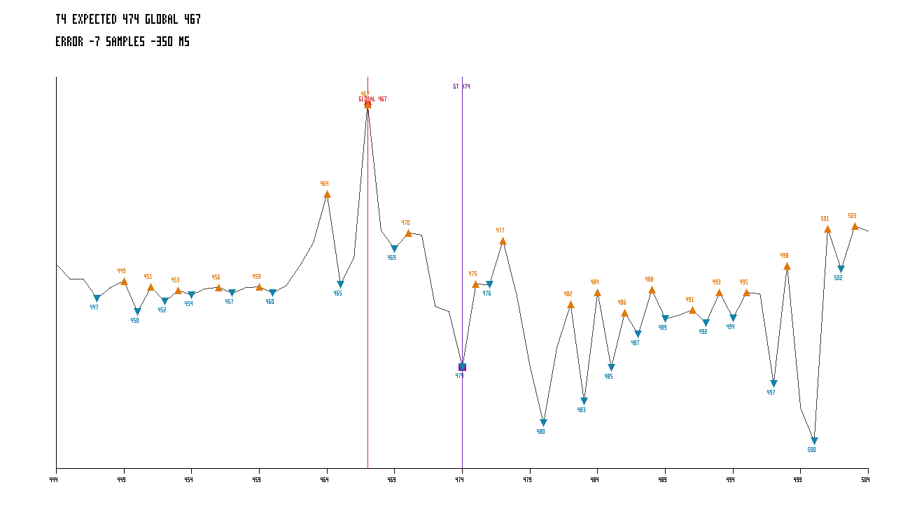

### B5

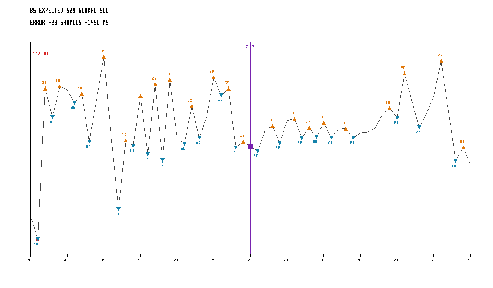

### T5

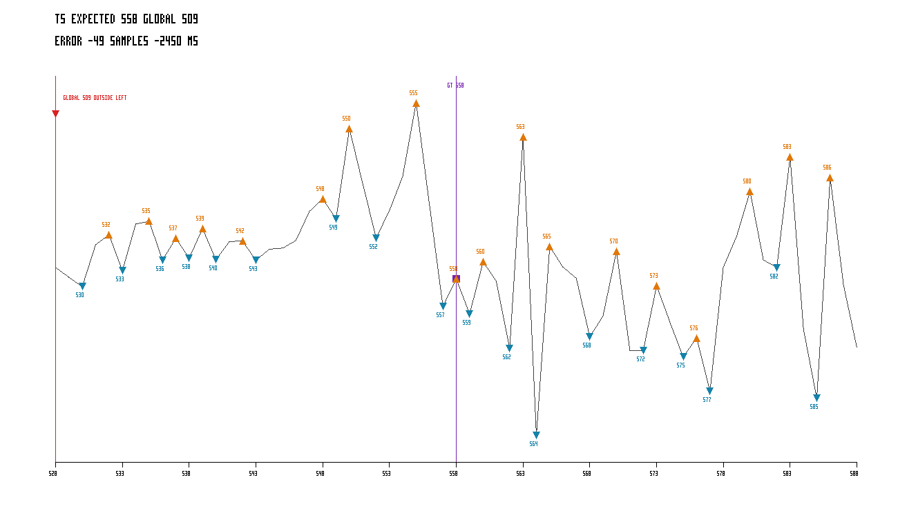

### B6

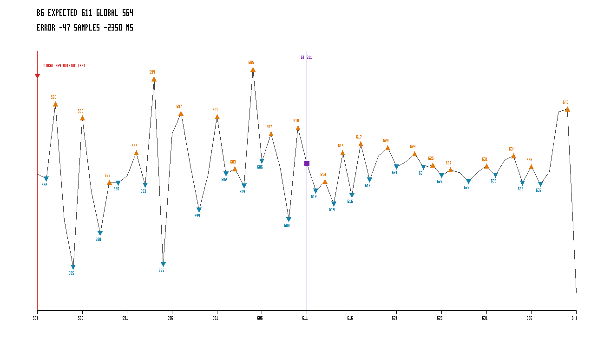

## Interprétation limitée

- 2 événements sont à deux samples ou moins.
- 9 événements sont à plus de deux samples.
- Ces mesures ne constituent aucune conclusion biomécanique.
- Ce rapport ne propose aucune modification d’algorithme.
